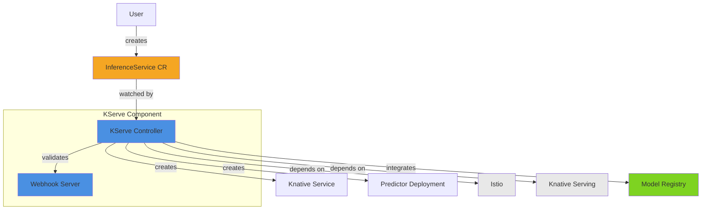
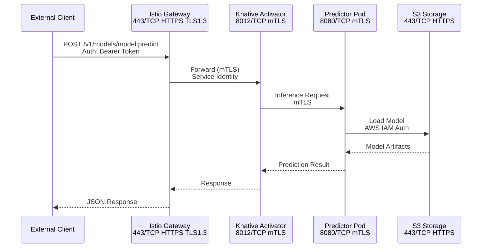
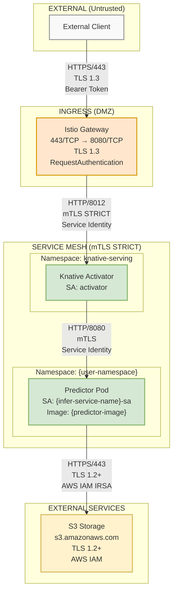
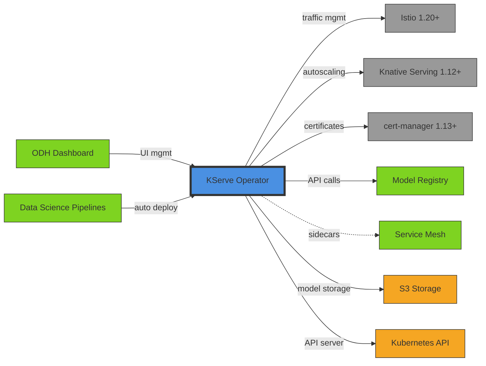
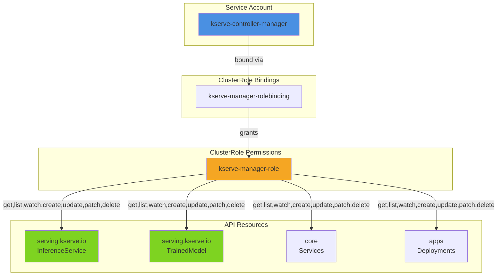

# Generate Architecture Diagrams

Read a `GENERATED_ARCHITECTURE.md` file and generate multiple diagram formats for different audiences:
- **Mermaid diagrams**: For embedding in markdown, PRs, wikis
- **C4 diagrams**: For architectural documentation
- **Security network diagrams**: For Security Architecture Reviews (SAR)
- **Data flow diagrams**: For understanding component interactions

## Arguments

Required/optional arguments:
- `--architecture=<path>` (default: ./GENERATED_ARCHITECTURE.md)
- `--output-dir=<path>` (default: auto - relative to architecture file)
- `--formats=<comma-separated>` (default: all) - Options: mermaid, c4, security, dataflow, component
- `--audience=<audience>` (optional) - Optimize for: developer, architect, security, executive

Examples:
```bash
# Auto output to diagrams/ relative to architecture file
/generate-architecture-diagrams --architecture=architecture/odh-3.3.0/feast.md
# → Outputs to: architecture/odh-3.3.0/diagrams/

# Specify custom output directory
/generate-architecture-diagrams --architecture=./GENERATED_ARCHITECTURE.md --output-dir=./custom-diagrams

# Generate specific formats only
/generate-architecture-diagrams --architecture=architecture/odh-3.3.0/feast.md --formats=mermaid,security
```

## Instructions

Generate visual diagrams from structured markdown architecture documentation:

### Step 1: Determine Component Name

Derive the component name from the architecture filename (not from file content):

**Logic**:
```bash
# Get basename without extension
FILENAME=$(basename "$ARCHITECTURE_FILE" .md)
# Convert to lowercase for consistency
COMPONENT_NAME=$(echo "$FILENAME" | tr '[:upper:]' '[:lower:]')
```

**Examples**:
- `architecture/odh-3.3.0/feast.md` → `feast`
- `architecture/odh-3.3.0/PLATFORM.md` → `platform`
- `./GENERATED_ARCHITECTURE.md` → `generated_architecture`

**Important**: Use the filename-derived name for ALL diagram filenames. Do NOT extract component name from file content or include version numbers in filenames (the directory is already versioned).

### Step 2: Read Architecture Documentation

Read the architecture file and parse the structured markdown to extract:
- **Component metadata**: Name, type, purpose
- **Architecture components**: From "## Architecture Components" table
- **CRDs**: From "### Custom Resource Definitions" table
- **HTTP/gRPC endpoints**: From API tables
- **Dependencies**: External and internal from dependency tables
- **Network services**: From "### Services" table
- **Ingress/Egress**: From network tables
- **RBAC**: From security tables
- **Data flows**: From "### Flow" tables
- **Integration points**: From integration tables

### Step 3: Determine Output Directory

If `--output-dir` is NOT provided, auto-determine based on architecture file location:

**Auto mode** (recommended for organized structure):
- Architecture file: `architecture/odh-3.3.0/feast.md`
- Output directory: `architecture/odh-3.3.0/diagrams/`

**Logic**:
```bash
# Get directory containing the architecture file
ARCH_DIR=$(dirname "$ARCHITECTURE_FILE")
# Set output to diagrams/ subdirectory
OUTPUT_DIR="$ARCH_DIR/diagrams"
```

**Examples**:
- `architecture/odh-3.3.0/feast.md` → `architecture/odh-3.3.0/diagrams/`
- `./GENERATED_ARCHITECTURE.md` → `./diagrams/`
- `/path/to/kserve/GENERATED_ARCHITECTURE.md` → `/path/to/kserve/diagrams/`

If `--output-dir` IS provided, use that exactly as specified.

### Step 4: Create Output Directory

```bash
mkdir -p {output-dir}
```

### Step 5: Generate Diagrams

Generate the requested diagram formats using the component name from Step 1:

**File naming**: All diagrams use `{component-name}` from Step 1 (derived from filename, no version).

**Examples**:
- `feast.md` → `feast-component.mmd`, `feast-dataflow.mmd`, etc.
- `PLATFORM.md` → `platform-component.mmd`, `platform-dataflow.mmd`, etc.

---

#### Format 1: Mermaid Component Diagram

**Purpose**: Show component structure and relationships
**Audience**: Developers, architects
**File**: `{output-dir}/{component-name}-component.mmd`

Read the architecture markdown and generate a Mermaid diagram showing:
- Component internal structure
- CRDs watched/created
- External dependencies
- Internal integrations

**Example output**:


---

#### Format 2: Mermaid Data Flow Diagram

**Purpose**: Show request/response flows with technical details
**Audience**: Developers, SREs
**File**: `{output-dir}/{component-name}-dataflow.mmd`

Read the "## Data Flows" section and generate a sequence diagram:

**Example output**:


---

#### Format 3: Security Network Diagram (ASCII + Mermaid)

**Purpose**: Precise network topology for Security Architecture Reviews
**Audience**: Security teams, compliance
**Files**:
- `{output-dir}/{component-name}-security-network.txt` (ASCII - for SAR documentation)
- `{output-dir}/{component-name}-security-network.mmd` (Mermaid - for visual presentations)

Read network and security sections to create detailed diagrams with:
- Exact port numbers (e.g., 8443/TCP)
- Protocols (HTTP/HTTPS/gRPC)
- Encryption (TLS 1.3, mTLS, plaintext)
- Authentication mechanisms (Bearer, mTLS certs, AWS IAM)
- Trust boundaries (external, internal, service mesh)

Generate BOTH formats - ASCII for precision/security reviews, Mermaid for visual clarity.

**Example output**:
```
┌─────────────────────────────────────────────────────────────────────────┐
│  EXTERNAL (Untrusted)                                                   │
│                                                                          │
│  [External Client]                                                       │
│         │                                                                │
│         │ Port: 443/TCP                                                  │
│         │ Protocol: HTTPS                                                │
│         │ Encryption: TLS 1.3                                            │
│         │ Auth: Bearer Token (optional)                                  │
│         ▼                                                                │
├─────────────────────────────────────────────────────────────────────────┤
│  INGRESS (DMZ)                                                          │
│                                                                          │
│  [Istio Gateway]                                                         │
│  - Port: 443/TCP (external) → 8080/TCP (internal)                      │
│  - TLS Termination: TLS 1.3                                             │
│  - AuthN: RequestAuthentication (validates JWT if present)              │
│         │                                                                │
│         │ Port: 8012/TCP                                                 │
│         │ Protocol: HTTP                                                 │
│         │ Encryption: mTLS (STRICT)                                      │
│         │ Auth: Service Identity (Istio)                                 │
│         ▼                                                                │
├─────────────────────────────────────────────────────────────────────────┤
│  SERVICE MESH (Trusted - mTLS STRICT)                                   │
│                                                                          │
│  [Knative Activator]                                                     │
│  - Namespace: knative-serving                                            │
│  - ServiceAccount: activator                                             │
│         │                                                                │
│         │ Port: 8080/TCP                                                 │
│         │ Protocol: HTTP                                                 │
│         │ Encryption: mTLS (ServiceMesh sidecar)                         │
│         │ Auth: Service Identity                                         │
│         ▼                                                                │
│  [Predictor Pod]                                                         │
│  - Namespace: {user-namespace}                                           │
│  - ServiceAccount: {infer-service-name}-sa                              │
│  - Image: {predictor-image}:tag                                          │
│         │                                                                │
│         │ Port: 443/TCP                                                  │
│         │ Protocol: HTTPS                                                │
│         │ Encryption: TLS 1.2+                                           │
│         │ Auth: AWS IAM Role (IRSA)                                      │
│         ▼                                                                │
├─────────────────────────────────────────────────────────────────────────┤
│  EXTERNAL SERVICES                                                       │
│                                                                          │
│  [S3 Storage - s3.amazonaws.com]                                         │
│  - Purpose: Model artifact storage                                       │
│  - Auth: AWS IAM credentials                                             │
│  - Encryption: TLS 1.2+                                                  │
└─────────────────────────────────────────────────────────────────────────┘

RBAC Summary:
- ClusterRole: kserve-manager-role
  - API Groups: serving.kserve.io
  - Resources: inferenceservices, trainedmodels
  - Verbs: get, list, watch, create, update, patch, delete

Service Mesh Configuration:
- PeerAuthentication: STRICT (namespace-scoped)
- AuthorizationPolicy: kserve-controller-access
  - Allows: cluster.local/ns/{namespace}/sa/kserve-controller-manager
  - Methods: GET, POST, PUT, DELETE

Secrets:
- kserve-webhook-server-cert (kubernetes.io/tls) - TLS cert, cert-manager, 90d rotation
- storage-config (Opaque) - S3 credentials (AWS_ACCESS_KEY_ID, AWS_SECRET_ACCESS_KEY)
```

**Mermaid version** (`{component-name}-security-network.mmd`):



**Notes**:
- **ASCII format**: Include RBAC summary, Service Mesh config, Secrets at bottom
- **Mermaid format**: Focus on visual network flow with trust zones
- Both formats should contain the same network architecture information
- Use ASCII for SAR documentation, Mermaid for presentations

---

#### Format 4: C4 Context Diagram (Structurizr DSL)

**Purpose**: System context showing component in broader ecosystem
**Audience**: Architects, stakeholders
**File**: `{output-dir}/{component-name}-c4-context.dsl`

Read dependencies and integration points to create C4 context:

**Example output**:
```
workspace {
    model {
        user = person "Data Scientist" "Creates and deploys ML models"

        kserve = softwareSystem "KServe" "Standardized serverless ML inference platform" {
            controller = container "KServe Controller" "Manages InferenceService lifecycle" "Go Operator"
            webhook = container "Webhook Server" "Validates and mutates InferenceServices" "Go Service"
        }

        istio = softwareSystem "Istio" "Service mesh for traffic management" "External"
        knative = softwareSystem "Knative Serving" "Serverless autoscaling platform" "External"
        modelRegistry = softwareSystem "Model Registry" "Stores model metadata" "Internal ODH"
        s3 = softwareSystem "S3 Storage" "Model artifact storage" "External"

        user -> kserve "Creates InferenceService via kubectl"
        kserve -> istio "Uses for traffic routing and mTLS"
        kserve -> knative "Uses for autoscaling"
        kserve -> modelRegistry "Fetches model metadata" "gRPC/9090"
        kserve -> s3 "Downloads model artifacts" "HTTPS/443"
    }

    views {
        systemContext kserve "SystemContext" {
            include *
            autoLayout
        }

        container kserve "Containers" {
            include *
            autoLayout
        }

        styles {
            element "External" {
                background #999999
            }
            element "Internal ODH" {
                background #7ed321
            }
        }
    }
}
```

---

#### Format 5: Component Dependency Graph (Mermaid)

**Purpose**: Show component dependencies and integration points
**Audience**: Architects, integration engineers
**File**: `{output-dir}/{component-name}-dependencies.mmd`

Read "## Dependencies" and "## Integration Points" sections:

**Example output**:


---

#### Format 6: RBAC Matrix Diagram (Markdown Table → Mermaid)

**Purpose**: Visualize RBAC permissions
**Audience**: Security, compliance
**File**: `{output-dir}/{component-name}-rbac.mmd`

Read "### RBAC" tables and create visual representation:

**Example output**:


---

### Step 6: Generate PNG Files from Mermaid Diagrams

Automatically convert all `.mmd` files to high-resolution PNG images using the Python script.

Use the Python script to generate PNGs from all Mermaid diagrams:

```bash
python scripts/generate_diagram_pngs.py {output-dir} --width=3000
```

**Expected output**:
```
Generating PNGs for 5 Mermaid diagram(s)...
Width: 3000px, Chrome: /usr/bin/google-chrome

  feast-component.mmd → feast-component.png
  feast-dataflow.mmd → feast-dataflow.png
  feast-security-network.mmd → feast-security-network.png
  feast-dependencies.mmd → feast-dependencies.png
  feast-rbac.mmd → feast-rbac.png

============================================================
✅ PNG generation complete!
============================================================
Successful: 5
Failed: 0
Width: 3000px
```

**Error handling**:

If the script fails (mmdc or Chrome not available), output a warning and continue:
```
⚠️  PNG generation skipped (mmdc or Chrome not installed)
   Install with: npm install -g @mermaid-js/mermaid-cli
   Mermaid source files (.mmd) were created and can be converted manually
```

**Notes**:
- PNG width: 3000px (height auto-adjusts to content)
- PNGs are high-resolution for presentations and documentation
- Script auto-detects Chrome/Chromium path
- Graceful degradation: If unavailable, skill continues without PNGs
- Original `.mmd` files are preserved (can be embedded in markdown)
- Single permission grant for the script covers all PNG generation

---

### Step 8: Generate Index/README

Create `{output-dir}/README.md` with links to all diagrams:

**Important**: Use `{component-name}` from Step 1 (derived from filename) for all links.

```markdown
# Architecture Diagrams for {Component Name}

Generated from: `{architecture-file}`
Date: {date}

**Note**: Diagram filenames use base component name without version (directory is already versioned).

## Available Diagrams

All Mermaid diagrams are available in both `.mmd` (source) and `.png` (3000px width, high-resolution) formats.

### For Developers
- [Component Structure](./{component-name}-component.png) ([mmd](./{component-name}-component.mmd)) - Mermaid diagram showing internal components
- [Data Flows](./{component-name}-dataflow.png) ([mmd](./{component-name}-dataflow.mmd)) - Sequence diagram of request/response flows
- [Dependencies](./{component-name}-dependencies.png) ([mmd](./{component-name}-dependencies.mmd)) - Component dependency graph

### For Architects
- [C4 Context](./{component-name}-c4-context.dsl) - System context in C4 format (Structurizr)
- [Component Overview](./{component-name}-component.png) ([mmd](./{component-name}-component.mmd)) - High-level component view

### For Security Teams
- [Security Network Diagram (PNG)](./{component-name}-security-network.png) - High-resolution network topology
- [Security Network Diagram (Mermaid)](./{component-name}-security-network.mmd) - Visual network topology (editable)
- [Security Network Diagram (ASCII)](./{component-name}-security-network.txt) - Precise text format for SAR submissions
- [RBAC Visualization](./{component-name}-rbac.png) ([mmd](./{component-name}-rbac.mmd)) - RBAC permissions and bindings

## How to Use

### PNG Files (.png files)
**Automatically generated** at 3000px width for high-resolution presentations and documentation.

- **Ready to use**: High-resolution images suitable for presentations, wikis, and documentation
- **Width**: 3000px (height auto-adjusts to content)
- **Use directly**: Include in PowerPoint, Google Slides, Confluence, etc.

### Mermaid Source Files (.mmd files)
- **In GitHub/GitLab**: Paste into markdown with ````mermaid` code blocks - renders automatically!
- **Live editor**: https://mermaid.live (paste code, edit, export)
- **Editable**: Modify and regenerate if needed

**Manual PNG regeneration** (if you edit .mmd files):

1. **Ensure Mermaid CLI is installed**:
   ```bash
   npm install -g @mermaid-js/mermaid-cli
   ```

2. **Regenerate PNG** (3000px width):
   ```bash
   PUPPETEER_EXECUTABLE_PATH=/usr/bin/google-chrome mmdc -i diagram.mmd -o diagram.png -w 3000
   ```

3. **Alternative formats** (if needed):
   ```bash
   # SVG (vector, scales perfectly)
   PUPPETEER_EXECUTABLE_PATH=/usr/bin/google-chrome mmdc -i diagram.mmd -o diagram.svg

   # PDF
   PUPPETEER_EXECUTABLE_PATH=/usr/bin/google-chrome mmdc -i diagram.mmd -o diagram.pdf
   ```

**Note**: If `google-chrome` is not found, try `chromium` or `which google-chrome` to locate it

### C4 Diagrams (.dsl files)
- **Structurizr Lite**: `docker run -p 8080:8080 -v .:/usr/local/structurizr structurizr/lite`
- **CLI export**: `structurizr-cli export -workspace diagram.dsl -format png`

### ASCII Diagrams (.txt files)
- View in any text editor
- Include in documentation as-is
- Perfect for security reviews (precise technical details)

## Updating Diagrams

To regenerate after architecture changes:
```bash
/generate-architecture-diagrams --architecture=../GENERATED_ARCHITECTURE.md
```
```

---

### Step 9: Report Results

Output a summary:

```
✅ Architecture diagrams generated!

Component: {component-name} (from filename)
Source: {architecture-file}
Output directory: {output-dir}/

Mermaid diagrams (source + PNG):
- ✅ {component-name}-component.mmd + .png (Component structure)
- ✅ {component-name}-dataflow.mmd + .png (Data flow sequences)
- ✅ {component-name}-security-network.mmd + .png (Security network diagram - visual)
- ✅ {component-name}-dependencies.mmd + .png (Dependency graph)
- ✅ {component-name}-rbac.mmd + .png (RBAC visualization)

Other formats:
- ✅ {component-name}-security-network.txt (ASCII security diagram - precise/SAR)
- ✅ {component-name}-c4-context.dsl (C4 context diagram)
- ✅ README.md (Index of all diagrams)

PNG files: 3000px width, high-resolution, ready for presentations

Note: Filenames use base component name without version (directory is already versioned)

Next steps:
1. Review diagrams in {output-dir}/
2. Use PNG files directly in presentations and documentation
3. Embed Mermaid source (.mmd) in markdown: ```mermaid ... ```
4. Use ASCII security diagram (.txt) for SAR documentation
5. Share C4 diagrams (.dsl) with Architecture Council
```

**If mmdc was not available**, append warning:
```
⚠️  PNG generation skipped (mmdc not installed)
   Install with: npm install -g @mermaid-js/mermaid-cli
   Mermaid source files (.mmd) were created and can be converted manually
```

## Notes

### Output Directory Behavior

**Auto mode** (recommended - no --output-dir specified):
- Output directory is created **relative to the architecture file**
- Example: `architecture/odh-3.3.0/feast.md` → `architecture/odh-3.3.0/diagrams/`
- This keeps component diagrams organized with their architecture files

**Manual mode** (--output-dir specified):
- Use the exact path provided
- Useful for custom directory structures

### Organized Structure Example

```
architecture/odh-3.3.0/                # ← Directory is versioned
├── feast.md                           # Component architecture
├── kserve.md
├── model-registry.md
├── diagrams/                          # Auto-created (shared by all components)
│   ├── feast-component.mmd            # ← No version in filename (redundant)
│   ├── feast-component.png            # ← Auto-generated PNG (3000px width)
│   ├── feast-dataflow.mmd
│   ├── feast-dataflow.png
│   ├── feast-security-network.mmd     # Mermaid (visual, editable)
│   ├── feast-security-network.png     # PNG (high-res)
│   ├── feast-security-network.txt     # ASCII (precise)
│   ├── feast-c4-context.dsl
│   ├── feast-dependencies.mmd
│   ├── feast-dependencies.png
│   ├── feast-rbac.mmd
│   ├── feast-rbac.png
│   ├── kserve-component.mmd           # ← Simple names
│   ├── kserve-component.png
│   ├── kserve-dataflow.mmd
│   ├── kserve-dataflow.png
│   ├── kserve-security-network.mmd
│   ├── kserve-security-network.png
│   ├── kserve-security-network.txt
│   ├── platform-component.mmd         # ← PLATFORM.md → platform-*.mmd
│   ├── platform-component.png
│   ├── platform-dataflow.mmd
│   ├── platform-dataflow.png
│   ├── platform-security-network.mmd
│   ├── platform-security-network.png
│   └── README.md
└── PLATFORM.md                        # Aggregated platform view
```

**Key principles**:
- Filenames use base component name only (no version). The directory `odh-3.3.0/` provides versioning context.
- PNG files auto-generated at 3000px width for all Mermaid diagrams (.mmd files)

### General Notes

- Diagrams are generated from structured markdown tables (LLM-based transpilation)
- All technical details (ports, protocols, TLS, auth) are preserved from source
- Multiple formats serve different audiences (developers, architects, security)
- **Automatic PNG generation**: All Mermaid diagrams (.mmd) are automatically converted to high-resolution PNG (3000px width)
  - Requires: `mmdc` (Mermaid CLI) and Chrome/Chromium
  - If not available: graceful degradation, .mmd files still created
- **Security network diagrams have dual formats**:
  - **Mermaid + PNG**: Visual, color-coded trust zones, great for presentations
  - **ASCII**: Precise text format, no ambiguity, required for SAR submissions
  - Both contain the same information, just different representations
- Mermaid source files (.mmd) can be embedded directly in markdown
- PNG files (3000px width) are ready for presentations and documentation
- ASCII diagrams are perfect for security reviews (no ambiguity)
- C4 diagrams provide architectural context
- Regenerate diagrams after updating component architecture files

## Customization

### Generate for Specific Component

```bash
# Auto output to architecture/odh-3.3.0/diagrams/
/generate-architecture-diagrams --architecture=architecture/odh-3.3.0/feast.md

# Generate only specific formats
/generate-architecture-diagrams --architecture=architecture/odh-3.3.0/feast.md --formats=mermaid,security

# Custom output directory
/generate-architecture-diagrams --architecture=architecture/odh-3.3.0/feast.md --output-dir=./feast-diagrams
```

### Optimize for Audience

```bash
/generate-architecture-diagrams --architecture=architecture/odh-3.3.0/feast.md --audience=security  # Emphasizes security details
/generate-architecture-diagrams --architecture=architecture/odh-3.3.0/feast.md --audience=executive # Simplified, high-level views
```

### Workflow Integration

```bash
# Full workflow for a single component
/repo-to-architecture-summary checkouts/opendatahub-io/feast
/collect-component-architectures
/generate-architecture-diagrams --architecture=architecture/odh-3.3.0/feast.md
```
