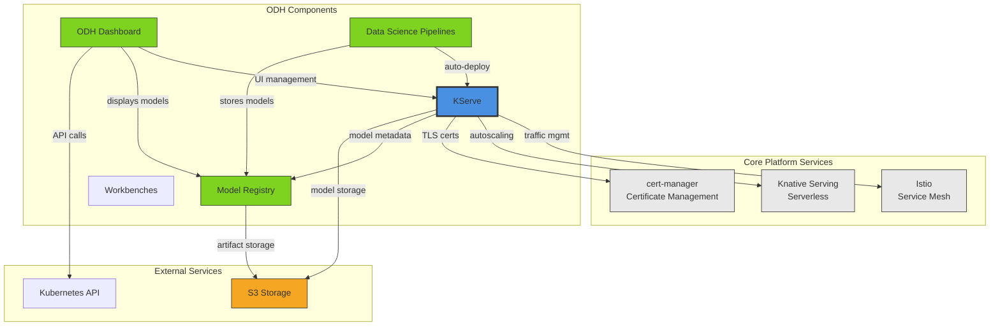
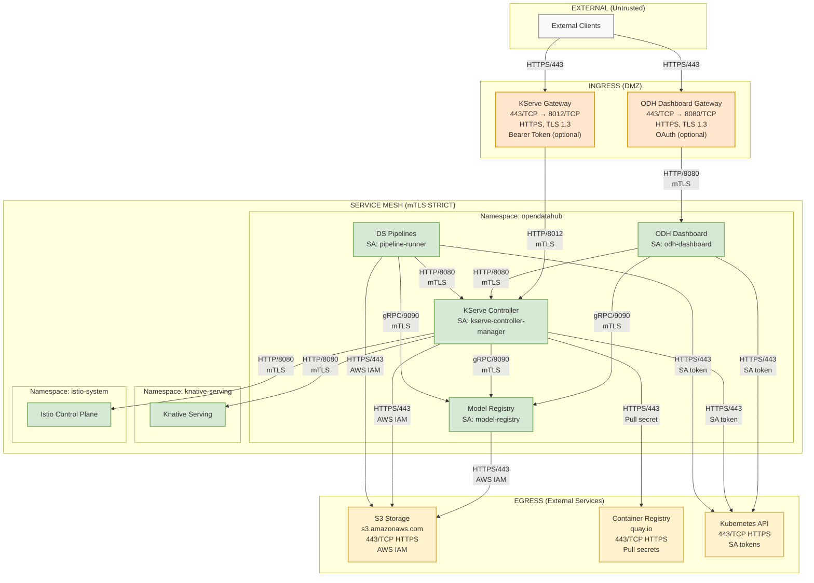
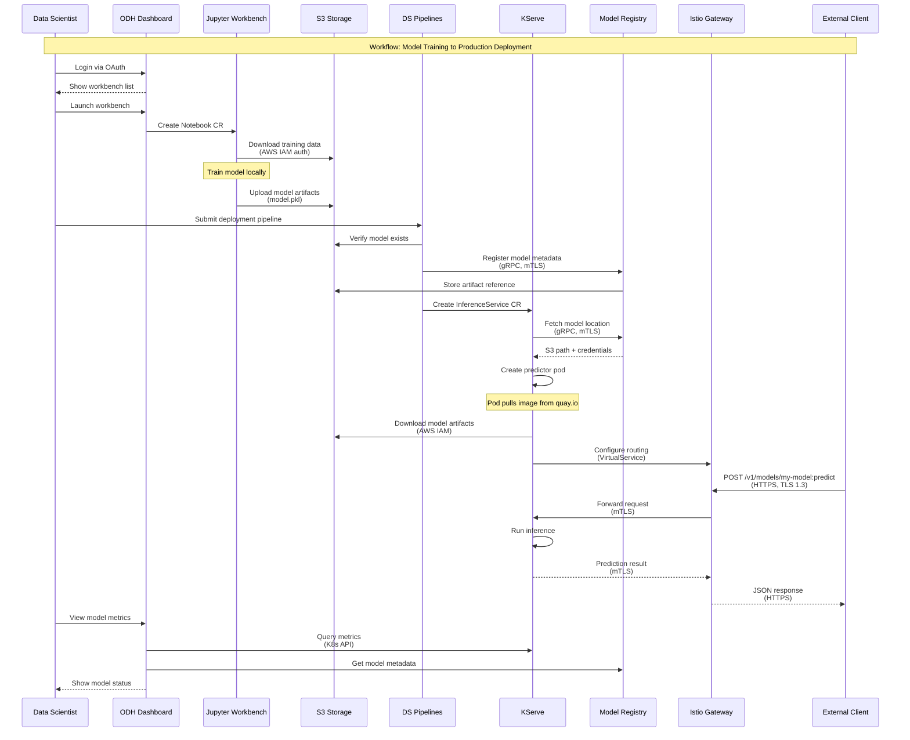
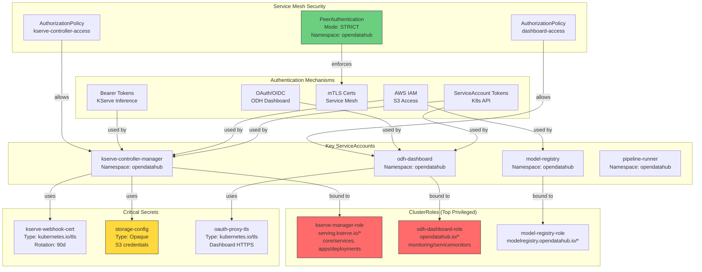

# Generate Platform Diagrams

Read a `PLATFORM.md` file (created by `/aggregate-platform-architecture`) and generate platform-level diagrams showing component relationships, cross-component workflows, and platform-wide architecture.

## Arguments

Required/optional arguments:
- `--platform-file=<path>` (default: auto-detect from current directory or ./architecture/)
- `--output-dir=<path>` (default: ./diagrams relative to platform file)
- `--formats=<comma-separated>` (default: all) - Options: dependency, network, workflow, security, maturity

Examples:
```bash
# Auto-detect PLATFORM.md in current directory
/generate-platform-diagrams

# Specify platform file
/generate-platform-diagrams --platform-file=architecture/odh-3.3.0/PLATFORM.md

# Generate specific formats only
/generate-platform-diagrams --formats=dependency,network
```

## Instructions

Generate platform-level diagrams from aggregated architecture documentation:

### Step 1: Locate Platform File

If `--platform-file` not provided, auto-detect:
1. Check current directory for `PLATFORM.md`
2. Check `architecture/*/PLATFORM.md` (organized structure)
3. Check `platform-architecture/*-PLATFORM.md` (legacy structure)

If found, use that file. If multiple found, list them and ask user to specify.

If not found, output error:
```
⚠️  No PLATFORM.md file found

Expected locations:
- ./PLATFORM.md
- ./architecture/{platform}-{version}/PLATFORM.md
- ./platform-architecture/{platform}-{version}-PLATFORM.md

Generate one first: /aggregate-platform-architecture
```

### Step 2: Read Platform Architecture

Read the `PLATFORM.md` file and extract:
- **Platform metadata**: Distribution, version, component count
- **Component inventory**: From "## Component Inventory" table
- **Component relationships**: From "## Component Relationships" section
- **Network architecture**: From "## Platform Network Architecture" tables
- **Security**: From "## Platform Security" tables
- **Data flows**: From "## Data Flows" section
- **Integration points**: From dependency and integration tables

### Step 3: Create Output Directory

Determine output directory:
- If `--output-dir` provided: use that
- Default: `{platform-file-directory}/diagrams/`

Example: If platform file is `architecture/odh-3.3.0/PLATFORM.md`, output to `architecture/odh-3.3.0/diagrams/`

```bash
mkdir -p {output-dir}
```

### Step 4: Generate Diagrams

Generate the requested diagram formats:

---

#### Format 1: Component Dependency Graph (Mermaid)

**Purpose**: Show which components depend on each other
**Audience**: Architects, platform engineers
**File**: `{output-dir}/platform-dependency-graph.mmd`

Read "## Component Relationships" → "### Dependency Graph" and "### Integration Patterns" sections.

**Example output**:


**Instructions**:
- Group components by category (Core Platform, ODH Components, External)
- Show dependency arrows with labels (e.g., "traffic mgmt", "model metadata")
- Highlight central components with thicker borders
- Use consistent color scheme: gray for external platform, blue for key components, green for ODH components, orange for external services

---

#### Format 2: Platform Network Topology (ASCII + Mermaid)

**Purpose**: Complete network architecture for Security Architecture Reviews
**Audience**: Security teams, compliance, SREs
**Files**:
- `{output-dir}/platform-network-topology.txt` (ASCII - for SAR documentation)
- `{output-dir}/platform-network-topology.mmd` (Mermaid - for visual presentations)

Read "## Platform Network Architecture" section (all subsections).

Generate BOTH formats - ASCII for precision/security reviews, Mermaid for visual clarity.

**Example output**:
```
┌─────────────────────────────────────────────────────────────────────────┐
│  EXTERNAL (Untrusted)                                                   │
│                                                                          │
│  [External Clients]                                                      │
│         │                                                                │
├─────────┼────────────────────────────────────────────────────────────────┤
│  INGRESS│(DMZ)                                                          │
│         │                                                                │
│         ├─→ [ODH Dashboard - dashboard-opendatahub.apps.cluster.com]    │
│         │   Port: 443/TCP (ext) → 8080/TCP (int)                        │
│         │   Protocol: HTTPS, Encryption: TLS 1.3                         │
│         │   Auth: OAuth (optional)                                       │
│         │                                                                │
│         ├─→ [KServe Gateway - *.kserve.apps.cluster.com]                │
│         │   Port: 443/TCP (ext) → 8012/TCP (int)                        │
│         │   Protocol: HTTPS, Encryption: TLS 1.3                         │
│         │   Auth: Bearer Token (optional)                                │
│         │                                                                │
├─────────┼────────────────────────────────────────────────────────────────┤
│  SERVICE│MESH (mTLS STRICT)                                             │
│         │                                                                │
│         ├─→ [ODH Dashboard]                                              │
│         │   Namespace: opendatahub                                       │
│         │   ServiceAccount: odh-dashboard                                │
│         │   ├─→ Model Registry (gRPC/9090, mTLS)                        │
│         │   ├─→ KServe (HTTP/8080, mTLS)                                │
│         │   └─→ Kubernetes API (HTTPS/443, ServiceAccount token)        │
│         │                                                                │
│         ├─→ [KServe Controller]                                          │
│         │   Namespace: opendatahub                                       │
│         │   ServiceAccount: kserve-controller-manager                    │
│         │   ├─→ Model Registry (gRPC/9090, mTLS)                        │
│         │   ├─→ Knative Serving (HTTP/8080, mTLS)                       │
│         │   ├─→ Istio (HTTP/8080, mTLS)                                 │
│         │   └─→ Kubernetes API (HTTPS/443, ServiceAccount token)        │
│         │                                                                │
│         ├─→ [Model Registry]                                             │
│         │   Namespace: opendatahub                                       │
│         │   ServiceAccount: model-registry                               │
│         │   └─→ S3 Storage (HTTPS/443, AWS IAM)                         │
│         │                                                                │
│         └─→ [Data Science Pipelines]                                     │
│             Namespace: opendatahub                                       │
│             ServiceAccount: pipeline-runner                              │
│             ├─→ KServe (HTTP/8080, mTLS)                                │
│             ├─→ Model Registry (gRPC/9090, mTLS)                        │
│             └─→ S3 Storage (HTTPS/443, AWS IAM)                         │
│                                                                          │
├─────────────────────────────────────────────────────────────────────────┤
│  EGRESS (External Services)                                             │
│                                                                          │
│  [S3 Storage - s3.amazonaws.com]                                         │
│  - Purpose: Model artifacts, pipeline artifacts                          │
│  - Auth: AWS IAM (IRSA or static credentials)                           │
│  - Encryption: TLS 1.2+                                                  │
│  - Components: KServe, Model Registry, Pipelines                         │
│                                                                          │
│  [Container Registry - quay.io]                                          │
│  - Purpose: Pull runtime images                                          │
│  - Auth: Pull secrets                                                    │
│  - Encryption: TLS 1.2+                                                  │
│  - Components: KServe, Workbenches                                       │
└─────────────────────────────────────────────────────────────────────────┘

NAMESPACES:
- opendatahub: Main platform namespace (mTLS STRICT)
- knative-serving: Knative components (mTLS PERMISSIVE)
- istio-system: Service mesh control plane

SERVICE MESH CONFIGURATION:
- Mode: STRICT mTLS for opendatahub namespace
- PeerAuthentication: Namespace-scoped, enforced at sidecar
- AuthorizationPolicy: Component-specific access controls
- Certificate Rotation: 90 days (cert-manager)

RBAC SUMMARY:
(Top 5 most privileged cluster roles)
- kserve-manager-role: serving.kserve.io/*, core/services, apps/deployments
- model-registry-role: modelregistry.opendatahub.io/*
- odh-dashboard-role: opendatahub.io/*, monitoring.coreos.com/servicemonitors
```

**Mermaid version** (`platform-network-topology.mmd`):



**ASCII version** (same content, text format - keep existing example)

**Instructions**:
- **ASCII format**: Create clear trust boundaries (External, Ingress, Service Mesh, Egress)
- List ALL ingress points with exact details (ports, protocols, TLS, auth)
- Show component-to-component communication within service mesh
- Include namespace, ServiceAccount for each component
- List egress destinations with encryption and auth details
- Add platform-wide security summary (mTLS mode, RBAC, namespaces)
- **Mermaid format**: Use subgraphs for trust zones, include protocol/port details on edges
- Both formats should contain the same information, just different representations

---

#### Format 3: Cross-Component Workflows (Mermaid Sequence)

**Purpose**: Show end-to-end flows spanning multiple components
**Audience**: Architects, product managers, SREs
**File**: `{output-dir}/platform-workflows.mmd`

Read "## Data Flows" → "### Key Platform Workflows" section.

**Example output**:


**Instructions**:
- Generate 2-3 major workflows from PLATFORM.md
- Use sequence diagrams to show component interactions over time
- Include protocol details (mTLS, HTTPS, gRPC)
- Show authentication at each boundary crossing
- Add notes for important steps (e.g., "Train model locally", "Pod pulls image")
- Group related steps with "Note over" annotations

---

#### Format 4: Platform Security Overview (Mermaid)

**Purpose**: Visualize security architecture (RBAC, auth, secrets)
**Audience**: Security teams, compliance
**File**: `{output-dir}/platform-security-overview.mmd`

Read "## Platform Security" section (all subsections).

**Example output**:


**Instructions**:
- Group by security domain (Auth, ServiceAccounts, Roles, Secrets, Service Mesh)
- Highlight privileged roles in red
- Highlight sensitive secrets (credentials) in yellow
- Show which ServiceAccounts use which auth mechanisms
- Show RBAC bindings (ServiceAccount → ClusterRole)
- Include service mesh policies

---

#### Format 5: Platform Maturity Dashboard (Markdown Table → Mermaid Chart)

**Purpose**: Show platform health metrics and component maturity
**Audience**: Platform engineers, executives
**File**: `{output-dir}/platform-maturity.mmd`

Read "## Platform Maturity" section.

**Example output**:


**Alternative: ASCII Dashboard** (if Mermaid too complex):
```
================================================================================
PLATFORM MATURITY DASHBOARD - ODH 3.3.0
================================================================================

Component Statistics:
┌────────────────────────┬───────┬────────┐
│ Metric                 │ Count │ Percent│
├────────────────────────┼───────┼────────┤
│ Total Components       │  12   │  100%  │
│ Operator-based         │   8   │   67%  │
│ Service-based          │   3   │   25%  │
│ Frontend               │   1   │    8%  │
└────────────────────────┴───────┴────────┘

Security Posture:
┌────────────────────────┬──────────────┐
│ Metric                 │ Status       │
├────────────────────────┼──────────────┤
│ Service Mesh           │ ✓ Enabled    │
│ mTLS Mode              │ ✓ STRICT     │
│ PeerAuthentication     │ ✓ Enforced   │
│ AuthorizationPolicies  │ ✓ 12 policies│
└────────────────────────┴──────────────┘

Dependencies:
┌────────────────────────┬───────┐
│ Type                   │ Count │
├────────────────────────┼───────┤
│ External Platform      │   3   │
│ External Services      │   2   │
│ Internal Integrations  │  15   │
└────────────────────────┴───────┘

API Maturity:
┌────────────────────────┬──────────────┐
│ Metric                 │ Status       │
├────────────────────────┼──────────────┤
│ CRD API Versions       │ ✓ All v1     │
│ Total CRDs             │  18          │
│ HTTP Endpoints         │  24          │
│ gRPC Services          │   3          │
└────────────────────────┴──────────────┘
```

---

### Step 5: Generate Index/README

Create `{output-dir}/README.md` with links to all diagrams:

```markdown
# Platform Diagrams for {Platform} {Version}

Generated from: `{platform-file}`
Date: {date}

## Available Diagrams

### For Architects
- [Component Dependency Graph](./platform-dependency-graph.mmd) - Shows component relationships and dependencies
- [Platform Workflows](./platform-workflows.mmd) - End-to-end flows spanning multiple components
- [Platform Maturity](./platform-maturity.mmd) - Health metrics and component statistics

### For Security Teams
- [Platform Network Topology (Mermaid)](./platform-network-topology.mmd) - Visual network architecture diagram
- [Platform Network Topology (ASCII)](./platform-network-topology.txt) - Precise text format for SAR submissions
- [Platform Security Overview](./platform-security-overview.mmd) - RBAC, auth mechanisms, secrets, service mesh policies

### For Platform Engineers
- [Component Dependency Graph](./platform-dependency-graph.mmd) - Understand integration points
- [Platform Network Topology (Mermaid)](./platform-network-topology.mmd) - Visualize network architecture
- [Platform Network Topology (ASCII)](./platform-network-topology.txt) - Debug connectivity issues (precise details)
- [Platform Workflows](./platform-workflows.mmd) - Trace request flows

## How to Use

### Mermaid Diagrams (.mmd files)
- **In GitHub/GitLab**: Paste into markdown with ````mermaid` code blocks
- **Render to PNG locally**:
   ```bash
   PUPPETEER_EXECUTABLE_PATH=/usr/bin/google-chrome mmdc -i diagram.mmd -o diagram.png -s 3
   ```

### ASCII Diagrams (.txt files)
- View in any text editor
- Include directly in security documentation
- Perfect for SAR (Security Architecture Review) submissions

## Diagram Descriptions

### Component Dependency Graph
Shows how platform components depend on each other. Central components (most dependencies) are highlighted. Useful for understanding blast radius of changes and planning upgrades.

### Platform Network Topology
Complete network architecture showing all ingress points, service mesh communication, and egress destinations. Includes exact port numbers, protocols, encryption, and authentication mechanisms.

**Two formats provided**:
- **Mermaid (.mmd)**: Visual diagram with color-coded trust zones. Great for presentations and architecture discussions.
- **ASCII (.txt)**: Precise text format with no ambiguity. Required for SAR (Security Architecture Review) submissions and compliance documentation.

Both formats contain the same information - use Mermaid for visual clarity, ASCII for security reviews.

### Cross-Component Workflows
Sequence diagrams showing end-to-end user workflows that span multiple components. Examples: model training to deployment, user authentication flow, pipeline execution.

### Platform Security Overview
Visual representation of security architecture including ServiceAccounts, ClusterRoles, secrets, and service mesh policies. Shows which components have which permissions.

### Platform Maturity Dashboard
High-level metrics about platform health: component counts, mTLS coverage, API maturity, dependency counts. Useful for executive reviews and maturity assessments.

## Updating Diagrams

To regenerate after platform changes:
1. Update component architectures: `/repo-to-architecture-summary`
2. Collect components: `/collect-component-architectures`
3. Aggregate platform: `/aggregate-platform-architecture`
4. Regenerate diagrams: `/generate-platform-diagrams`
```

---

### Step 6: Report Results

Output a summary:

```
✅ Platform diagrams generated!

Platform: {Platform} {Version}
Source: {platform-file}
Output directory: {output-dir}/

Diagrams created:
- ✅ platform-dependency-graph.mmd (Component dependencies)
- ✅ platform-network-topology.mmd (Network architecture - visual)
- ✅ platform-network-topology.txt (Network architecture - precise/SAR)
- ✅ platform-workflows.mmd (Cross-component flows)
- ✅ platform-security-overview.mmd (RBAC, auth, secrets)
- ✅ platform-maturity.mmd (Health metrics)
- ✅ README.md (Index and usage guide)

Next steps:
1. Review diagrams in {output-dir}/
2. Render Mermaid diagrams to PNG for presentations:
   PUPPETEER_EXECUTABLE_PATH=/usr/bin/google-chrome mmdc -i {output-dir}/platform-dependency-graph.mmd -o dependency.png -s 3
   PUPPETEER_EXECUTABLE_PATH=/usr/bin/google-chrome mmdc -i {output-dir}/platform-network-topology.mmd -o network.png -s 3
3. Use platform-network-topology.txt (ASCII) for Security Architecture Review submissions
4. Use platform-network-topology.mmd (Mermaid) for architecture presentations
5. Share with Architecture Council for platform-level discussions
```

## Notes

- Diagrams are generated from PLATFORM.md (aggregated view), not individual component architectures
- Focus is on platform-level concerns: dependencies, cross-component flows, aggregated security
- **Network topology has dual formats**:
  - **Mermaid**: Visual, color-coded trust zones, great for presentations
  - **ASCII**: Precise text format, no ambiguity, required for SAR submissions
  - Both contain the same information, just different representations
- Mermaid diagrams can be embedded directly in documentation or rendered to PNG
- ASCII diagrams are precise and unambiguous for security reviews
- Regenerate after running `/aggregate-platform-architecture` with updated component data

## Differences from Component Diagrams

| Aspect | Component Diagrams | Platform Diagrams |
|--------|-------------------|-------------------|
| Input | GENERATED_ARCHITECTURE.md | PLATFORM.md |
| Scope | Single component internals | Cross-component relationships |
| Audience | Component developers | Architects, security teams |
| Focus | Component APIs, internal structure | Dependencies, workflows, network |
| Security | Component-specific RBAC | Platform-wide security posture |
| Network | Component services | Full topology (Mermaid + ASCII) |
| Formats | Mermaid, C4, ASCII | Mermaid, ASCII (dual format for network) |

## Customization

Generate only specific formats:
```bash
/generate-platform-diagrams --formats=dependency,network
```

Use with different platform files:
```bash
/generate-platform-diagrams --platform-file=architecture/rhoai-2.19/PLATFORM.md
```
