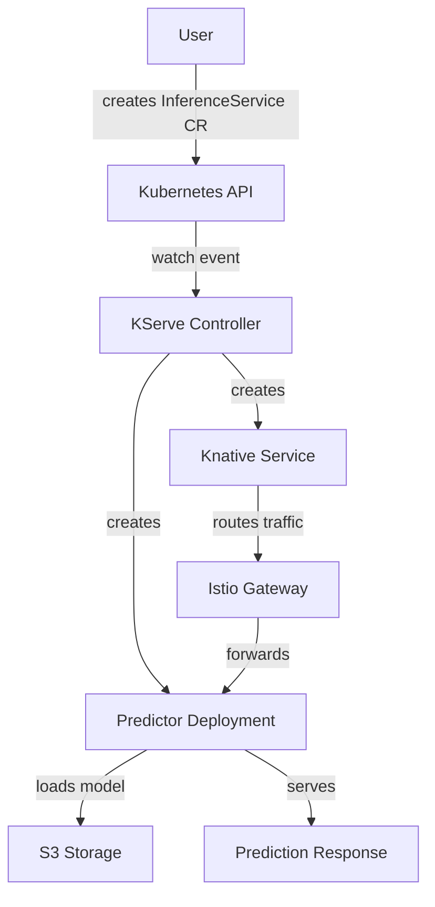

# Architecture Diagram Automation Proposal
**AI-Driven Architecture Documentation Generation for ODH and RHOAI**

**Date**: March 11, 2026
**Status**: Draft Proposal
**Related Initiatives**: RHOAIENG-52636 (AI Automation for RHOAI architecture)
**Context Documents**:
- `./ARCHITECTURE_DIAGRAM_REQUIREMENTS.md` - Requirements from Slack/Jira/repository analysis
- `./RHOAI_LIFECYCLE_ANALYSIS.md` - Feature development lifecycle and process gaps

---

## 🎯 Critical Requirement: Structured Markdown for Security Diagrams

**Issue Identified**: Security diagrams require **precise technical details**, not vague prose:
- ✅ Exact port numbers: `8443/TCP` (not "HTTPS port")
- ✅ Specific protocols: `gRPC/HTTP2`, `PostgreSQL wire protocol` (not "network traffic")
- ✅ TLS versions: `TLS 1.3`, `mTLS with STRICT PeerAuthentication` (not "encrypted")
- ✅ Auth mechanisms: `mTLS client certificates`, `AWS IAM role credentials` (not "authenticated")
- ✅ RBAC details: Specific API groups, resources, verbs (not "has permissions")
- ✅ Network policies: Exact CIDR blocks, port ranges (not "restricted network")

**Solution for MVP (Phase 0)**: **Structured Markdown with Tables**
- Use **markdown tables** for ports, protocols, TLS, auth (machine-parseable by LLMs)
- Use **structured sections** consistently (Network Architecture, Security, Data Flows)
- **LLM-based transpilation**: Claude reads markdown → generates diagrams (Mermaid, security diagrams)
- **Human-editable**: Engineers can review/fix in familiar format
- **Single source of truth**: Markdown is both documentation AND data source

**Optional Enhancement (Phase 1+)**: **Add YAML if needed**
- Consider YAML only if: Template-based transpilation needed for speed, strict schema validation required
- For MVP: Structured markdown is sufficient and simpler

**Why This Matters**: Security Architecture Reviews (SAR) are **mandatory** for RHOAI features. Imprecise diagrams fail security review, blocking releases. Auto-generated diagrams MUST have 100% precision on security-critical details.

**Components Output (Phase 0)**: `GENERATED_ARCHITECTURE.md` (structured markdown with tables)

---

## Executive Summary

This proposal outlines an AI-driven system for automatically generating and maintaining architecture documentation for Open Data Hub (ODH) and Red Hat OpenShift AI (RHOAI). The system addresses the critical 3+ month lag in architecture documentation by:

1. **Scanning component repositories** to generate component-level architecture summaries (structured markdown with tables)
2. **Aggregating component summaries** into platform-level architecture documentation
3. **Generating multiple diagram formats** from structured data (Mermaid, C4, security diagrams, PNG)
4. **Supporting multi-distribution** architecture (ODH upstream + RHOAI downstream)
5. **Producing version-specific diagrams** from release branches
6. **Serving multiple stakeholders** with appropriate diagram types and abstraction levels

**Key Innovation**: Use **structured markdown with tables** as the source of truth (capturing precise port numbers, protocols, TLS versions, auth mechanisms). Diagrams are generated via **LLM-based transpilation** (Claude reads markdown → generates Mermaid/C4/security diagrams), ensuring security diagrams have the exact technical details needed for security reviews.

**🎯 Recommended Starting Point: Skills-Based MVP** (Weeks 1-4, not months)

Instead of building production-grade custom agents immediately, **start with Claude Code skills** for rapid prototyping and stakeholder validation:

- ✅ **Faster to value**: Create 4 skills in days (not custom agents in months)
- ✅ **Lower risk**: Get architect/security feedback BEFORE committing to automation infrastructure
- ✅ **Iterative refinement**: Adjust markdown structure based on real stakeholder feedback
- ✅ **Proof of concept**: Generate actual architecture docs for 5-10 RHOAI components
- ✅ **Decision gate**: Only build production agents (Phase 1+) if MVP validates the approach

**MVP Skills to Create**:
1. `/repo-to-architecture-summary` - Analyze single component repo → Structured markdown
2. `/aggregate-platform-architecture` - Combine component markdowns → Platform architecture
3. `/markdown-to-diagram` - Transpile markdown → Mermaid/C4/security diagrams
4. `/analyze-running-cluster` - QA generated docs against actual deployed cluster

**Why Skills First?**
- Manual invocation is fine for MVP (5-10 components)
- Zero infrastructure to maintain (skills are prompts, not code)
- Rapid iteration on markdown structure and output format
- Real outputs for stakeholder review (not theoretical examples)
- Clear go/no-go decision before building Phase 1 automation

---

## Problem Statement

### Current State (From Lifecycle Analysis)

**Architecture documentation is fundamentally broken**:
- ❌ Architecture docs lag **3+ months** behind product releases (arch-overview.md v2.13 from Dec 2025, product v3.3 from March 2026)
- ❌ **28+ retroactive cleanup tickets** for "Feature documented in architecture diagrams"
- ❌ **Process inversion**: Product docs written BEFORE architecture docs (should be opposite)
- ❌ **No enforcement gates**: Features ship to GA without architecture documentation
- ❌ **Ownership ambiguity**: Unclear who creates/maintains architecture diagrams
- ❌ **Manual maintenance doesn't scale**: 70+ component repositories, multiple versions, dual distributions

### Why Manual Processes Fail

1. **Volume**: 70+ ODH component repositories, each evolving independently
2. **Velocity**: Rapid feature development (RHOAI 3.0 introduces significant changes)
3. **Complexity**: Dual distribution (ODH upstream + RHOAI downstream) with version branches
4. **Distributed ownership**: Component teams implement, architects document (3+ month delay)
5. **Context loss**: Implementation decisions made, code written, then someone tries to reverse-engineer architecture months later

### What We Need

**Architecture documentation that**:
- ✅ Stays current with codebase (auto-updated on commits/releases)
- ✅ Captures implementation reality (not outdated design intentions)
- ✅ Serves multiple stakeholders (engineers, architects, security, customers)
- ✅ Supports multiple distributions (ODH, RHOAI, version branches)
- ✅ Generates multiple diagram types (C4, component, network, deployment)
- ✅ Integrates with existing workflows (ADR repo, product docs, release process)

---

## Proposed Solution: AI Agent-Based Architecture Documentation System

### Core Architecture: Component → Platform Aggregation

**Philosophy**: Architecture documentation should be **derived from implementation**, not manually written after the fact.

```
┌─────────────────────────────────────────────────────────────────┐
│  PHASE 1: COMPONENT ANALYSIS (Parallel per-repo agents)        │
├─────────────────────────────────────────────────────────────────┤
│                                                                 │
│  Component Repo      AI Agent Scans        Component           │
│  ──────────────  →   ─────────────────  →  Architecture        │
│  (Go/Python/TS)      • Code structure       Summary            │
│                      • APIs/interfaces      ──────────          │
│  - Operator CRDs     • Dependencies         (Markdown)         │
│  - API endpoints     • Deployment configs   ──────────          │
│  - Service mesh      • Network topology     • Purpose          │
│  - Config files      • Data flows           • Architecture     │
│  - Helm charts       • Security boundaries  • Dependencies     │
│  - README/docs       • Running clusters     • APIs             │
│                        (optional)            • Deployment       │
│                                              • Network          │
│                                              • Security         │
│                                              • Metadata         │
│                                                                 │
│  Outputs: 70+ component markdown files (one per repo)          │
└─────────────────────────────────────────────────────────────────┘
                              │
                              ▼
┌─────────────────────────────────────────────────────────────────┐
│  PHASE 2: PLATFORM AGGREGATION (Single aggregator agent)       │
├─────────────────────────────────────────────────────────────────┤
│                                                                 │
│  Component           Aggregator Agent     Platform              │
│  Summaries (70+)  →  ────────────────  →  Architecture         │
│  ──────────          • Relationship        Document             │
│  (Markdown)            detection          ────────────          │
│                      • Dependency graph    (Markdown)           │
│  + Version context   • Integration         ────────────         │
│  + Distribution        points              • Overview           │
│    (ODH/RHOAI)       • Network topology    • Components (all)   │
│                      • Data flows          • Integrations       │
│                      • Trust boundaries    • Network arch       │
│                      • Deployment models   • Security           │
│                                            • Deployment          │
│                                              topologies          │
│                                                                 │
│  Outputs: Unified platform architecture markdown               │
└─────────────────────────────────────────────────────────────────┘
                              │
                              ▼
┌─────────────────────────────────────────────────────────────────┐
│  PHASE 3: DIAGRAM GENERATION (Transpilation)                   │
├─────────────────────────────────────────────────────────────────┤
│                                                                 │
│  Platform            Transpilers          Multiple              │
│  Architecture     →  ─────────────────  → Diagram               │
│  (Markdown)          (Template-based)     Formats               │
│                      (LLM-assisted)       ──────────            │
│                                                                 │
│  Stakeholder-specific outputs:                                 │
│                                                                 │
│  • Engineers:        Mermaid (in markdown, PRs, wikis)         │
│  • Architects:       Structurizr/C4 (Context, Container,       │
│                        Component, Deployment views)            │
│  • Security:         Network diagrams (trust boundaries,       │
│                        data flows, attack surface)             │
│  • Product Docs:     PNG/SVG exports (for docs.redhat.com)     │
│  • ADR Repository:   draw.io + PNG (D1-D9 component diagrams)  │
│  • Presentations:    Slide-optimized SVG/PNG                   │
│                                                                 │
│  Outputs: 10+ diagram formats per platform version             │
└─────────────────────────────────────────────────────────────────┘
```

### Key Design Decisions

#### 1. Structured Markdown as Source of Truth (Phase 0 MVP)

**Critical Insight**: Security diagrams require **precise technical details** (port 8443/TCP/TLS1.3, not "uses HTTPS"), but this can be captured in **structured markdown** using tables and consistent section formatting.

**MVP Solution (Phase 0)**: **Structured Markdown Only**

Use markdown with **tables and consistent sections** to capture precise security details:
- **Tables** for ports, protocols, TLS versions, auth mechanisms
- **Structured sections** for consistent parsing (Network Architecture, Security, Data Flows)
- **LLM-based transpilation**: Claude reads markdown → generates diagrams
- **Human-editable**: Engineers can review/fix errors in familiar format
- **Single source of truth**: Markdown is both documentation AND data source

**Why Structured Markdown for MVP?**
- ✅ **Captures security details**: Tables with port 8443/TCP/TLS1.3 (precise, not vague)
- ✅ **Machine-parseable by LLMs**: Claude can read tables and generate diagrams
- ✅ **Human-editable**: Engineers know markdown (no YAML syntax errors)
- ✅ **Git-friendly**: Readable diffs, familiar format
- ✅ **Simpler for MVP**: One format instead of two (YAML + markdown)
- ✅ **LLM-native**: Claude excels at reading/writing structured markdown

**Component Output (Phase 0)**:
```
summaries/
└── kserve/
    └── GENERATED_ARCHITECTURE.md    # Structured markdown (source of truth)
```

**Optional Enhancement (Phase 1+)**: Add YAML if needed for:
- Template-based transpilation (faster than LLM calls at scale)
- Strict schema validation (markdown too flexible)
- Programmatic parsing by non-LLM tools

---

### Component Architecture Markdown Template (Phase 0)

> **📝 IMPORTANT - Phase 0 MVP Uses Structured Markdown (Not YAML)**
>
> For the **Phase 0 MVP**, we use **structured markdown with tables** as the single source of truth. This approach is:
> - ✅ Simpler (one format instead of two)
> - ✅ LLM-native (Claude excels at reading/writing markdown tables)
> - ✅ Human-editable (engineers know markdown, no YAML syntax errors)
> - ✅ Machine-parseable (LLMs can read tables and generate diagrams)
>
> **The YAML schema examples below are for reference only** and represent a potential Phase 1+ enhancement if we need template-based transpilation at scale. **For MVP: Focus on structured markdown, not YAML.**

---

**Purpose**: Structured markdown that captures ALL technical details for security/network diagrams

#### Example: KServe Component Architecture (Structured Markdown)

```markdown
# Component: KServe

## Metadata
- **Repository**: https://github.com/opendatahub-io/kserve
- **Version**: 0.13.0
- **Distribution**: ODH, RHOAI
- **Languages**: Go
- **Deployment Type**: Kubernetes Operator

## Purpose
**Short**: Standardized serverless ML inference platform on Kubernetes

**Detailed**: KServe provides a Kubernetes CRD for serving ML models with auto-scaling, traffic management, and multi-framework support. Enables declarative deployment of inference services with predictors, transformers, and explainers.

## Architecture Components

| Component | Type | Purpose |
|-----------|------|---------|
| kserve-controller-manager | Operator Controller | Watches InferenceService/TrainedModel CRDs, creates Knative Services and predictor Deployments |
| kserve-webhook-server | Validating/Mutating Webhook | Validates InferenceService specs, injects storage initializer containers and ServiceMesh sidecars |

## APIs Exposed

### Custom Resource Definitions (CRDs)

| Group | Version | Kind | Scope | Purpose |
|-------|---------|------|-------|---------|
| serving.kserve.io | v1beta1 | InferenceService | Namespaced | Declares inference service with predictor/transformer/explainer |
| serving.kserve.io | v1alpha1 | TrainedModel | Namespaced | References trained model artifacts for serving |

### HTTP Endpoints

| Path | Method | Port | Protocol | Encryption | Auth | Purpose |
|------|--------|------|----------|------------|------|---------|
| /v1/models/{model_name}:predict | POST | 8080/TCP | HTTP | mTLS (ServiceMesh) | Optional Bearer Token | Model inference endpoint |
| /v1/models/{model_name} | GET | 8080/TCP | HTTP | mTLS (ServiceMesh) | None | Model metadata retrieval |

### gRPC Services

| Service | Port | Protocol | Encryption | Auth | Purpose |
|---------|------|----------|------------|------|---------|
| inference.GRPCInferenceService | 8081/TCP | gRPC | mTLS | Optional mTLS client cert | gRPC inference protocol |

## Dependencies

### External Dependencies

| Component | Version | Required | Purpose |
|-----------|---------|----------|---------|
| Istio | 1.20+ | Yes | Traffic management, mTLS, authn/authz |
| Knative Serving | 1.12+ | Yes | Serverless autoscaling, revision management |
| cert-manager | 1.13+ | Yes | TLS certificate provisioning |

### Internal ODH Dependencies

| Component | Interaction Type | Purpose |
|-----------|------------------|---------|
| odh-model-controller | Watches same CRDs | Model serving coordination |
| service-mesh | Sidecar injection | mTLS, traffic routing |
| model-registry | API calls | Model metadata and artifact locations |

## Network Architecture

### Services

| Service Name | Type | Port | Target Port | Protocol | Encryption | Auth | Exposure |
|--------------|------|------|-------------|----------|------------|------|----------|
| kserve-controller-manager-metrics | ClusterIP | 8080/TCP | 8080 | HTTP | None | Prometheus | Internal only |
| kserve-webhook-server-service | ClusterIP | 443/TCP | 9443 | HTTPS | TLS 1.3 | mTLS client certs | Internal only |

### Ingress

| Name | Type | Hosts | Port | Protocol | Encryption | TLS Mode | Exposure |
|------|------|-------|------|----------|------------|----------|----------|
| istio-gateway | Istio Gateway | *.example.com | 443/TCP | HTTPS | TLS 1.3 | SIMPLE (TLS termination) | External |

### Egress

| Destination | Port | Protocol | Encryption | Auth | Purpose |
|-------------|------|----------|------------|------|---------|
| s3.amazonaws.com | 443/TCP | HTTPS | TLS 1.2+ | AWS IAM credentials | Model artifact download |
| kubernetes.default.svc | 443/TCP | HTTPS | TLS 1.3 | Service account token | Kubernetes API calls |

### Service Mesh Configuration

| Setting | Value | Notes |
|---------|-------|-------|
| mTLS Mode | STRICT | All service-to-service communication must use mTLS |
| Peer Authentication | STRICT (namespace-scoped) | Applied to all pods in deployment namespace |

## Security

### RBAC - Cluster Roles

| Role Name | API Group | Resources | Verbs |
|-----------|-----------|-----------|-------|
| kserve-manager-role | serving.kserve.io | inferenceservices, trainedmodels | get, list, watch, create, update, patch, delete |
| kserve-manager-role | "" (core) | services, serviceaccounts | get, list, watch, create, update, patch, delete |
| kserve-manager-role | apps | deployments | get, list, watch, create, update, patch, delete |

### RBAC - Role Bindings

| Binding Name | Namespace | Role | Service Account |
|--------------|-----------|------|-----------------|
| kserve-manager-rolebinding | {deployment.namespace} | kserve-manager-role | kserve-controller-manager |

### Secrets

| Secret Name | Type | Purpose | Provisioned By | Auto-Rotate |
|-------------|------|---------|----------------|-------------|
| kserve-webhook-server-cert | kubernetes.io/tls | TLS certificate for webhook server | cert-manager | Yes (90 days) |
| storage-config | Opaque | S3 credentials (AWS_ACCESS_KEY_ID, AWS_SECRET_ACCESS_KEY) | Manual/External Secrets Operator | No |

### TLS Certificates

| Certificate | Issuer | Common Name | Validity | Auto-Renewal |
|-------------|--------|-------------|----------|--------------|
| webhook-server-cert | cert-manager | kserve-webhook-server-service.{namespace}.svc | 90 days | Yes |

### Authentication & Authorization

| Endpoint | Methods | Auth Mechanism | Enforcement Point | Policy |
|----------|---------|----------------|-------------------|--------|
| /v1/models/*:predict | POST | Optional Bearer Token | Istio RequestAuthentication | Validated if provided |
| /v1/models/*:predict | POST | Optional mTLS client cert | ServiceMesh | Validated if ServiceMesh enabled |
| /v1/models/*:predict | POST | Namespace-based authz | Istio AuthorizationPolicy | Allow: {deployment.namespace}, user-workbenches; Deny: external |

## Data Flows

### Flow 1: Inference Request (External Client → Model)

| Step | Source | Destination | Port | Protocol | Encryption | Auth |
|------|--------|-------------|------|----------|------------|------|
| 1 | External Client | Istio Gateway | 443/TCP | HTTPS | TLS 1.3 | Optional Bearer Token |
| 2 | Istio Gateway | Knative Activator | 8012/TCP | HTTP | mTLS (ServiceMesh) | Service Identity |
| 3 | Knative Activator | Predictor Pod | 8080/TCP | HTTP | mTLS (ServiceMesh) | Service Identity |
| 4 | Predictor Pod | S3 Storage | 443/TCP | HTTPS | TLS 1.2 | AWS IAM Role |

### Flow 2: Model Deployment (User → InferenceService Created)

| Step | Source | Destination | Port | Protocol | Encryption | Auth | Action |
|------|--------|-------------|------|----------|------------|------|--------|
| 1 | User (kubectl) | Kubernetes API | 6443/TCP | HTTPS | TLS 1.3 | Kubeconfig token | Create InferenceService CR |
| 2 | Kubernetes API | KServe Controller | N/A (internal watch) | Internal | N/A | Service account token | Watch notification |
| 3 | KServe Controller | Kubernetes API | 6443/TCP | HTTPS | TLS 1.3 | Service account token | Create Deployment |

## Integration Points

| Component | Interaction Type | Port | Protocol | Encryption | Purpose |
|-----------|------------------|------|----------|------------|---------|
| model-registry | API Client (gRPC) | 9090/TCP | gRPC | mTLS | Fetch model metadata and artifact URIs |
| data-science-pipelines | CRD Creation | 6443/TCP | Kubernetes API | TLS 1.3 | Automated model deployment from pipelines |
| dashboard | API Client (HTTP) | 8080/TCP | HTTP | mTLS | UI for managing InferenceServices |

## Recent Changes (auto-detected from git)

| Version | Date | Changes |
|---------|------|---------|
| 0.13.0 | 2026-01 | - Added vLLM runtime support for LLM serving<br>- Improved autoscaling (5s → 2s cold start)<br>- Security: Enforced mTLS for all predictor communication |
| 0.12.1 | 2025-11 | - Removed ModelMesh integration (deprecated)<br>- Migrated to Knative-based autoscaling |
```

---

### YAML Schema Reference (Phase 1+ Only)

> **⚠️ NOTE: This section documents the YAML-based approach from the original proposal.**
>
> **For Phase 0 MVP**, we are using **structured markdown with tables** (see example above) as the single source of truth. This YAML schema is included for reference only and represents a potential Phase 1+ enhancement if we need template-based transpilation for performance at scale.
>
> **Phase 0 MVP does NOT use YAML.** The skills will generate and work with structured markdown directly.

The examples below show what auto-generated markdown might look like if we implemented YAML-based templates in Phase 1+:

```markdown
# Component: KServe Operator

## Metadata
- Repository: opendatahub-io/kserve
- Version: 0.13.0
- Distribution: ODH, RHOAI
- Language: Go
- Deployment: Kubernetes Operator

## Purpose
Standardized serverless ML inference platform on Kubernetes...

## Architecture

### Components
- InferenceService Controller (watches InferenceService CRDs)
- Webhook Server (validates/mutates inference service specs)
- Predictor Framework Adapters (SKLearn, XGBoost, TensorFlow, PyTorch, ONNX)

### APIs Exposed
- CRDs:
  - InferenceService (v1beta1)
  - TrainedModel (v1alpha1)
  - ClusterServingRuntime (v1alpha1)
- HTTP/gRPC Inference API (predictor endpoints)

### Dependencies
- External:
  - Istio/Knative (networking, autoscaling)
  - Cert Manager (TLS certificates)
  - Kubernetes API (CRD registration, controllers)
- Internal ODH Components:
  - odh-model-controller (model serving coordination)
  - ServiceMesh (traffic management)

### Deployment Topology
- Namespace: redhat-ods-applications (RHOAI) / opendatahub (ODH)
- Pods:
  - kserve-controller-manager (Deployment, 1 replica)
  - kserve-webhook-server (Deployment, 1 replica)
- Service Accounts: kserve-controller-manager

### Network Architecture
- Ingress: Istio Gateway (external model serving traffic)
- Service Mesh: Envoy sidecars (all predictor pods)
- Internal: ClusterIP services (controller → API server)
- Egress: Model storage access (S3, PVC)

### Security
- RBAC: ClusterRole for CRD management
- mTLS: Between predictor pods (via ServiceMesh)
- Secrets: Model credentials, S3 access keys
- Network Policies: Isolate predictor namespaces

## Data Flows
1. User creates InferenceService CR → kserve-controller watches
2. Controller creates Knative Service + predictor Deployment
3. Inference requests → Istio Gateway → Knative Activator → Predictor pods
4. Predictor loads model from S3/PVC → Serves predictions

## Integration Points
- Model Registry: Fetches model metadata and artifact locations
- Data Science Pipelines: Automated model deployment from pipelines
- Dashboard: UI for managing inference services

## Recent Changes (auto-detected from git)
- v0.13.0 (Jan 2026): Added vLLM runtime support
- v0.12.1 (Nov 2025): Removed ModelMesh integration (deprecated)
```

**Markdown Structure** (Platform-level):
```markdown
# Red Hat OpenShift AI (RHOAI) Platform Architecture

## Metadata
- Version: 3.3
- Release Date: March 2026
- Distribution: RHOAI Self-Managed
- Base Platform: OpenShift Container Platform 4.14+

## Overview
RHOAI is an AI/ML platform for developing, training, and serving models...

## Component Inventory
1. Dashboard (odh-dashboard)
2. Model Serving (KServe, ModelMesh deprecated)
3. Data Science Pipelines (Kubeflow Pipelines v2)
4. Distributed Workloads (Ray, Training Operator, Kueue)
5. Model Registry
... (all 70+ components)

## Namespace Architecture
- redhat-ods-operator: Operator controller
- redhat-ods-applications: Dashboard, model-registry-operator, core services
- redhat-ods-monitoring: Prometheus, Alertmanager, Telemetry
- rhods-notebooks: Workbench deployments

## Component Relationships
[Component A] --depends-on--> [Component B]
[Component A] --integrates-with--> [Component C]
... (auto-derived from component summaries)

## Network Topology
[Auto-aggregated from component network architectures]

## Security Architecture
[Auto-aggregated from component security sections]

## Deployment Models
- Self-Managed Operator: Customer-managed OpenShift clusters
- Cloud Service (deprecated Oct 2025): Red Hat-managed

## Version-Specific Changes (3.3)
- Added: LlamaStack integration (RAG, Gen AI)
- Added: vLLM optimal config recipes
- Removed: ModelMesh (replaced by KServe)
- Updated: Training Operator (v1.8)
```

#### 2. Dual-Distribution Support (ODH + RHOAI)

**Challenge**: ODH (upstream) and RHOAI (downstream) have different:
- Component sets (ODH has experimental features first)
- Namespaces (`opendatahub` vs `redhat-ods-*`)
- Deployment models (community vs enterprise)
- Documentation requirements (minimal vs comprehensive)

**Solution**: Conditional generation based on distribution flag

```bash
# Generate for ODH upstream
./arch-agent.sh --distribution=odh --version=v3.0

# Generate for RHOAI downstream
./arch-agent.sh --distribution=rhoai --version=3.3

# Generate for both
./arch-agent.sh --distribution=both --version=3.3
```

**Component Markdown Includes Distribution Metadata**:
```markdown
## Metadata
- Distribution: ODH, RHOAI  # or "ODH only" or "RHOAI only"
- ODH Namespace: opendatahub
- RHOAI Namespace: redhat-ods-applications
```

**Platform Aggregator Filters/Adapts** based on distribution:
- ODH mode: Include only components with "ODH" or "both"
- RHOAI mode: Include only components with "RHOAI" or "both"
- Namespace substitution: Replace namespace references

#### 3. Version-Specific Diagram Generation

**Challenge**: Need diagrams for:
- Current development (main branch)
- Release branches (RHOAI 3.3, 3.2, 2.25, etc.)
- ODH versions (v3.0, v2.25, v2.24, etc.)

**Solution**: Use gh-org-clone to fetch version-specific codebases

```bash
# Clone all opendatahub-io repos at v3.0 tag
gh-org-clone --org opendatahub-io \
  --output-dir ./repos/odh-v3.0 \
  --tag v3.0 \
  --include-archived=false

# Clone all red-hat-data-services repos at release-3.3 branch
gh-org-clone --org red-hat-data-services \
  --output-dir ./repos/rhoai-3.3 \
  --branch release-3.3 \
  --include-archived=false

# Run component agents on version-specific repos
./component-agent.sh --repo-dir ./repos/rhoai-3.3/kserve \
  --output ./summaries/rhoai-3.3/kserve.md

# Aggregate for specific version
./platform-agent.sh --summaries-dir ./summaries/rhoai-3.3 \
  --version 3.3 \
  --distribution rhoai \
  --output ./platform/rhoai-3.3-architecture.md
```

**Benefit**: Can regenerate historical architecture documentation to fill gaps

#### 4. Running Cluster Inspection (Optional Enhancement)

**Current Proposal**: Scan code repositories (static analysis)

**Future Enhancement**: Also scan running clusters (dynamic analysis)

**Why?**
- ✅ Captures actual runtime topology (not just intended design)
- ✅ Detects configuration drift (cluster state vs code)
- ✅ Discovers emergent architecture (integration patterns not in code)
- ✅ Validates security policies (actual vs declared)

**How?**
```bash
# Component agent with cluster access
./component-agent.sh --repo-dir ./repos/kserve \
  --kubeconfig ~/.kube/config \
  --namespace redhat-ods-applications \
  --include-runtime-topology

# Agent queries:
# - Running pods/deployments
# - Service endpoints and routes
# - ConfigMaps/Secrets
# - Network policies
# - RBAC rules
# - Resource usage
# - Inter-service traffic (if ServiceMesh telemetry available)
```

**Trade-offs**:
- ➕ More accurate (reality vs intention)
- ➕ Detects undocumented patterns
- ➖ Requires cluster access (security/permissions)
- ➖ Slower (API calls vs local file reads)
- ➖ May vary by cluster (dev vs prod)

**Recommendation**: Start with code-only, add cluster inspection as Phase 2

---

## Component Agent Design

### Inputs
1. **Repository directory** (local clone of component repo)
2. **Configuration**:
   - Component name
   - Distribution (ODH/RHOAI/both)
   - Version/tag
   - Output path for markdown

### Analysis Steps

**Step 1: Repository Discovery**
- Language detection (Go, Python, TypeScript, Java)
- Framework detection (Operator SDK, Flask/FastAPI, React)
- Build system (Makefile, Dockerfile, Helm charts, Kustomize)

**Step 2: Code Analysis**
- **Operators**: Parse CRD definitions, controller logic, reconcile loops
- **APIs**: Extract endpoints (REST, gRPC), schemas (OpenAPI, Protobuf)
- **Services**: Identify service types (ClusterIP, NodePort, LoadBalancer, Route)
- **Dependencies**: Parse go.mod, requirements.txt, package.json
- **Configuration**: Read ConfigMaps, environment variables, flags

**Step 3: Deployment Analysis**
- **Kubernetes manifests**: Deployments, StatefulSets, DaemonSets, Jobs
- **Helm charts**: Values, templates, dependencies
- **Kustomize**: Overlays, patches, namespace mappings
- **Namespace detection**: ODH vs RHOAI namespace patterns

**Step 4: Network Analysis**
- **Services**: Port mappings, selectors
- **Ingress/Routes**: External access patterns
- **NetworkPolicies**: Ingress/egress rules
- **ServiceMesh**: VirtualServices, DestinationRules, Gateways

**Step 5: Security Analysis**
- **RBAC**: ClusterRoles, Roles, RoleBindings
- **ServiceAccounts**: Permissions, token mounts
- **Secrets**: Types, references (not values)
- **TLS/mTLS**: Certificate management, encryption

**Step 6: Documentation Mining**
- **README.md**: Purpose, architecture overview
- **DESIGN.md** (if exists): Design decisions
- **API docs**: Auto-generated or manual
- **ADRs** (if in repo): Architecture decisions

**Step 7: Git History Analysis (Recent Changes)**
- Last 3 months of commits
- Major version bumps
- Deprecated features
- New integrations

### Output Format
Markdown file following component template (see above)

### Example Implementation (Pseudo-code)

```python
# component-agent.py
import os
import yaml
import json
from pathlib import Path
from anthropic import Anthropic

class ComponentArchitectureAgent:
    def __init__(self, repo_dir, component_name, distribution, version):
        self.repo_dir = Path(repo_dir)
        self.component_name = component_name
        self.distribution = distribution
        self.version = version
        self.client = Anthropic()

    def analyze(self):
        """Main analysis pipeline"""
        repo_structure = self.discover_repository()
        code_analysis = self.analyze_code(repo_structure)
        deployment = self.analyze_deployment()
        network = self.analyze_network()
        security = self.analyze_security()
        docs = self.mine_documentation()
        recent_changes = self.analyze_git_history()

        # LLM synthesizes all data into markdown
        summary = self.synthesize_summary({
            'repo_structure': repo_structure,
            'code_analysis': code_analysis,
            'deployment': deployment,
            'network': network,
            'security': security,
            'documentation': docs,
            'recent_changes': recent_changes
        })

        return summary

    def discover_repository(self):
        """Detect languages, frameworks, build systems"""
        files = {
            'go': list(self.repo_dir.rglob('*.go')),
            'python': list(self.repo_dir.rglob('*.py')),
            'typescript': list(self.repo_dir.rglob('*.ts')),
            'crds': list(self.repo_dir.rglob('*_crd.yaml')),
            'helm': list(self.repo_dir.rglob('Chart.yaml')),
            'kustomize': list(self.repo_dir.rglob('kustomization.yaml')),
            'dockerfile': list(self.repo_dir.rglob('Dockerfile')),
        }

        return {
            'languages': self._detect_languages(files),
            'framework': self._detect_framework(files),
            'build_system': self._detect_build_system(files),
            'file_inventory': {k: len(v) for k, v in files.items()}
        }

    def analyze_code(self, repo_structure):
        """Use Claude Code Agent to analyze code structure"""
        if repo_structure['languages'].get('go'):
            return self._analyze_go_operator()
        elif repo_structure['languages'].get('python'):
            return self._analyze_python_service()
        # ... etc

    def _analyze_go_operator(self):
        """Analyze Go-based Kubernetes operator"""
        # Find CRDs
        crds = list(self.repo_dir.rglob('*_crd.yaml'))

        # Parse CRD definitions
        crd_data = []
        for crd_file in crds:
            with open(crd_file) as f:
                crd = yaml.safe_load(f)
                crd_data.append({
                    'kind': crd['spec']['names']['kind'],
                    'group': crd['spec']['group'],
                    'version': crd['spec']['versions'][0]['name'],
                    'file': str(crd_file.relative_to(self.repo_dir))
                })

        # Find controller code
        controllers = list(self.repo_dir.rglob('*_controller.go'))

        # Use Claude to analyze controller logic
        analysis = self.client.messages.create(
            model="claude-sonnet-4-5",
            max_tokens=4000,
            messages=[{
                "role": "user",
                "content": f"""Analyze this Kubernetes operator:

Repository: {self.component_name}
CRDs found: {json.dumps(crd_data, indent=2)}
Controllers: {[str(c.relative_to(self.repo_dir)) for c in controllers]}

For each controller, identify:
1. What CRD it watches
2. Reconciliation logic (what it does)
3. External API calls (Kubernetes API, other services)
4. Error handling patterns
5. Status updates

Respond in structured JSON."""
            }]
        )

        return json.loads(analysis.content[0].text)

    def analyze_deployment(self):
        """Analyze Kubernetes deployment manifests"""
        # Find Helm charts
        charts = list(self.repo_dir.rglob('Chart.yaml'))

        # Find Kustomize
        kustomize = list(self.repo_dir.rglob('kustomization.yaml'))

        # Find raw manifests
        manifests = list(self.repo_dir.rglob('*.yaml'))
        manifests = [m for m in manifests if 'kind: Deployment' in m.read_text() or 'kind: StatefulSet' in m.read_text()]

        deployment_info = {
            'helm_charts': [self._parse_helm_chart(c) for c in charts],
            'kustomize_overlays': [self._parse_kustomize(k) for k in kustomize],
            'raw_manifests': [self._parse_manifest(m) for m in manifests]
        }

        return deployment_info

    def analyze_network(self):
        """Analyze network topology"""
        services = list(self.repo_dir.rglob('*.yaml'))
        services = [s for s in services if 'kind: Service' in s.read_text()]

        routes = [s for s in services if 'kind: Route' in s.read_text()]
        ingress = [s for s in services if 'kind: Ingress' in s.read_text()]

        network_policies = [s for s in services if 'kind: NetworkPolicy' in s.read_text()]

        return {
            'services': [self._parse_service(s) for s in services],
            'routes': [self._parse_route(r) for r in routes],
            'ingress': [self._parse_ingress(i) for i in ingress],
            'network_policies': [self._parse_network_policy(np) for np in network_policies]
        }

    def synthesize_summary(self, analysis_data):
        """Use Claude to synthesize all analysis into YAML (structured) + Markdown (narrative)"""

        # First, generate structured YAML
        yaml_output = self._generate_structured_yaml(analysis_data)

        # Then, generate markdown from YAML
        markdown_output = self._generate_markdown_from_yaml(yaml_output)

        return {
            'yaml': yaml_output,
            'markdown': markdown_output
        }

    def _generate_structured_yaml(self, analysis_data):
        """Generate structured YAML with precise security/network details"""

        prompt = f"""You are analyzing the {self.component_name} component for {self.distribution} version {self.version}.

Here is all the analysis data collected:

{json.dumps(analysis_data, indent=2, default=str)}

Generate a comprehensive component architecture in STRUCTURED YAML format.

CRITICAL: For security diagrams, we need PRECISE details:
- Exact port numbers (not "HTTPS port" but "443/TCP")
- Specific protocols (HTTP/1.1, gRPC, PostgreSQL wire protocol, etc.)
- TLS versions (TLS 1.3, TLS 1.2, plaintext)
- Authentication mechanisms (Bearer tokens, mTLS client certs, AWS IAM, etc.)
- Authorization details (RBAC roles, Istio AuthorizationPolicies, NetworkPolicies)
- Network policies with specific CIDR blocks and port ranges

Follow this YAML schema exactly:

metadata:
  name: string
  repository: string
  version: string
  distribution: [ODH, RHOAI]  # or [ODH] or [RHOAI]
  languages: [Go, Python, TypeScript, etc.]
  deployment_type: kubernetes_operator | python_service | react_app

purpose:
  short: string (1 sentence)
  detailed: string (1-2 paragraphs)

architecture:
  components: [list of component objects]

apis:
  crds: [list with group, version, kind]
  http_endpoints: [list with path, method, purpose, authentication, authorization]
  grpc_services: [list with service, port, purpose, authentication]

dependencies:
  external: [list with name, purpose, version, required bool]
  internal_odh: [list with name, purpose, interaction]

deployment:
  namespaces: {odh: string, rhoai: string}
  resources: [list of k8s resources with EXACT specs]
  service_accounts: [list with namespace, automount bool]

network:
  services: [name, type, ports (NUMBER/PROTOCOL), selector, internal_only bool]
  ingress: [name, type, hosts, ports (NUMBER/PROTOCOL/TLS_MODE), external bool]
  egress: [destination, port NUMBER, protocol, purpose, encryption TLS_VERSION, authentication]
  network_policies: [name, pod_selector, policy_types, ingress/egress rules with EXACT ports]
  service_mesh: {mtls_mode, peer_authentication, authorization_policies}

security:
  rbac: {cluster_roles, role_bindings with EXACT API groups/resources/verbs}
  secrets: [name, type, purpose, provisioned_by, auto_rotation, contains]
  tls_certificates: [name, issued_by, common_name, validity, auto_renewal]
  authentication: [endpoint, methods, mechanisms (be specific: bearer_token, mtls_client_cert, oauth2, etc.)]
  authorization: [endpoint, methods, enforcement (RBAC, Istio, OPA), policies]

data_flows:
  - name: string
    steps:
      - source: string
        destination: string
        port: NUMBER (not "HTTPS" but "443")
        protocol: string (HTTP/1.1, gRPC, PostgreSQL, etc.)
        encryption: string (TLS1.3, TLS1.2, mTLS, plaintext)
        authentication: string (bearer_token, service_account_token, AWS_IAM_role, etc.)
        action: string (optional, what happens)

integration_points: [component, interaction_type, protocol, port NUMBER, encryption, purpose]

recent_changes: [version, date, changes list]

Output ONLY valid YAML. Be PRECISE with numbers and technical details.
"""

        response = self.client.messages.create(
            model="claude-sonnet-4-5",
            max_tokens=8000,
            messages=[{"role": "user", "content": prompt}]
        )

        return yaml.safe_load(response.content[0].text)

    def _generate_markdown_from_yaml(self, yaml_data):
        """Generate human-readable markdown from structured YAML"""

        # Use a template-based approach for consistency
        template = """# Component: {name}

## Metadata
- Repository: {repository}
- Version: {version}
- Distribution: {distribution}
- Language: {languages}
- Deployment: {deployment_type}

## Purpose
{purpose_detailed}

## Architecture

### Components
{components_list}

### APIs Exposed
{apis_section}

### Dependencies
{dependencies_section}

### Deployment Topology
{deployment_section}

### Network Architecture
{network_section}

### Security
{security_section}

## Data Flows
{data_flows_section}

## Integration Points
{integration_points_section}

## Recent Changes
{recent_changes_section}
"""

        # Populate template from YAML data
        # (simplified - actual implementation would be more sophisticated)
        markdown = template.format(
            name=yaml_data['metadata']['name'],
            repository=yaml_data['metadata']['repository'],
            version=yaml_data['metadata']['version'],
            distribution=', '.join(yaml_data['metadata']['distribution']),
            languages=', '.join(yaml_data['metadata']['languages']),
            deployment_type=yaml_data['metadata']['deployment_type'],
            purpose_detailed=yaml_data['purpose']['detailed'],
            # ... (render other sections from YAML)
        )

        return markdown

# Usage
if __name__ == "__main__":
    agent = ComponentArchitectureAgent(
        repo_dir="./repos/rhoai-3.3/kserve",
        component_name="KServe",
        distribution="RHOAI",
        version="3.3"
    )

    result = agent.analyze()

    # Save YAML (source of truth)
    with open("./summaries/rhoai-3.3/kserve.yaml", "w") as f:
        yaml.dump(result['yaml'], f, default_flow_style=False, sort_keys=False)

    # Save Markdown (generated from YAML, for human reading)
    with open("./summaries/rhoai-3.3/kserve.md", "w") as f:
        f.write(result['markdown'])
```

---

## Platform Aggregation Agent Design

### Inputs
1. **Component summary directory** (all component markdown files)
2. **Configuration**:
   - Distribution (ODH/RHOAI)
   - Version
   - Output path for platform architecture markdown

### Aggregation Steps

**Step 1: Load Component Summaries**
- Read all component .md files
- Parse metadata sections
- Filter by distribution (if ODH-only, exclude RHOAI-only components)

**Step 2: Dependency Graph Construction**
- Extract "Dependencies" sections from each component
- Build directed graph: Component A → depends on → Component B
- Detect dependency cycles (flag as issues)
- Identify integration points (bidirectional relationships)

**Step 3: Namespace Architecture**
- Aggregate all namespace references
- Group components by namespace
- Identify cross-namespace communication patterns

**Step 4: Network Topology Aggregation**
- Merge all "Network Architecture" sections
- Build platform-wide network map:
  - Ingress points (external → cluster)
  - Inter-component communication (service → service)
  - Egress points (cluster → external, e.g., S3)
- Identify service mesh patterns

**Step 5: Security Architecture Aggregation**
- Aggregate RBAC roles across components
- Map trust boundaries (namespace isolation, network policies)
- Identify secret sharing patterns
- Document mTLS/TLS usage

**Step 6: Data Flow Synthesis**
- Trace end-to-end data flows:
  - Example: "User creates InferenceService → Dashboard → KServe Operator → Model Server → S3 Model Storage"
- Identify critical data paths
- Document data persistence patterns

**Step 7: Deployment Topology**
- Count total pods/deployments across components
- Identify high-availability patterns (replicas, anti-affinity)
- Document resource requirements (aggregated)

**Step 8: Version-Specific Change Detection**
- Compare component "Recent Changes" sections
- Summarize what's new in this platform version
- Identify deprecated components

### Output Format
Platform architecture markdown (see template above)

### Example Implementation (Pseudo-code)

```python
# platform-agent.py
import os
import re
from pathlib import Path
from anthropic import Anthropic
import networkx as nx

class PlatformArchitectureAgent:
    def __init__(self, summaries_dir, distribution, version):
        self.summaries_dir = Path(summaries_dir)
        self.distribution = distribution
        self.version = version
        self.client = Anthropic()
        self.dependency_graph = nx.DiGraph()

    def aggregate(self):
        """Main aggregation pipeline"""
        components = self.load_components()
        components = self.filter_by_distribution(components)

        self.build_dependency_graph(components)
        namespace_arch = self.aggregate_namespaces(components)
        network_topology = self.aggregate_network(components)
        security_arch = self.aggregate_security(components)
        data_flows = self.synthesize_data_flows(components)
        deployment = self.aggregate_deployment(components)
        changes = self.aggregate_changes(components)

        # LLM synthesizes into platform architecture
        platform_doc = self.synthesize_platform_doc({
            'components': components,
            'dependency_graph': self.dependency_graph,
            'namespace_arch': namespace_arch,
            'network_topology': network_topology,
            'security_arch': security_arch,
            'data_flows': data_flows,
            'deployment': deployment,
            'version_changes': changes
        })

        return platform_doc

    def load_components(self):
        """Load all component markdown summaries"""
        components = []
        for md_file in self.summaries_dir.glob('*.md'):
            with open(md_file) as f:
                content = f.read()
                metadata = self._parse_metadata(content)
                components.append({
                    'name': md_file.stem,
                    'file': str(md_file),
                    'metadata': metadata,
                    'content': content
                })
        return components

    def filter_by_distribution(self, components):
        """Filter components by distribution"""
        filtered = []
        for comp in components:
            dist = comp['metadata'].get('distribution', '').lower()
            if self.distribution.lower() in dist or 'both' in dist:
                filtered.append(comp)
        return filtered

    def build_dependency_graph(self, components):
        """Build directed graph of component dependencies"""
        for comp in components:
            comp_name = comp['name']
            self.dependency_graph.add_node(comp_name)

            # Extract dependencies from markdown
            deps = self._extract_dependencies(comp['content'])
            for dep in deps:
                self.dependency_graph.add_edge(comp_name, dep)

        # Detect cycles
        try:
            cycles = nx.find_cycle(self.dependency_graph)
            print(f"WARNING: Dependency cycle detected: {cycles}")
        except nx.NetworkXNoCycle:
            pass

    def aggregate_network(self, components):
        """Aggregate network topology from all components"""
        all_services = []
        all_routes = []
        all_network_policies = []

        for comp in components:
            # Parse network section
            network_section = self._extract_section(comp['content'], 'Network Architecture')
            if network_section:
                # Use LLM to extract structured network data
                network_data = self._llm_parse_network(network_section, comp['name'])
                all_services.extend(network_data.get('services', []))
                all_routes.extend(network_data.get('routes', []))
                all_network_policies.extend(network_data.get('policies', []))

        # Build network topology map
        topology = {
            'ingress_points': [s for s in all_services if s.get('external', False)],
            'internal_services': [s for s in all_services if not s.get('external', False)],
            'routes': all_routes,
            'network_policies': all_network_policies,
            'service_mesh_enabled': self._detect_service_mesh(components)
        }

        return topology

    def synthesize_platform_doc(self, aggregated_data):
        """Use Claude to synthesize platform architecture markdown"""

        prompt = f"""You are synthesizing the platform-level architecture documentation for {self.distribution} version {self.version}.

You have analyzed {len(aggregated_data['components'])} components.

Here is the aggregated analysis data:

Component List:
{[c['name'] for c in aggregated_data['components']]}

Dependency Graph (edges):
{list(aggregated_data['dependency_graph'].edges())}

Namespace Architecture:
{aggregated_data['namespace_arch']}

Network Topology:
{aggregated_data['network_topology']}

Security Architecture:
{aggregated_data['security_arch']}

Key Data Flows:
{aggregated_data['data_flows']}

Version-Specific Changes:
{aggregated_data['version_changes']}

Generate a comprehensive platform architecture document in markdown format following this template:

# {self.distribution} Platform Architecture

## Metadata
- Version: {self.version}
- Release Date: [infer from version]
- Distribution: {self.distribution}
- Base Platform: OpenShift Container Platform

## Overview
[High-level description of the platform]

## Component Inventory
[List all {len(aggregated_data['components'])} components with brief descriptions]

## Namespace Architecture
[Document namespace structure and component placement]

## Component Relationships
[Describe dependency graph, integration points]

## Network Topology
[Platform-wide network architecture]

## Security Architecture
[Aggregated security boundaries, RBAC, trust zones]

## Deployment Models
[How the platform can be deployed]

## Key Data Flows
[End-to-end workflows across components]

## Version-Specific Changes ({self.version})
[What's new, deprecated, changed in this version]

Be comprehensive, technical, and specific. This will be used by architects and engineers.
"""

        response = self.client.messages.create(
            model="claude-sonnet-4-5",
            max_tokens=16000,
            messages=[{"role": "user", "content": prompt}]
        )

        return response.content[0].text

# Usage
if __name__ == "__main__":
    agent = PlatformArchitectureAgent(
        summaries_dir="./summaries/rhoai-3.3",
        distribution="RHOAI",
        version="3.3"
    )

    platform_doc = agent.aggregate()

    with open("./platform/rhoai-3.3-architecture.md", "w") as f:
        f.write(platform_doc)
```

---

## Diagram Transpilation

> **📝 NOTE: This section describes diagram generation approaches for Phase 0 MVP and Phase 1+**
>
> **Phase 0 MVP**: Diagrams are generated from **structured markdown with tables** via **LLM-based transpilation** (Claude reads markdown → generates diagrams). This is simpler and sufficient for validating the approach.
>
> **Phase 1+ (Optional)**: If needed for performance at scale, diagrams could be generated from YAML via template-based transpilation. The examples below show both approaches.

### Supported Output Formats

**Phase 0 MVP Transpilation Pipeline (LLM-based)**:
```
Component Markdown (tables) → LLM reads → Diagram Formats (Mermaid, C4, PNG, etc.)
```

**Phase 1+ Alternative (Template-based, if needed for scale)**:
```
Component YAML (70+ files) → Platform YAML (aggregated) → Diagram Formats (Mermaid, C4, PNG, etc.)
                    ↓
              Markdown (narrative docs, auto-generated from YAML)
```

Once we have structured data (markdown for Phase 0, YAML for Phase 1+), we can transpile to any diagram format needed:

#### 1. Mermaid (for markdown, PRs, GitHub/GitLab wikis)

**Use Case**: Embed diagrams in markdown files, ADRs, pull requests

**Example Transpilation** (Component Diagram):


**Transpiler**: Template-based (preferred for consistency) or LLM-assisted

```python
def transpile_to_mermaid_component_diagram(component_yaml):
    """Convert component YAML to Mermaid diagram"""

    # Extract data_flows from YAML (already structured!)
    data_flows = component_yaml['data_flows']

    # Template-based generation for consistency
    mermaid_lines = ["graph TB"]

    for flow in data_flows:
        flow_name = flow['name']
        for i, step in enumerate(flow['steps']):
            source = sanitize_node_name(step['source'])
            dest = sanitize_node_name(step['destination'])

            # Include precise details from YAML
            label = f"{step['port']}/{step['protocol']}<br/>{step['encryption']}<br/>{step['authentication']}"

            mermaid_lines.append(f'    {source} -->|{label}| {dest}')

    return '\n'.join(mermaid_lines)

# Result includes PRECISE details:
# User -->|443/TCP HTTPS<br/>TLS1.3<br/>Bearer Token| Gateway
# Gateway -->|8012/TCP HTTP<br/>mTLS<br/>Service Identity| Predictor
```

**Why Template-Based > LLM for Diagrams**:
- ✅ Deterministic (same YAML = same diagram, every time)
- ✅ Precise (ports/protocols from YAML, not hallucinated)
- ✅ Fast (no LLM API calls for diagram generation)
- ✅ Debuggable (inspect template logic)
- ❌ LLM useful for: YAML generation (synthesis from code), not diagram rendering

#### 2. Structurizr/C4 (for architects, formal documentation)

**Use Case**: Generate C4 model diagrams (Context, Container, Component, Deployment views)

**Example**: C4 Context Diagram (Platform-level)
```
workspace {
    model {
        user = person "Data Scientist"
        rhoai = softwareSystem "Red Hat OpenShift AI" {
            description "AI/ML platform for model development, training, serving"

            dashboard = container "Dashboard" {
                technology "React, TypeScript"
            }
            kserve = container "KServe" {
                technology "Go, Kubernetes Operator"
            }
            pipelines = container "Data Science Pipelines" {
                technology "Kubeflow Pipelines, Argo"
            }
        }

        s3 = softwareSystem "S3 Object Storage" "Model and data storage"

        user -> dashboard "Manages models and workbenches"
        dashboard -> kserve "Deploys models"
        kserve -> s3 "Loads models"
    }

    views {
        systemContext rhoai {
            include *
            autolayout lr
        }
    }
}
```

**Transpiler**:
```python
def transpile_to_c4_context(platform_md):
    """Convert platform markdown to C4 context diagram (Structurizr DSL)"""
    # Extract component inventory, relationships, external dependencies
    components = extract_section(platform_md, "Component Inventory")
    relationships = extract_section(platform_md, "Component Relationships")

    prompt = f"""Generate a C4 Context diagram in Structurizr DSL format for this platform:

Components: {components}
Relationships: {relationships}

Include:
- person (Data Scientist, Administrator)
- softwareSystem (Red Hat OpenShift AI)
- external systems (S3, databases, etc.)
- relationships between them

Output valid Structurizr DSL."""

    # ... LLM generates C4 DSL
```

#### 3. draw.io XML (for ADR repository D1-D9 diagrams)

**Use Case**: Generate editable diagrams for `architecture-decision-records/documentation/diagram/`

**Challenge**: draw.io uses XML format with geometric coordinates

**Solution**:
- Option A: Generate Mermaid, use mermaid-to-drawio converter
- Option B: Use draw.io template files, populate with component data
- Option C: Generate GraphML, import into draw.io

**Recommended**: Start with Mermaid → PNG export for ADR repo, add draw.io XML generation as Phase 2

#### 4. PNG/SVG (for product docs, presentations)

**Use Case**: Static images for docs.redhat.com, slides, ADR repo

**Pipeline**:
```
Markdown → Mermaid/Structurizr → Render to PNG/SVG
```

**Tools**:
- Mermaid CLI: `mmdc -i diagram.mmd -o diagram.png`
- Structurizr CLI: Export to PNG/SVG
- Kroki API: Universal diagram rendering service

#### 5. Network Diagrams (for Security Reviews)

**Use Case**: Security Architecture Reviews (SAR) require **precise network topology** with ports, protocols, encryption, and authentication details

**Source Data (Phase 0)**: Generated from component structured markdown `Network Architecture` and `Security` tables
**Source Data (Phase 1+)**: Generated from component YAML `network` and `security` sections (if YAML is adopted)

**Example Security Network Diagram** (generated from KServe architecture markdown):

```
┌─────────────────────────────────────────────────────────────────────┐
│  EXTERNAL (Untrusted)                                               │
│                                                                     │
│  [External Client]                                                  │
│         │                                                           │
│         │ Port: 443/TCP                                             │
│         │ Protocol: HTTPS                                           │
│         │ Encryption: TLS 1.3                                       │
│         │ Auth: Bearer Token (optional)                             │
│         ▼                                                           │
└─────────────────────────────────────────────────────────────────────┘
         │
         │ TRUST BOUNDARY: External → DMZ
         │ (TLS termination, token validation)
         ▼
┌─────────────────────────────────────────────────────────────────────┐
│  INGRESS ZONE (DMZ)                                                 │
│                                                                     │
│  [Istio Gateway]                                                    │
│         │                                                           │
│         │ Port: 8012/TCP                                            │
│         │ Protocol: HTTP (internal)                                 │
│         │ Encryption: mTLS (ServiceMesh)                            │
│         │ Auth: Service Identity                                    │
│         ▼                                                           │
│  [Knative Activator]                                                │
│         │                                                           │
│         │ Port: 8080/TCP                                            │
│         │ Protocol: HTTP                                            │
│         │ Encryption: mTLS (Istio peer auth: STRICT)                │
│         │ Auth: Service principal                                   │
│         ▼                                                           │
└─────────────────────────────────────────────────────────────────────┘
         │
         │ TRUST BOUNDARY: DMZ → Application
         │ (Authorization policy: allow predictor namespace only)
         ▼
┌─────────────────────────────────────────────────────────────────────┐
│  APPLICATION ZONE (redhat-ods-applications)                         │
│                                                                     │
│  [Predictor Pod - KServe Runtime]                                  │
│         │                              │                            │
│         │ Egress to S3                 │ Metrics export             │
│         │ Port: 443/TCP                │ Port: 8080/TCP             │
│         │ Protocol: HTTPS              │ Protocol: HTTP             │
│         │ Encryption: TLS 1.2          │ Encryption: mTLS           │
│         │ Auth: AWS IAM credentials    │ Auth: ServiceAccount       │
│         ▼                              ▼                            │
│  [S3 Storage]              [Prometheus - monitoring namespace]      │
│                                                                     │
│  Network Policy: kserve-controller-egress                           │
│    - Allow: kube-system (port 443/TCP) for K8s API                  │
│    - Allow: predictor namespaces (port 8080/TCP) for metrics        │
│    - Deny: All other egress                                         │
└─────────────────────────────────────────────────────────────────────┘

┌─────────────────────────────────────────────────────────────────────┐
│  CONTROL PLANE (kube-system)                                        │
│                                                                     │
│  [Kubernetes API Server]                                            │
│         ▲                                                           │
│         │ Port: 6443/TCP                                            │
│         │ Protocol: HTTPS                                           │
│         │ Encryption: TLS 1.3                                       │
│         │ Auth: ServiceAccount token                                │
│         │ RBAC: kserve-manager-role                                 │
│         │   - serving.kserve.io/* (all verbs)                       │
│         │   - apps/deployments (all verbs)                          │
│         │   - core/services (all verbs)                             │
│         │                                                           │
│  [KServe Controller Manager]                                        │
│    Namespace: redhat-ods-applications                               │
│    ServiceAccount: kserve-controller-manager                        │
└─────────────────────────────────────────────────────────────────────┘

SECRETS MANAGEMENT:
• kserve-webhook-server-cert (TLS cert for webhook, cert-manager, auto-rotate 90d)
• storage-config (S3 credentials, injected into predictor pods)

MTLS CONFIGURATION:
• Istio PeerAuthentication: STRICT mode (all service-to-service)
• No plaintext communication allowed within cluster
• Gateway performs TLS termination for external traffic

AUTHORIZATION:
• Istio AuthorizationPolicy: kserve-controller-access
  - Allow: kserve-controller-manager service principal
  - Methods: GET, POST, PUT, DELETE
  - Resources: InferenceServices, TrainedModels
• Network Policy enforcement at namespace boundaries
```

**Key Security Details Captured from YAML**:
- ✅ **Exact port numbers**: 443, 8012, 8080, 6443
- ✅ **Protocols**: HTTPS, HTTP, gRPC (not generic "web traffic")
- ✅ **TLS versions**: TLS 1.3 (external), TLS 1.2 (S3), mTLS (internal)
- ✅ **Authentication mechanisms**: Bearer tokens, AWS IAM, ServiceAccount tokens, mTLS client certs
- ✅ **Authorization**: RBAC roles/permissions, Istio AuthorizationPolicies, NetworkPolicies
- ✅ **Trust boundaries**: External → DMZ → Application → Control Plane
- ✅ **Secrets management**: What secrets exist, how provisioned, rotation policy
- ✅ **Network policies**: Explicit allow/deny rules with ports/protocols

**Transpiler Implementation**:
```python
def transpile_to_security_network_diagram(component_yaml):
    """Generate security-focused network diagram from structured YAML"""

    network = component_yaml['network']
    security = component_yaml['security']
    data_flows = component_yaml['data_flows']

    # Extract trust boundaries
    zones = {
        'external': [],
        'dmz': [],
        'application': [],
        'control_plane': []
    }

    # Map data flows to zones
    for flow in data_flows:
        for step in flow['steps']:
            zone = classify_zone(step['source'], step['destination'])
            zones[zone].append({
                'source': step['source'],
                'destination': step['destination'],
                'port': step['port'],
                'protocol': step['protocol'],
                'encryption': step['encryption'],
                'authentication': step['authentication']
            })

    # Generate diagram with precise security details
    diagram = render_security_diagram_template(
        zones=zones,
        network_policies=network['network_policies'],
        rbac=security['rbac'],
        secrets=security['secrets'],
        mtls_config=network.get('service_mesh', {})
    )

    return diagram
```

**Output Formats**:
- ASCII diagram (for text documents, ADRs)
- Mermaid flowchart (for markdown embedding)
- draw.io XML (with color-coded security zones)
- PlantUML (for formal security docs)

---

## Integration with Existing Workflows

### 1. ADR Repository Integration

**Goal**: Auto-update `architecture-decision-records/documentation/arch-overview.md` and D1-D9 diagrams

**Workflow**:
```bash
# Generate platform architecture for RHOAI 3.3
./platform-agent.sh --distribution rhoai --version 3.3 \
  --output ./output/rhoai-3.3-architecture.md

# Transpile to arch-overview.md format
./transpile.sh --input ./output/rhoai-3.3-architecture.md \
  --format adr-overview \
  --output ./architecture-decision-records/documentation/arch-overview.md

# Generate D1-D9 component diagrams
./transpile.sh --input ./summaries/rhoai-3.3/*.md \
  --format d-diagrams \
  --output-dir ./architecture-decision-records/documentation/images/

# Create PR to ADR repo
cd ./architecture-decision-records
git checkout -b auto-update-arch-3.3
git add documentation/arch-overview.md documentation/images/
git commit -m "Auto-update architecture docs for RHOAI 3.3

Generated by architecture automation agent (RHOAIENG-52636)
Source: Component analysis of release-3.3 branches

Co-Authored-By: Architecture Automation Agent <<REMOVED>>"
git push origin auto-update-arch-3.3
gh pr create --title "Update architecture docs for RHOAI 3.3" --body "..."
```

**Benefits**:
- ✅ Eliminates 3+ month lag (auto-generated on release branch cut)
- ✅ Ensures arch-overview.md matches actual codebase
- ✅ Creates audit trail (PR with diffs)
- ✅ Human review before merge (architects can edit)

### 2. Product Documentation Integration

**Goal**: Generate architecture content for `openshift-ai-documentation/modules/architecture-of-openshift-ai-self-managed.adoc`

**Challenge**: Product docs are brief (39 lines), high-level overview

**Workflow**:
```bash
# Generate simplified architecture summary for product docs
./platform-agent.sh --distribution rhoai --version 3.3 \
  --output-format product-docs \
  --output ./output/rhoai-3.3-product-arch.md

# Transpile to AsciiDoc format
./transpile.sh --input ./output/rhoai-3.3-product-arch.md \
  --format asciidoc \
  --template ./templates/architecture-of-openshift-ai.adoc.template \
  --output ./openshift-ai-documentation/modules/architecture-of-openshift-ai-self-managed.adoc
```

**Consideration**: Product docs are manually maintained and updated per release. Automation might be overkill for 39 lines. **Recommendation**: Focus automation on ADR repository (high complexity, high lag), leave product docs manual.

### 3. Release Process Integration

**Goal**: Generate architecture docs as part of release branch workflow

**Trigger**: When release branch is cut (e.g., `release-3.4` created)

**GitHub Actions Workflow** (concept):
```yaml
# .github/workflows/generate-architecture-docs.yml
name: Generate Architecture Documentation

on:
  create:
    branches:
      - 'release-*'
  workflow_dispatch:
    inputs:
      version:
        description: 'RHOAI version (e.g., 3.4)'
        required: true

jobs:
  generate-docs:
    runs-on: ubuntu-latest
    steps:
      - name: Checkout repos
        run: |
          # Clone all component repos at release branch
          gh-org-clone --org red-hat-data-services \
            --branch ${{ github.ref_name }} \
            --output-dir ./repos

      - name: Run component agents
        run: |
          for repo in ./repos/*; do
            ./component-agent.sh --repo-dir "$repo" \
              --distribution rhoai \
              --version ${{ inputs.version }} \
              --output ./summaries/$(basename "$repo").md
          done

      - name: Run platform aggregation
        run: |
          ./platform-agent.sh --summaries-dir ./summaries \
            --distribution rhoai \
            --version ${{ inputs.version }} \
            --output ./platform/rhoai-${{ inputs.version }}-architecture.md

      - name: Transpile to diagrams
        run: |
          ./transpile.sh --input ./platform/*.md \
            --formats mermaid,c4,png \
            --output-dir ./diagrams

      - name: Create PR to ADR repo
        run: |
          # Update arch-overview.md
          # Generate D1-D9 diagrams
          # Create PR for review
```

**Benefits**:
- ✅ Architecture docs generated **simultaneously** with code release
- ✅ Eliminates manual bottleneck
- ✅ Ensures docs match code (same git commit)
- ✅ Still allows human review (via PR)

### 4. CI/CD Validation

**Goal**: Prevent architecture documentation drift

**Pre-commit Hook** (for component repos):
```bash
#!/bin/bash
# .git/hooks/pre-commit

# If code changes affect architecture (CRDs, APIs, deployment), warn
if git diff --cached --name-only | grep -E '(crd|api|deploy|helm)'; then
  echo "⚠️  WARNING: Architecture-affecting changes detected"
  echo "    Please ensure architecture documentation is updated"
  echo "    Run: ./component-agent.sh --repo-dir . --update-summary"
fi
```

**PR Check** (for ADR repository):
```yaml
# .github/workflows/validate-architecture-docs.yml
name: Validate Architecture Docs

on: pull_request

jobs:
  validate:
    runs-on: ubuntu-latest
    steps:
      - name: Check arch-overview.md version matches latest release
        run: |
          # Parse version from arch-overview.md
          # Compare to latest RHOAI release
          # Fail if >1 version behind

      - name: Check all D1-D9 diagrams exist
        run: |
          # Ensure D1, D2, ..., D9 all present (no gaps)

      - name: Validate diagram sources exist
        run: |
          # For each PNG, ensure corresponding .drawio file exists
```

---

## Phased Implementation Plan

### Phase 0: Skills-Based MVP (Weeks 1-4) 🆕 **RECOMMENDED STARTING POINT**

**Critical Insight**: Don't build custom Python agents until stakeholders validate the approach. Use **Claude Code skills** for rapid prototyping and feedback collection.

**Goal**: Generate architecture summaries for 5-10 components using Claude Code skills, get architect feedback on format/quality

**Why Skills-Based MVP?**
- ✅ **Faster to market**: Leverage Claude Code's existing capabilities (code analysis, file I/O)
- ✅ **Lower implementation risk**: No custom agent infrastructure until approach is validated
- ✅ **Stakeholder feedback first**: Architects review actual outputs before we commit to automation
- ✅ **Iterative format refinement**: Adjust structured markdown format based on real feedback
- ✅ **No code to maintain**: Skills are prompts, not infrastructure
- ❌ **Trade-off**: Manual invocation per repo (but that's fine for MVP!)

**Claude Code Skills to Create**:

#### Skill 1: `repo-to-architecture-summary`

**Purpose**: Analyze a single component repository, generate `GENERATED_ARCHITECTURE.md` (structured markdown with tables)

**Usage**:
```bash
# User clones a component repo
cd ~/repos/kserve

# Invoke skill
/repo-to-architecture-summary --distribution=rhoai --version=3.3
```

**What the skill does**:
1. **Discover repository structure**: Languages, frameworks (Go operator? Python service? React app?)
2. **Analyze code artifacts**:
   - CRDs (parse YAML definitions)
   - Controllers (reconciliation logic from Go code)
   - API endpoints (HTTP/gRPC from code)
   - Deployment manifests (Helm charts, Kustomize, raw YAML)
   - Network topology (Services, Ingress, NetworkPolicies)
   - Security configs (RBAC, ServiceAccounts, Secrets references)
3. **Extract recent changes**: Last 3 months of git commits
4. **Synthesize structured markdown**: Use Claude to generate structured markdown with tables following the template
5. **Write file**:
   - `GENERATED_ARCHITECTURE.md` (structured markdown - source of truth)

**Skill Implementation** (pseudo-code):
```python
# skills/repo-to-architecture-summary.py
"""
Claude Code Skill: Analyze component repository and generate architecture summary

Usage: /repo-to-architecture-summary --distribution=rhoai --version=3.3
"""

def execute(args):
    distribution = args.get('distribution', 'both')
    version = args.get('version', 'latest')

    # Step 1: Discover repo structure
    repo_info = discover_repository_structure()

    # Step 2: Analyze artifacts (using Claude's code analysis)
    crds = glob_and_read('**/*_crd.yaml')
    controllers = glob_and_read('**/*_controller.go')
    helm_charts = glob_and_read('**/Chart.yaml')
    network_policies = glob_and_read('**/NetworkPolicy*.yaml')
    rbac = glob_and_read('**/ClusterRole*.yaml', '**/Role*.yaml')

    # Step 3: Git history analysis
    recent_commits = bash('git log --since="3 months ago" --oneline --no-merges | head -20')

    # Step 4: LLM synthesis into YAML
    prompt = f"""Analyze this component repository and generate architecture documentation.

Repository: {os.getcwd()}
Distribution: {distribution}
Version: {version}

Repository structure:
{json.dumps(repo_info, indent=2)}

CRDs found:
{yaml_summary(crds)}

Controllers found:
{code_summary(controllers)}

Helm charts:
{yaml_summary(helm_charts)}

Network policies:
{yaml_summary(network_policies)}

RBAC:
{yaml_summary(rbac)}

Recent commits:
{recent_commits}

Generate a structured markdown file following this template format:
{read_file('templates/component-architecture-template.md')}

CRITICAL for security diagrams - Use markdown TABLES for precise technical details:
- Use EXACT port numbers (8443/TCP, not "HTTPS port")
- Specify protocols precisely (gRPC/HTTP2, not "network")
- Include TLS versions (TLS 1.3, mTLS, plaintext)
- List authentication mechanisms specifically (mTLS client certs, AWS IAM, etc.)
- Document RBAC with exact API groups, resources, verbs in tables

Output structured markdown with tables. Follow the template format exactly."""

    markdown_output = ask_claude(prompt, model='claude-sonnet-4-5')

    # Step 5: Write file
    write_file('GENERATED_ARCHITECTURE.md', markdown_output)

    return f"""✅ Architecture summary generated!

File created:
- GENERATED_ARCHITECTURE.md (structured markdown - source of truth)

Next steps:
1. Review the markdown for accuracy (especially network/security tables)
2. Edit markdown if corrections needed
3. Commit to repo: git add GENERATED_ARCHITECTURE.md && git commit -m "Add architecture summary"
4. Use /aggregate-platform-architecture to combine with other components
"""
```

#### Skill 2: `aggregate-platform-architecture`

**Purpose**: Combine component summaries into platform-level architecture document

**Usage**:
```bash
# User has multiple component repos with GENERATED_ARCHITECTURE.md
cd ~/repos/

# Directory structure:
# repos/
#   kserve/GENERATED_ARCHITECTURE.md
#   dashboard/GENERATED_ARCHITECTURE.md
#   pipelines/GENERATED_ARCHITECTURE.md
#   model-registry/GENERATED_ARCHITECTURE.md
#   training-operator/GENERATED_ARCHITECTURE.md

# Invoke skill
/aggregate-platform-architecture --distribution=rhoai --version=3.3 --repos-dir=~/repos
```

**What the skill does**:
1. **Discover component markdowns**: Find all `GENERATED_ARCHITECTURE.md` files in subdirectories
2. **Read component docs**: Load all component markdown files
3. **Filter by distribution**: Include only components matching distribution (ODH/RHOAI)
4. **Extract structured data**: Parse markdown tables to understand dependencies, network, security
5. **Build dependency graph**: Extract component relationships from dependencies sections
6. **Aggregate network topology**: Combine all network architecture tables
7. **Aggregate security**: Merge RBAC tables, secrets, auth patterns
8. **Synthesize platform markdown**: Create platform-level architecture document with aggregated tables

**Skill Implementation**:
```python
# skills/aggregate-platform-architecture.py
"""
Claude Code Skill: Aggregate component architectures into platform-level docs

Usage: /aggregate-platform-architecture --distribution=rhoai --version=3.3 --repos-dir=~/repos
"""

def execute(args):
    repos_dir = args.get('repos_dir', '.')
    distribution = args.get('distribution', 'rhoai')
    version = args.get('version', '3.3')

    # Step 1: Find all component summaries
    component_files = glob(f'{repos_dir}/**/GENERATED_ARCHITECTURE.md')

    if not component_files:
        return f"❌ No GENERATED_ARCHITECTURE.md files found in {repos_dir}"

    # Step 2: Read component markdown files
    components = []
    for file in component_files:
        with open(file) as f:
            component_md = f.read()
            components.append({'path': file, 'content': component_md})

            # Filter by distribution
            if distribution.lower() in [d.lower() for d in component_yaml['metadata']['distribution']]:
                components.append({
                    'name': component_yaml['metadata']['name'],
                    'yaml': component_yaml,
                    'path': file
                })

    # Step 3: Build dependency graph
    dependencies = build_dependency_graph(components)

    # Step 4: Aggregate network topology
    network_topology = aggregate_network_topology(components)

    # Step 5: Aggregate security
    security_summary = aggregate_security(components)

    # Step 6: LLM synthesis
    prompt = f"""Aggregate these {len(components)} component architectures into platform-level documentation.

Distribution: {distribution}
Version: {version}

Components:
{[c['name'] for c in components]}

Component summaries:
{json.dumps([c['yaml'] for c in components], indent=2, default=str)}

Dependency graph (component A depends on component B):
{dependencies}

Network topology (aggregated):
{network_topology}

Security architecture (aggregated):
{security_summary}

Generate a platform-level architecture YAML that:
1. Lists all components with brief descriptions
2. Documents namespace architecture ({distribution} namespaces)
3. Shows component relationships and integration points
4. Aggregates network topology (ingress, service mesh, egress)
5. Aggregates security (RBAC, secrets, trust boundaries)
6. Describes deployment models
7. Lists version-specific changes for {version}

Follow this platform architecture template:
{read_file('templates/platform-architecture-template.md')}

Output structured markdown with tables following the template format."""

    platform_md = ask_claude(prompt, model='claude-sonnet-4-5')

    # Step 7: Write file
    output_dir = f'{repos_dir}/../platform-architecture'
    os.makedirs(output_dir, exist_ok=True)

    write_file(f'{output_dir}/{distribution}-{version}-PLATFORM.md', platform_md)

    return f"""✅ Platform architecture aggregated!

Analyzed {len(components)} components:
{', '.join([c['name'] for c in components])}

File created:
- {output_dir}/{distribution}-{version}-PLATFORM.md (structured markdown - source of truth)

Next steps:
1. Review platform architecture markdown for completeness (check tables for accuracy)
2. Share with Architecture Council for feedback
3. Use structured markdown to generate diagrams (Mermaid, C4, security diagrams via LLM transpilation)
"""
```

#### Skill 3: `discover-platform-components` (Enhanced)

**Purpose**: Auto-discover which repos are part of the platform, clone them, analyze relationships

**Usage**:
```bash
# Automatically discover and analyze RHOAI 3.3 components
/discover-platform-components --distribution=rhoai --version=3.3 --output-dir=~/rhoai-3.3-analysis
```

**What the skill does**:
1. **Query operator repo**: Read `opendatahub-operator/docs/DESIGN.md` or code to get component list
2. **Use gh-org-clone**: Clone all component repos at specified version/branch
3. **Invoke repo-to-architecture-summary** for each component (parallel or sequential)
4. **Aggregate results**: Call `aggregate-platform-architecture`
5. **Generate report**: Summary of what was analyzed

**Skill Implementation**:
```python
# skills/discover-platform-components.py
"""
Claude Code Skill: Auto-discover platform components, clone, and analyze

Usage: /discover-platform-components --distribution=rhoai --version=3.3
"""

def execute(args):
    distribution = args.get('distribution', 'rhoai')
    version = args.get('version', '3.3')
    output_dir = args.get('output_dir', f'~/architecture-analysis/{distribution}-{version}')

    # Step 1: Discover components
    if distribution.lower() == 'rhoai':
        org = 'red-hat-data-services'
        branch = f'release-{version}'
    else:  # ODH
        org = 'opendatahub-io'
        branch = f'v{version}'

    # Read operator DESIGN.md or code to get component list
    operator_components = discover_components_from_operator(org, branch)

    # Step 2: Clone repos using gh-org-clone
    bash(f"""
        gh-org-clone --org {org} \
          --output-dir {output_dir}/repos \
          --branch {branch} \
          --include-archived=false \
          --repos {','.join(operator_components)}
    """)

    # Step 3: Analyze each component
    analyzed = []
    for component in operator_components:
        repo_path = f'{output_dir}/repos/{component}'

        # Invoke repo-to-architecture-summary skill
        result = invoke_skill('repo-to-architecture-summary',
                             cwd=repo_path,
                             distribution=distribution,
                             version=version)

        if os.path.exists(f'{repo_path}/GENERATED_ARCHITECTURE.md'):
            analyzed.append(component)

    # Step 4: Aggregate
    aggregate_result = invoke_skill('aggregate-platform-architecture',
                                   repos_dir=f'{output_dir}/repos',
                                   distribution=distribution,
                                   version=version)

    return f"""✅ Platform component discovery complete!

Organization: {org}
Branch: {branch}
Components discovered: {len(operator_components)}
Successfully analyzed: {len(analyzed)}

Output directory: {output_dir}/
  repos/               (component repos cloned)
    kserve/GENERATED_ARCHITECTURE.md
    dashboard/GENERATED_ARCHITECTURE.md
    ...
  platform-architecture/
    {distribution}-{version}-PLATFORM.md

Next steps:
1. Review component and platform architecture markdown docs
2. Generate diagrams from YAML
3. Share with stakeholders for feedback
"""
```

#### Skill 4: `analyze-running-cluster` (QA/Validation)

**Purpose**: Compare generated architecture docs against actual running cluster

**Usage**:
```bash
# QA the generated architecture against deployed cluster
/analyze-running-cluster --kubeconfig ~/.kube/rhoai-cluster --architecture ./GENERATED_ARCHITECTURE.md
```

**What the skill does**:
1. **Load architecture markdown**: Read expected architecture (parse structured markdown tables)
2. **Query cluster**: Get actual deployed resources
   - Namespaces
   - Deployments/StatefulSets
   - Services (with ports)
   - NetworkPolicies
   - RBAC (ClusterRoles, RoleBindings)
   - Secrets (names only, not values)
3. **Compare expected vs actual**:
   - Missing resources (in markdown but not in cluster)
   - Extra resources (in cluster but not in markdown)
   - Port/protocol mismatches
   - RBAC differences
4. **Generate drift report**: What doesn't match

**Skill Implementation**:
```python
# skills/analyze-running-cluster.py
"""
Claude Code Skill: Validate architecture docs against running cluster

Usage: /analyze-running-cluster --kubeconfig ~/.kube/config --architecture GENERATED_ARCHITECTURE.md
"""

def execute(args):
    kubeconfig = args.get('kubeconfig', os.environ.get('KUBECONFIG'))
    arch_file = args.get('architecture', 'GENERATED_ARCHITECTURE.md')

    # Load expected architecture (ask Claude to parse the markdown)
    with open(arch_file) as f:
        expected_md = f.read()

    # Use Claude to extract structured data from markdown tables
    expected = parse_architecture_markdown(expected_md)

    component_name = expected['metadata']['name']
    namespace = expected.get('deployment_namespace', 'redhat-ods-applications')

    # Query cluster
    deployments = bash(f'kubectl --kubeconfig {kubeconfig} -n {namespace} get deployments -o json')
    services = bash(f'kubectl --kubeconfig {kubeconfig} -n {namespace} get services -o json')
    network_policies = bash(f'kubectl --kubeconfig {kubeconfig} -n {namespace} get networkpolicies -o json')

    # Parse actual state
    actual_deployments = json.loads(deployments)['items']
    actual_services = json.loads(services)['items']
    actual_policies = json.loads(network_policies)['items']

    # Compare
    drift_report = []

    # Check deployments
    expected_deploys = [r['name'] for r in expected['deployment']['resources'] if r['type'] == 'Deployment']
    actual_deploys = [d['metadata']['name'] for d in actual_deployments]

    missing = set(expected_deploys) - set(actual_deploys)
    extra = set(actual_deploys) - set(expected_deploys)

    if missing:
        drift_report.append(f"❌ Missing deployments: {missing}")
    if extra:
        drift_report.append(f"⚠️  Extra deployments (not in docs): {extra}")

    # Check service ports
    for svc in expected['network']['services']:
        actual_svc = next((s for s in actual_services if s['metadata']['name'] == svc['name']), None)
        if not actual_svc:
            drift_report.append(f"❌ Missing service: {svc['name']}")
            continue

        expected_ports = {p['port'] for p in svc['ports']}
        actual_ports = {p['port'] for p in actual_svc['spec']['ports']}

        if expected_ports != actual_ports:
            drift_report.append(f"⚠️  Service {svc['name']} port mismatch: expected {expected_ports}, actual {actual_ports}")

    # Generate report
    if drift_report:
        report = f"""⚠️  Drift detected between architecture docs and cluster!

Component: {component_name}
Namespace: {namespace}

Issues found:
{''.join(['- ' + issue + '' for issue in drift_report])}

Recommendations:
1. Update GENERATED_ARCHITECTURE.md to match cluster state
2. Or, update cluster to match intended architecture
3. Re-run analysis after fixes
"""
    else:
        report = f"""✅ Architecture docs match cluster state!

Component: {component_name}
Namespace: {namespace}

All resources, services, and network policies match expected architecture.
"""

    write_file('DRIFT_REPORT.md', report)

    return report
```

**MVP Workflow** (Manual but Fast):

```bash
# Step 1: Clone component repos (manual or scripted)
mkdir ~/rhoai-3.3-analysis
cd ~/rhoai-3.3-analysis

gh-org-clone --org red-hat-data-services \
  --output-dir ./repos \
  --branch release-3.3 \
  --repos kserve,odh-dashboard,data-science-pipelines,training-operator,model-registry

# Step 2: Analyze each component (one at a time, manual invocation)
cd repos/kserve
/repo-to-architecture-summary --distribution=rhoai --version=3.3

cd ../odh-dashboard
/repo-to-architecture-summary --distribution=rhoai --version=3.3

# ... repeat for each component (or automate with a shell script)

# Step 3: Aggregate into platform architecture
cd ~/rhoai-3.3-analysis
/aggregate-platform-architecture --distribution=rhoai --version=3.3 --repos-dir=./repos

# Step 4: Review outputs
cat platform-architecture/rhoai-3.3-PLATFORM.md

# Step 5: Share with Architecture Council for feedback
```

**Deliverables** (Weeks 1-4):
1. ✅ 4 Claude Code skills (repo-to-architecture, aggregate, discover, analyze-cluster)
2. ✅ YAML schema templates (component + platform)
3. ✅ Markdown generation templates (Jinja2)
4. ✅ Architecture summaries for 5-10 RHOAI components
5. ✅ Platform-level architecture doc for RHOAI 3.3
6. ✅ Feedback session with Architecture Council

**Success Criteria**:
- ✅ Skills successfully generate YAML + Markdown for 5-10 components
- ✅ Architects validate: "Yes, this is accurate and useful" (or provide corrections)
- ✅ Security team reviews network diagrams: "Port/protocol/TLS details are precise"
- ✅ Stakeholders approve schema format (or request changes)
- **Decision point**: Proceed to Phase 1 (production agents) or iterate on skills?

**Why This Is Better Than Custom Agents for MVP**:
- 🚀 **Weeks not months**: Skills can be created in days
- 💰 **Zero infrastructure**: No agent hosting, no cron jobs, no CI/CD integration
- 🔄 **Rapid iteration**: Adjust YAML schema based on feedback, update skill prompt
- 🎯 **Focused validation**: Answers "Do stakeholders like this approach?" before building automation
- 📊 **Real data**: Actual component summaries to review, not theoretical examples

**What We Learn from Skills MVP**:
1. Is the YAML schema comprehensive enough? (Do architects ask "where's X?")
2. Are LLM-generated summaries accurate? (Do component teams say "that's wrong"?)
3. Is the markdown narrative useful? (Or do people just read YAML?)
4. What diagram formats do stakeholders actually want? (Mermaid? C4? draw.io?)
5. How much manual review/editing is needed? (Informs Phase 1 agent design)

---

### Phase 1: Production Component Agents (Months 2-3) **[Only if Phase 0 validates approach]**

**Goal**: Scale to all 70+ repos with automated component analysis

**Transition from Skills**: Take learnings from Phase 0 and build production-grade infrastructure

**Why Transition to Custom Agents?**
- Skills require manual invocation per repo (fine for 5-10, painful for 70+)
- Production needs CI/CD integration (auto-generate on release branch)
- Production needs parallelization (analyze 70 repos simultaneously)
- Production needs error handling and retry logic
- Production needs versioning and caching

**Deliverables**:

### Phase 1: Component Analysis (Weeks 3-6)

**Goal**: Scale component agent to all 70+ repos

**Deliverables**:
1. Robust component agent supporting Go, Python, TypeScript
2. Parallel execution (analyze multiple repos simultaneously)
3. Error handling (some repos may not follow patterns)
4. Component summary storage/versioning

**Success Criteria**:
- Successfully analyze 90%+ of ODH/RHOAI component repos
- Component summaries reviewed by component teams (sampling)
- Markdown summaries committed to version control

### Phase 2: Platform Aggregation (Weeks 7-10)

**Goal**: Generate platform-level architecture for ODH and RHOAI

**Deliverables**:
1. Platform aggregation agent
2. Dependency graph visualization
3. Network topology synthesis
4. Version-specific generation (main, release-3.3, release-3.2)

**Success Criteria**:
- Platform architecture markdown for RHOAI 3.3 matches reality (architect validation)
- Platform architecture for ODH v3.0 filled in missing upstream docs
- Dependency graphs reveal insights (no cycles, expected relationships)

### Phase 3: Diagram Transpilation (Weeks 11-14)

**Goal**: Generate multiple diagram formats

**Deliverables**:
1. Mermaid transpiler (for markdown embedding)
2. C4/Structurizr transpiler (for architect documentation)
3. PNG/SVG export pipeline
4. draw.io template integration (for D1-D9 ADR diagrams)

**Success Criteria**:
- Generate all diagram types from single markdown source
- Diagrams render correctly and are readable
- Architects prefer auto-generated diagrams over manual (or close)

### Phase 4: Integration & Automation (Weeks 15-18)

**Goal**: Integrate into development workflow

**Deliverables**:
1. ADR repository auto-update workflow
2. Release branch trigger (GitHub Actions)
3. CI/CD validation checks
4. Documentation for component teams

**Success Criteria**:
- arch-overview.md auto-updated when release branch cut
- Zero 3+ month lag (docs current within 1 sprint)
- Component teams can manually trigger re-generation for their component
- Architects spend less time maintaining docs, more time reviewing

### Phase 5: Running Cluster Inspection (Future)

**Goal**: Add dynamic analysis (runtime topology)

**Deliverables**:
1. Cluster inspection module (Kubernetes API queries)
2. ServiceMesh telemetry integration (if available)
3. Drift detection (code vs runtime)

**Success Criteria**:
- Detect undocumented service dependencies from runtime traffic
- Identify configuration drift (deployed vs intended)
- Generate "as-deployed" diagrams for specific clusters

---

## Alternative Approaches Considered

### Alternative 1: Fully Manual (Status Quo)

**Process**: Architects manually update arch-overview.md and D1-D9 diagrams

**Pros**:
- ✅ Human expertise ensures quality
- ✅ No tooling cost

**Cons**:
- ❌ 3+ month lag (unacceptable)
- ❌ Doesn't scale (70+ repos, multiple versions)
- ❌ 28+ retroactive cleanup tickets prove it's broken

**Verdict**: **Rejected** - Status quo is failing

### Alternative 2: Template-Based Generation (No AI)

**Process**: Static analysis tools extract data, populate templates

**Pros**:
- ✅ Deterministic (same input = same output)
- ✅ Faster than AI (no LLM calls)
- ✅ Easier to debug

**Cons**:
- ❌ Brittle (breaks when repo structure changes)
- ❌ Limited synthesis (can't understand context)
- ❌ Hard to handle variability (70+ repos, different patterns)

**Verdict**: **Partial use** - Use templates where possible, AI for synthesis

### Alternative 3: Pure LLM (No Structure)

**Process**: Dump entire repo to Claude, ask "generate architecture docs"

**Pros**:
- ✅ Simple to implement initially
- ✅ Handles variability well

**Cons**:
- ❌ Token limits (can't fit entire repo in context)
- ❌ Expensive (high token usage)
- ❌ Non-deterministic (inconsistent output)
- ❌ Hard to debug (black box)

**Verdict**: **Rejected** - Not scalable or maintainable

### Alternative 4: Hybrid Structured Analysis + LLM (Proposed)

**Process**: Structured analysis + LLM synthesis

**Pros**:
- ✅ Scalable (structured data extraction)
- ✅ Flexible (LLM handles synthesis, context)
- ✅ Debuggable (inspect intermediate data)
- ✅ Maintainable (update templates without retraining)

**Cons**:
- ⚠️ More complex implementation (custom agents)
- ⚠️ Requires both static analysis and LLM expertise

**Verdict**: **Selected for production** (Phase 1+) - Best balance of quality, scale, maintainability

### Alternative 5: Claude Code Skills MVP → Custom Agents (Recommended Path)

**Process**:
- **Phase 0** (MVP): Claude Code skills for manual/semi-automated generation
- **Phase 1+** (Production): Custom agents only if MVP validates approach

**Phase 0 (Skills-Based MVP)**:
- ✅ Weeks not months (create skills in days)
- ✅ Zero infrastructure (skills = prompts)
- ✅ Real stakeholder feedback (actual outputs, not demos)
- ✅ Rapid iteration (update skill prompts, re-run)
- ✅ Low risk (don't build agents until validated)
- ⚠️ Manual invocation (fine for 5-10 components, not 70+)

**Phase 1+ (Custom Agents - if MVP succeeds)**:
- ✅ Automated at scale (70+ repos, parallel execution)
- ✅ CI/CD integration (auto-generate on release branch)
- ✅ Production-grade (error handling, retry, caching)
- ⚠️ Higher implementation cost (only justified if MVP proves value)

**Verdict**: **Selected as recommended path** - De-risks investment, validates approach before building infrastructure

**Key Decision Point**: After Phase 0, stakeholders decide:
- 👍 "Yes, this is useful and accurate" → Proceed to Phase 1 (build agents)
- 👎 "Format needs major changes" → Iterate on skills (cheap)
- 🛑 "This approach doesn't work" → Stop before wasting months on agents

---

## Open Questions & Decisions Needed

### 1. **Agent Execution Model**

**Question**: Should component agents run:
- A) Locally on developer machines?
- B) In CI/CD (GitHub Actions)?
- C) As a service (centralized architecture doc service)?

**Trade-offs**:
- Local: Fast, but requires installation
- CI/CD: Automated, but slower (cold start)
- Service: Always available, but infrastructure cost

**Recommendation**: **B) CI/CD for automated updates** + **A) Local for on-demand re-generation**

### 2. **Update Frequency**

**Question**: How often should architecture docs be regenerated?
- A) On every commit (continuous)?
- B) On release branch creation (per-version)?
- C) On demand (manual trigger)?
- D) Weekly scheduled (periodic)?

**Recommendation**: **B) Release branches (most important)** + **C) On-demand** for component teams

### 3. **Human Review Required?**

**Question**: Should auto-generated docs:
- A) Auto-commit to main (no review)?
- B) Create PR for architect review (recommended)?
- C) Create draft docs for manual editing?

**Recommendation**: **B) PR for review** - Maintain human oversight while automating grunt work

### 4. **Diagram Format Priority**

**Question**: Which diagram formats are most important?
- Priority 1: ?
- Priority 2: ?
- Priority 3: ?

**Recommendation**:
1. **Mermaid** (easiest, embeddable in markdown)
2. **PNG** (for ADR repo and product docs)
3. **C4/Structurizr** (for formal architecture docs)
4. **draw.io XML** (nice-to-have, complex)

### 5. **Component Summary Versioning**

**Question**: Where should component markdown summaries be stored?
- A) In each component repo (decentralized)?
- B) In ADR repo (centralized)?
- C) Separate "architecture-summaries" repo?

**Recommendation**: **C) Separate repo** - Keeps component repos clean, centralizes architecture artifacts

### 6. **LLM Model Selection**

**Question**: Which Claude model for agents?
- A) Haiku (fast, cheap, lower quality)?
- B) Sonnet (balanced)?
- C) Opus (slow, expensive, best quality)?

**Recommendation**:
- Component analysis: **Sonnet** (complex reasoning needed)
- Platform aggregation: **Sonnet** or **Opus** (critical synthesis)
- Diagram transpilation: **Sonnet** (structured output)

### 7. **Upstream ODH vs Downstream RHOAI**

**Question**: Should we prioritize:
- A) RHOAI only (where the pain is)?
- B) ODH first (upstream-first philosophy)?
- C) Both equally?

**Recommendation**: **A) RHOAI first** (addresses critical 3-month lag), then **extend to ODH** (fills upstream documentation gap)

---

## Success Metrics

### Quantitative Metrics

1. **Documentation Lag**: Time from release branch cut to architecture docs updated
   - **Current**: 3+ months
   - **Target**: <1 week (ideally same day)

2. **Architecture Diagram Debt Tickets**: Number of retroactive "Feature documented in architecture diagrams" tickets
   - **Current**: 28+ tickets
   - **Target**: 0 new tickets (docs generated proactively)

3. **Component Coverage**: % of components with architecture summaries
   - **Current**: ~30% (based on arch-overview.md missing components)
   - **Target**: 95%+ (allow for edge cases)

4. **Diagram Accuracy**: % of diagrams validated as accurate by component teams
   - **Target**: 90%+ (sampling validation)

4b. **Security Diagram Precision**: % of security network diagrams with correct port/protocol/TLS details
   - **Validation**: Security team review (mandatory for SAR)
   - **Target**: 100% precision on security-critical details (ports, TLS versions, auth mechanisms)
   - **Metric**: Zero security review rejections due to inaccurate network diagrams

5. **Architect Time Savings**: Hours per month spent manually updating architecture docs
   - **Current**: Estimate 40+ hours/month (2 architects * 2 weeks/month)
   - **Target**: <10 hours/month (review only)

### Qualitative Metrics

1. **Architect Satisfaction**: Do architects prefer auto-generated docs to manual?
   - Survey: "Auto-generated docs are useful/accurate/save time"
   - **Target**: 4/5 rating

2. **Component Team Adoption**: Do component teams use auto-generated summaries in their ADRs?
   - **Target**: 50%+ of new ADRs reference auto-generated component summaries

3. **Stakeholder Value**: Do different stakeholders find appropriate diagrams useful?
   - Engineers: Mermaid diagrams in PRs
   - Security: Network topology for SAR
   - Product: Architecture overview for docs
   - **Target**: Positive feedback from all 3 groups

---

## Risks & Mitigation

### Risk 1: Auto-Generated Docs Are Inaccurate

**Likelihood**: Medium
**Impact**: High (erodes trust, worse than no docs)

**Mitigation**:
- Human review via PR (don't auto-merge)
- Component team validation (sampling)
- Continuous improvement (fix errors when found)
- Confidence scoring (flag low-confidence sections)

### Risk 2: Repos Don't Follow Standard Patterns

**Likelihood**: High (70+ repos, different teams)
**Impact**: Medium (some components may fail to analyze)

**Mitigation**:
- Graceful degradation (partial analysis better than none)
- Manual override (component teams can provide summary manually)
- Template library (handle common patterns: Go operator, Python service, React app)
- Continuous improvement (add patterns as discovered)

### Risk 3: LLM Hallucinations

**Likelihood**: Medium
**Impact**: High (incorrect architecture info is dangerous)

**Mitigation**:
- Ground in facts (LLM synthesizes from extracted data, not invents)
- Structured prompts (reduce free-form generation)
- Validation checks (e.g., all referenced components actually exist)
- Human review

### Risk 4: Token Costs

**Likelihood**: Medium
**Impact**: Low-Medium (budget concern)

**Estimation**:
- Component analysis: 70 repos * 4K tokens/repo * $0.003/1K tokens (Sonnet output) = ~$0.84/run
- Platform aggregation: 1 platform * 16K tokens * $0.003/1K tokens = ~$0.05/run
- **Total per version**: ~$1-2
- **Annual cost** (12 releases): ~$12-24

**Mitigation**: Negligible cost compared to human time (40 hours/month * $150/hour = $6K/month)

### Risk 5: Automation Doesn't Match Architect Expectations

**Likelihood**: Medium
**Impact**: High (low adoption)

**Mitigation**:
- Early stakeholder involvement (architects design output format)
- Iterative refinement (POC → feedback → improve)
- Customization hooks (architects can edit templates)
- Human-in-the-loop (automation assists, doesn't replace)

---

## Next Steps

### Immediate (Week 1) - Skills-Based MVP Setup

1. **Stakeholder Alignment**
   - [ ] Present this proposal to Architecture Council (emphasize skills-based MVP approach)
   - [ ] Get buy-in from architects responsible for arch-overview.md
   - [ ] Validate priorities: RHOAI first, which diagram formats matter most
   - [ ] Set expectations: MVP uses manual skill invocation, automation comes later if validated

2. **YAML Schema Finalization**
   - [ ] Review proposed component architecture YAML schema with security team
   - [ ] Confirm: Are port/protocol/TLS/auth details sufficient for SAR?
   - [ ] Create template files:
     - `templates/component-architecture-schema.yaml` (with documentation)
     - `templates/platform-architecture-schema.yaml`
     - `templates/component-architecture.md.j2` (Jinja2 template for markdown generation)

3. **Select MVP Components**
   - [ ] Choose 5-10 components for initial analysis:
     - **Recommended**: KServe, Dashboard, Data Science Pipelines, Training Operator, Model Registry
     - **Rationale**: Mix of operator/service/UI, different languages (Go/Python/TypeScript), represent core platform capabilities

4. **Tooling Setup**
   - [ ] Install gh-org-clone: `pip install gh-org-clone` or use from https://github.com/jctanner/gh-org-clone
   - [ ] Clone MVP component repos:
     ```bash
     mkdir ~/rhoai-3.3-mvp
     cd ~/rhoai-3.3-mvp
     gh-org-clone --org red-hat-data-services \
       --output-dir ./repos \
       --branch release-3.3 \
       --repos kserve,odh-dashboard,data-science-pipelines,training-operator,model-registry
     ```

### Short Term (Weeks 2-3) - Create and Test Skills

5. **Create Claude Code Skills**
   - [ ] **Skill 1**: `/repo-to-architecture-summary`
     - Input: Current directory (component repo)
     - Output: `GENERATED_ARCHITECTURE.md` (structured markdown with tables)
     - Implementation: See Phase 0 section for detailed spec

   - [ ] **Skill 2**: `/aggregate-platform-architecture`
     - Input: Directory containing component repos with GENERATED_ARCHITECTURE.md files
     - Output: `{distribution}-{version}-PLATFORM.md` (platform architecture markdown)
     - Implementation: See Phase 0 section for detailed spec

   - [ ] **Skill 3**: `/discover-platform-components` (optional for MVP, nice-to-have)
     - Automates: Component discovery, cloning, analysis
     - Can be manual for MVP (just use skills 1 & 2)

   - [ ] **Skill 4**: `/analyze-running-cluster` (optional for MVP, QA validation)
     - Compares: Generated markdown vs actual cluster state
     - Use after initial summaries are generated

6. **Run Skills on MVP Components**
   - [ ] For each of 5-10 components:
     ```bash
     cd repos/kserve
     /repo-to-architecture-summary --distribution=rhoai --version=3.3
     # Review GENERATED_ARCHITECTURE.md for accuracy (especially network/security tables)
     # Edit markdown if needed (it's human-editable!)
     git add GENERATED_ARCHITECTURE.md
     git commit -m "Add architecture summary (auto-generated)"
     ```

   - [ ] Aggregate into platform architecture:
     ```bash
     cd ~/rhoai-3.3-mvp
     /aggregate-platform-architecture --distribution=rhoai --version=3.3 --repos-dir=./repos
     # Review platform-architecture/rhoai-3.3-PLATFORM.md
     ```

7. **Generate Sample Diagrams** (validate LLM-based transpilation)
   - [ ] Create simple transpiler scripts (Python or Claude skill):
     - Markdown → Mermaid (data flow diagram) via LLM
     - Markdown → Security network diagram (ASCII or Mermaid) via LLM
   - [ ] Generate diagrams for 2-3 components
   - [ ] Validate: Do security diagrams have correct ports/protocols/TLS from markdown tables?

### Week 4 - Stakeholder Review & Decision

8. **Package Results for Review**
   - [ ] Collect outputs:
     - 5-10 component markdown files (structured with tables)
     - 1 platform-level markdown (aggregated)
     - 3-5 sample diagrams (Mermaid, security network diagram)

   - [ ] Create review package:
     ```
     rhoai-3.3-architecture-mvp/
       README.md (explains what was generated, how to review)
       components/
         kserve/GENERATED_ARCHITECTURE.md
         dashboard/GENERATED_ARCHITECTURE.md
         ...
       platform/
         rhoai-3.3-PLATFORM.md
       diagrams/
         kserve-data-flow.mermaid.md
         kserve-network-security.txt
         platform-component-relationships.mermaid.md
     ```

9. **Stakeholder Feedback Sessions**
   - [ ] **Architecture Council**: "Is the markdown format complete? Are component summaries accurate?"
   - [ ] **Security Team**: "Do network diagrams have the precision needed for SAR?"
   - [ ] **Component Teams** (sampling): "Does the KServe summary match reality?"
   - [ ] **Documentation Team**: "Is the markdown format useful for product docs?"

10. **Go/No-Go Decision**
   - [ ] **GO**: Stakeholders say "This is useful, accurate, and valuable"
     - → Proceed to Phase 1: Build production custom agents
     - → Integrate with ADR repository workflow
     - → Add CI/CD automation (auto-generate on release branch)

   - [ ] **ITERATE**: Stakeholders say "Close, but needs changes to format/schema"
     - → Update YAML schema, skill prompts, templates
     - → Re-run on 2-3 components to validate changes
     - → Re-review (cheaper than Phase 1 pivot)

   - [ ] **NO-GO**: Stakeholders say "This approach doesn't work"
     - → Don't build Phase 1 agents
     - → Saved months of wasted effort
     - → Explore alternative approaches

### Medium Term (Months 2-4)

6. **Production Implementation**
   - [ ] Scale to all 70+ repos
   - [ ] Add multi-format transpilation
   - [ ] Integrate with ADR repository workflow
   - [ ] Release branch automation

7. **Metrics & Monitoring**
   - [ ] Track documentation lag
   - [ ] Measure architect time savings
   - [ ] Monitor diagram accuracy

---

## Conclusion

This proposal outlines a comprehensive, AI-driven solution to RHOAI's architecture documentation crisis. By using a **component → platform aggregation** approach with **structured markdown with tables as the source of truth** (for Phase 0 MVP), we can:

✅ **Eliminate the 3+ month documentation lag**
✅ **Scale to 70+ component repositories**
✅ **Support dual distributions (ODH + RHOAI)**
✅ **Generate version-specific diagrams**
✅ **Serve multiple stakeholders with appropriate diagram types**
✅ **Integrate with existing workflows** (ADR repo, release process)
✅ **Generate security diagrams with precision** (exact ports, protocols, TLS versions, auth mechanisms for SAR)

**Critical Design Decision**: **Security Architecture Reviews (SAR) require precise technical details** — port 8443/TCP/TLS1.3 (not "uses HTTPS"), mTLS with STRICT PeerAuthentication (not "encrypted communication"), AWS IAM role credentials (not "authenticated"). The **structured markdown with tables approach** for Phase 0 MVP ensures:
- Security teams get precise network diagrams for compliance reviews (tables are machine-parseable by LLMs)
- Engineers get readable, editable architecture documentation (markdown is familiar)
- Single source of truth (one format, not two)
- LLM-native transpilation (Claude reads markdown tables → generates diagrams)
- No manual synchronization between different documentation artifacts

The phased implementation plan allows us to **validate the approach with a POC** before committing to full-scale implementation, while the **human-in-the-loop design** ensures architects maintain oversight and can refine outputs.

**This is not about replacing architects** — it's about **freeing them from tedious manual documentation work** so they can focus on high-value architectural decision-making and review.

**Recommendation**: Start with **Phase 0: Skills-Based MVP** (weeks 1-4) to validate stakeholder value BEFORE building production agents. This approach:
- ✅ Gets real feedback from architects/security teams quickly
- ✅ Validates structured markdown format and output with actual examples
- ✅ Requires minimal implementation (skills = prompts, not infrastructure)
- ✅ De-risks the investment (don't build Phase 1 agents until approach is proven)
- ✅ Allows iteration on format based on stakeholder feedback

Only proceed to Phase 1 (production custom agents) if Phase 0 demonstrates:
1. Stakeholders find the outputs useful and accurate
2. The structured markdown format captures all needed details
3. LLM-generated summaries require minimal manual correction
4. There's clear demand for automation at scale (70+ repos)

**Quick Start**: Create 4 Claude Code skills (see Phase 0 section for detailed specifications):
1. `/repo-to-architecture-summary` - Analyze single component repo
2. `/aggregate-platform-architecture` - Combine components into platform architecture
3. `/discover-platform-components` - Auto-discover and analyze all components
4. `/analyze-running-cluster` - QA docs against deployed cluster

---

**Document Status**: Draft Proposal
**Last Updated**: March 11, 2026
**Next Review**: After stakeholder feedback
**Owner**: [To be assigned]
**Related JIRA**: RHOAIENG-52636 (AI Automation for RHOAI architecture)
