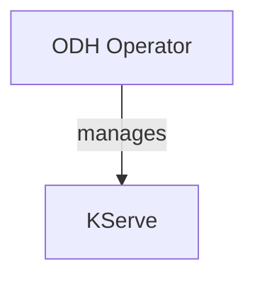

# Architecture Diagrams for Open Data Hub 3.3.0 Platform

Generated from: `architecture/odh-3.3.0/PLATFORM.md`
Date: 2026-03-12
Components: 17 (operators, applications, services)

**Note**: Diagram filenames use base component name without version (directory is already versioned).

## Available Diagrams

### For Developers
- [Component Structure](./platform-component.mmd) - Mermaid diagram showing all 17 platform components and their relationships
- [Data Flows](./platform-dataflow.mmd) - Sequence diagram of 4 key workflows (development, inference, pipelines, LLM training)
- [Dependencies](./platform-dependencies.mmd) - Component dependency graph with external services

### For Architects
- [C4 Context](./platform-c4-context.dsl) - System context in C4 format (Structurizr) with multiple views
- [Component Overview](./platform-component.mmd) - High-level platform component view

### For Security Teams
- [Security Network Diagram (Mermaid)](./platform-security-network.mmd) - Visual network topology diagram with trust zones
- [Security Network Diagram (ASCII)](./platform-security-network.txt) - Precise text format for SAR submissions (11 KB detailed spec)
- [RBAC Visualization](./platform-rbac.mmd) - RBAC permissions and bindings for all operators

## Diagram Details

### 1. Platform Component Diagram
**File**: `platform-component.mmd`
**Type**: Mermaid Graph
**Audience**: Developers, Architects
**Contents**:
- 17 platform components organized by function
- Control plane (ODH Operator, Dashboard)
- Development workbenches (Notebook Controller, images)
- Model serving (KServe, ODH Model Controller)
- Model management (Model Registry, MLflow)
- Training & distributed computing (Training Operator, Trainer v2, KubeRay, Spark)
- ML workflows (Data Science Pipelines, Feast)
- AI governance (TrustyAI)
- LLM tools (Llama Stack)
- External dependencies (Istio, Knative, cert-manager)
- External services (S3, PostgreSQL, HuggingFace, Container Registry)

### 2. Platform Data Flow Diagram
**File**: `platform-dataflow.mmd`
**Type**: Mermaid Sequence Diagram
**Audience**: Developers, SREs
**Contents**: 4 end-to-end workflows
1. **Model Development to Production** (23 steps)
   - Dashboard → Notebook creation → Model training → MLflow logging → Model Registry → KServe deployment → TrustyAI monitoring
2. **Model Inference** (8 steps)
   - External client → Istio Gateway → Knative Activator → KServe Predictor → Feast features → TrustyAI metrics
3. **Automated ML Pipeline** (12 steps)
   - Dashboard → DSP Operator → Argo Workflows → Data prep → PyTorchJob training → Model Registry → KServe deployment
4. **Distributed LLM Fine-tuning** (11 steps)
   - Dashboard → Trainer v2 → JobSet → LLM training pods → HuggingFace download → S3 checkpoints → MLflow metrics → vLLM deployment

### 3. Security Network Diagram (ASCII)
**File**: `platform-security-network.txt`
**Type**: ASCII Art (11 KB)
**Audience**: Security teams, SAR documentation
**Contents** (comprehensive):
- **Network zones**: External, Ingress (DMZ), Service Mesh (Internal), External Services
- **Namespaces**: opendatahub, knative-serving, istio-system, cert-manager, {user-namespace}
- **Exact ports**: 443/TCP, 8080/TCP, 8443/TCP, 5432/TCP, 6566/TCP, 9443/TCP, 15012/TCP, etc.
- **Protocols**: HTTPS, HTTP, gRPC, PostgreSQL, mTLS
- **Encryption**: TLS 1.2+, TLS 1.3, mTLS (PERMISSIVE/STRICT)
- **Authentication**: OAuth Bearer tokens, ServiceAccount tokens, AWS IAM (IRSA), API keys, mTLS certificates
- **RBAC summary**: ClusterRoles for all operators with API groups, resources, verbs
- **Service Mesh config**: PeerAuthentication, AuthorizationPolicy examples
- **Secrets management**: Webhook TLS, OAuth proxy TLS, S3 credentials, DB credentials, API tokens
- **Firewall rules**: Recommended egress/ingress policies

Perfect for Security Architecture Review (SAR) submissions.

### 4. Security Network Diagram (Mermaid)
**File**: `platform-security-network.mmd`
**Type**: Mermaid Graph
**Audience**: Security presentations, architecture reviews
**Contents**:
- Same information as ASCII version but visual
- Color-coded trust zones (External, Ingress, Service Mesh, External Services)
- Network flows with port/protocol/auth details
- Istio service mesh control plane

### 5. C4 Context Diagram
**File**: `platform-c4-context.dsl`
**Type**: Structurizr DSL
**Audience**: Architects, stakeholders
**Contents**:
- **People**: Data Scientist, ML Engineer, Platform Admin, External Client
- **ODH containers**: All 17 platform components with descriptions
- **External systems**: Istio, Knative, cert-manager, OpenShift, S3, PostgreSQL, HuggingFace, Container Registry
- **Views**:
  - System Context (full platform)
  - Container View (internal components)
  - Development Workflow (notebook-centric)
  - Serving Workflow (inference-centric)
  - Training Workflow (pipeline-centric)

### 6. Platform Dependencies
**File**: `platform-dependencies.mmd`
**Type**: Mermaid Graph
**Audience**: Architects, integration engineers
**Contents**:
- ODH Operator as central orchestrator
- Component dependencies (14 operators + 3 services)
- External platform dependencies (Istio, Knative, cert-manager, Kubernetes)
- External service dependencies (S3, PostgreSQL, HuggingFace, Container Registry)
- Integration patterns:
  - CRD creation (Dashboard → components)
  - API calls (Notebooks → Model Registry, MLflow)
  - Orchestration (DSP → Training Operator, KServe)
  - Feature serving (Feast → Training, KServe)
  - Monitoring (TrustyAI → KServe)
- Color-coded by function (control plane, serving, management, training, workflows, governance)

### 7. RBAC Visualization
**File**: `platform-rbac.mmd`
**Type**: Mermaid Graph
**Audience**: Security, compliance, platform admins
**Contents**:
- **Service Accounts** (opendatahub namespace):
  - opendatahub-operator-controller-manager
  - odh-dashboard
  - kserve-controller-manager
  - model-registry-operator-sa
  - training-operator
  - notebook-controller
  - data-science-pipelines-operator
- **ClusterRoleBindings**: Binding SAs to ClusterRoles
- **ClusterRoles**: Permissions for each operator
- **API Resources**:
  - Platform orchestration CRDs
  - Model serving CRDs
  - Development CRDs (Notebook, StatefulSet)
  - Training CRDs (PyTorchJob, TFJob, MPIJob, JAXJob, XGBoostJob, TrainJob)
  - ML workflow CRDs (DSPA, Workflow)
  - Core resources (Deployment, Service, ConfigMap, Secret)
- **User workload SAs**: {notebook-name}-sa, {infer-service-name}-sa (with AWS IRSA)
- **Service Mesh AuthZ**: PeerAuthentication, AuthorizationPolicy examples

## How to Use

### Mermaid Diagrams (.mmd files)
- **In GitHub/GitLab**: Paste into markdown with ` ```mermaid ` code blocks - renders automatically!
- **Live editor**: https://mermaid.live (paste code, click "Export PNG")

**Render to PNG locally (recommended)**:

1. **Install Mermaid CLI** (one-time setup):
   ```bash
   npm install -g @mermaid-js/mermaid-cli
   ```

2. **Generate PNG** (using system Chrome for rendering):
   ```bash
   # Basic (default resolution)
   PUPPETEER_EXECUTABLE_PATH=/usr/bin/google-chrome mmdc -i platform-component.mmd -o platform-component.png

   # High resolution (recommended - 3x scale)
   PUPPETEER_EXECUTABLE_PATH=/usr/bin/google-chrome mmdc -i platform-component.mmd -o platform-component.png -s 3

   # Custom width (height auto-adjusts)
   PUPPETEER_EXECUTABLE_PATH=/usr/bin/google-chrome mmdc -i platform-component.mmd -o platform-component.png -w 2400
   ```

3. **Alternative formats**:
   ```bash
   # SVG (vector, scales perfectly)
   PUPPETEER_EXECUTABLE_PATH=/usr/bin/google-chrome mmdc -i platform-component.mmd -o platform-component.svg

   # PDF
   PUPPETEER_EXECUTABLE_PATH=/usr/bin/google-chrome mmdc -i platform-component.mmd -o platform-component.pdf
   ```

**Note**: If `google-chrome` is not at `/usr/bin/google-chrome`, find it with `which google-chrome` or `which chromium`

**Batch conversion** (all Mermaid diagrams):
```bash
for file in *.mmd; do
  PUPPETEER_EXECUTABLE_PATH=/usr/bin/google-chrome mmdc -i "$file" -o "${file%.mmd}.png" -s 3
done
```

### C4 Diagrams (.dsl files)
- **Structurizr Lite** (web UI):
  ```bash
  docker run -it --rm -p 8080:8080 -v $(pwd):/usr/local/structurizr structurizr/lite
  # Open http://localhost:8080
  ```

- **CLI export** (render to PNG/SVG):
  ```bash
  docker run --rm -v $(pwd):/usr/local/structurizr structurizr/cli export -workspace platform-c4-context.dsl -format png
  ```

### ASCII Diagrams (.txt files)
- View in any text editor (use monospace font)
- Include in documentation as-is (copy/paste)
- Perfect for security reviews (no ambiguity, precise technical details)

## Embedding in Documentation

### Markdown (GitHub/GitLab)
```markdown
## Platform Architecture


```

### Security Architecture Review (SAR)
Use `platform-security-network.txt` directly:
```markdown
## Network Security Architecture

See attached: platform-security-network.txt

Key security controls:
- All external ingress via HTTPS (TLS 1.2+/1.3)
- Service mesh mTLS (PERMISSIVE/STRICT)
- OAuth proxy for all user-facing services
- RBAC with least-privilege ServiceAccounts
- NetworkPolicy enforcement
```

### Architecture Decision Records (ADRs)
Use `platform-c4-context.dsl` views:
```markdown
## ADR: Multi-Tenancy Model

### Context Diagram


### Decision
We will use namespace-based multi-tenancy with shared control plane...
```

## Updating Diagrams

To regenerate after architecture changes:
```bash
# Update PLATFORM.md first, then regenerate diagrams
/generate-architecture-diagrams --architecture=architecture/odh-3.3.0/PLATFORM.md
```

To generate only specific formats:
```bash
/generate-architecture-diagrams --architecture=architecture/odh-3.3.0/PLATFORM.md --formats=mermaid,security
```

## Platform Statistics

- **Total Components**: 17
- **Operators**: 14 (82%)
- **Applications/Services**: 3 (18%)
- **CRDs**: 60+
- **API Versions**: v1 (stable), v1beta1/v1beta2 (beta), v1alpha1 (alpha)
- **External Dependencies**: 4 (Istio, Knative, cert-manager, OpenShift)
- **External Services**: 4+ (S3, PostgreSQL/MySQL, HuggingFace, Container Registry)

## Component Categories

- **Control Plane**: ODH Operator, Dashboard
- **Development**: Notebook Controller, Notebook Images
- **Model Serving**: KServe, ODH Model Controller
- **Model Management**: Model Registry Operator, MLflow Operator
- **Training**: Training Operator, Trainer v2, KubeRay, Spark Operator
- **ML Workflows**: Data Science Pipelines Operator
- **Data & Governance**: Feast Operator, TrustyAI Operator
- **LLM Tools**: Llama Stack Operator

## Key Integration Patterns

1. **Hierarchical Management**: ODH Operator → Component Operators → Workloads
2. **CRD Creation**: Dashboard → Notebooks, InferenceServices, ModelRegistry CRs
3. **REST API Calls**: Notebooks → Model Registry, MLflow, KServe
4. **Service Mesh**: mTLS, AuthZ policies, traffic routing
5. **External Storage**: S3 for artifacts, PostgreSQL for metadata
6. **Feature Serving**: Feast → Training jobs, Inference services
7. **Monitoring**: TrustyAI → KServe (fairness, drift, explainability)

## Security Highlights

- **TLS Encryption**: All external endpoints (TLS 1.2+/1.3)
- **Service Mesh**: Istio mTLS (PERMISSIVE/STRICT)
- **Authentication**: OAuth, mTLS, Bearer tokens, AWS IAM, API keys
- **RBAC**: Comprehensive cluster/namespace policies
- **Secrets**: cert-manager for TLS, Opaque for credentials
- **NetworkPolicy**: Ingress/egress controls
- **FIPS**: crypto/rand usage for compliance

## Next Steps

1. **Review diagrams** for accuracy and completeness
2. **Embed Mermaid diagrams** in project README or wiki
3. **Use ASCII security diagram** for SAR documentation
4. **Share C4 diagrams** with Architecture Council
5. **Render to PNG/SVG** for presentations:
   - Mermaid: `mmdc -i diagram.mmd -o diagram.png -s 3`
   - C4: `docker run structurizr/cli export -workspace diagram.dsl -format png`
6. **Create component-specific diagrams** for individual components:
   ```bash
   /generate-architecture-diagrams --architecture=architecture/odh-3.3.0/kserve.md
   ```
