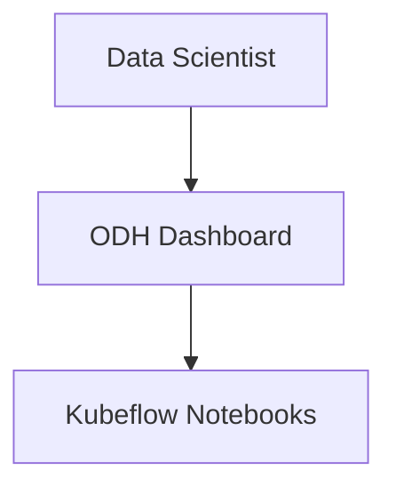

# Architecture Diagrams for ODH Dashboard

Generated from: `architecture/rhoai-2.11/odh-dashboard.md`
Date: 2026-03-15
Component: odh-dashboard

**Note**: Diagram filenames use base component name without version (directory is already versioned).

## Available Diagrams

All Mermaid diagrams are available in both `.mmd` (source) and `.png` (3000px width, high-resolution) formats.

### For Developers
- [Component Structure](./odh-dashboard-component.png) ([mmd](./odh-dashboard-component.mmd)) - Mermaid diagram showing internal components, CRDs, and dependencies
- [Data Flows](./odh-dashboard-dataflow.png) ([mmd](./odh-dashboard-dataflow.mmd)) - Sequence diagram of request/response flows (user access, notebook creation, metrics)
- [Dependencies](./odh-dashboard-dependencies.png) ([mmd](./odh-dashboard-dependencies.mmd)) - Component dependency graph showing external and internal integrations

### For Architects
- [C4 Context](./odh-dashboard-c4-context.dsl) - System context in C4 format (Structurizr) showing dashboard in broader RHOAI ecosystem
- [Component Overview](./odh-dashboard-component.png) ([mmd](./odh-dashboard-component.mmd)) - High-level component view with integrations

### For Security Teams
- [Security Network Diagram (PNG)](./odh-dashboard-security-network.png) - High-resolution network topology with trust zones
- [Security Network Diagram (Mermaid)](./odh-dashboard-security-network.mmd) - Visual network topology (editable)
- [Security Network Diagram (ASCII)](./odh-dashboard-security-network.txt) - Precise text format for SAR submissions
- [RBAC Visualization](./odh-dashboard-rbac.png) ([mmd](./odh-dashboard-rbac.mmd)) - RBAC permissions and bindings

## Component Overview

**ODH Dashboard** is the primary web interface for the Red Hat OpenShift AI (RHOAI) platform:
- **Type**: Web Application (React Frontend + Node.js Backend + OAuth Proxy)
- **Purpose**: Centralized management UI for data science tools, workbenches, models, and pipelines
- **Key Features**:
  - Notebook management (Kubeflow Notebooks)
  - Model serving (KServe, ModelMesh)
  - Pipeline orchestration (Data Science Pipelines)
  - Accelerator profile configuration
  - User/group management
  - Application catalog and learning resources

## How to Use

### PNG Files (.png files)
**Automatically generated** at 3000px width for high-resolution presentations and documentation.

- **Ready to use**: High-resolution images suitable for presentations, wikis, and documentation
- **Width**: 3000px (height auto-adjusts to content)
- **Use directly**: Include in PowerPoint, Google Slides, Confluence, etc.

### Mermaid Source Files (.mmd files)
- **In GitHub/GitLab**: Paste into markdown with ````mermaid` code blocks - renders automatically!
- **Live editor**: https://mermaid.live (paste code, edit, export)
- **Editable**: Modify and regenerate if needed

**Example - Embed in Markdown**:
````markdown

````

**Manual PNG regeneration** (if you edit .mmd files):

1. **Ensure Mermaid CLI is installed**:
   ```bash
   npm install -g @mermaid-js/mermaid-cli
   ```

2. **Regenerate PNG** (3000px width):
   ```bash
   PUPPETEER_EXECUTABLE_PATH=/usr/bin/google-chrome mmdc -i odh-dashboard-component.mmd -o odh-dashboard-component.png -w 3000
   ```

3. **Alternative formats** (if needed):
   ```bash
   # SVG (vector, scales perfectly)
   PUPPETEER_EXECUTABLE_PATH=/usr/bin/google-chrome mmdc -i odh-dashboard-component.mmd -o odh-dashboard-component.svg

   # PDF
   PUPPETEER_EXECUTABLE_PATH=/usr/bin/google-chrome mmdc -i odh-dashboard-component.mmd -o odh-dashboard-component.pdf
   ```

**Note**: If `google-chrome` is not found, try `chromium` or `which google-chrome` to locate it

### C4 Diagrams (.dsl files)
- **Structurizr Lite**:
  ```bash
  docker run -p 8080:8080 -v $(pwd):/usr/local/structurizr structurizr/lite
  ```
  Open http://localhost:8080 and load `odh-dashboard-c4-context.dsl`

- **CLI export**:
  ```bash
  structurizr-cli export -workspace odh-dashboard-c4-context.dsl -format png
  ```

### ASCII Diagrams (.txt files)
- View in any text editor
- Include in documentation as-is
- Perfect for security reviews (precise technical details)
- **Use Case**: Security Architecture Reviews (SARs) require precise network topology documentation

## Diagram Descriptions

### 1. Component Structure (odh-dashboard-component.mmd)
Shows the internal architecture of ODH Dashboard:
- **Frontend**: React/TypeScript SPA with PatternFly components
- **Backend**: Fastify (Node.js) REST API server
- **OAuth Proxy**: OpenShift authentication layer
- **CRDs Managed**: OdhApplication, OdhDocument, OdhDashboardConfig, AcceleratorProfile, OdhQuickStart
- **External Dependencies**: Kubernetes API, OpenShift OAuth, Thanos
- **Internal Integrations**: ODH Operator, Kubeflow Notebooks, KServe, ModelMesh, Pipelines, Model Registry

### 2. Data Flow Sequences (odh-dashboard-dataflow.mmd)
Four key flows:
- **Flow 1**: User dashboard access (OAuth authentication flow)
- **Flow 2**: Notebook creation (API request → Kubernetes API → Controller creates StatefulSet)
- **Flow 3**: Metrics query (Dashboard → Thanos → Prometheus)
- **Flow 4**: Accelerator profile management (CRUD operations on AcceleratorProfile CRs)

### 3. Security Network Diagram
**Two formats for different audiences**:

#### Mermaid Version (odh-dashboard-security-network.mmd + .png)
- **Visual representation** with color-coded trust zones
- **Trust boundaries**: External → Ingress (DMZ) → Application → Platform → Egress
- **Network flows** with ports, protocols, encryption, and authentication
- **Best for**: Presentations, architecture reviews, visual communication

#### ASCII Version (odh-dashboard-security-network.txt)
- **Precise text-based topology** with exact technical details
- **Includes**: RBAC summary, secrets configuration, auth policies, network policies
- **Best for**: Security Architecture Reviews (SARs), compliance documentation, precision requirements

**Key Security Details**:
- **Ingress**: OpenShift Route with TLS reencrypt (443 → 8443)
- **Authentication**: OpenShift OAuth with JWT tokens
- **Authorization**: RBAC via ClusterRole `odh-dashboard` and multiple RoleBindings
- **Secrets**: 3 secrets for TLS, OAuth cookie, and OAuth client credentials
- **Encryption**: TLS 1.2+ for all external communication, HTTP localhost within pod
- **Service Mesh**: Internal communication via ServiceAccount tokens

### 4. C4 Context Diagram (odh-dashboard-c4-context.dsl)
System context view showing:
- **People**: Data Scientists, ML Engineers, Platform Administrators
- **Containers**: React Frontend, Fastify Backend, OAuth Proxy
- **External Systems**: Kubernetes API, OpenShift OAuth, OpenShift Router, OpenShift Console
- **Internal ODH Systems**: ODH Operator, Notebooks, KServe, ModelMesh, Pipelines, Model Registry, Thanos
- **External Services**: S3 Storage
- **Relationships**: All interactions with ports, protocols, and purposes

### 5. Dependencies (odh-dashboard-dependencies.mmd)
Dependency graph showing:
- **External Dependencies**: Node.js 18+, Kubernetes 1.25+, OpenShift 4.12+, OAuth
- **Internal ODH Dependencies**: All ODH components the dashboard integrates with
- **External Services**: S3 storage (optional)
- **Integration Points**: OpenShift Console (ConsoleLink), users via web browser

### 6. RBAC Visualization (odh-dashboard-rbac.mmd)
Complete RBAC model:
- **ServiceAccount**: odh-dashboard (in odh-dashboard namespace)
- **ClusterRole**: odh-dashboard with extensive permissions
- **ClusterRoleBindings**: 4 bindings for different purposes
  - Main ClusterRole binding
  - Auth delegation (kube-system)
  - Cluster monitoring (openshift-monitoring)
  - Image pulling (openshift namespace)
- **Resources**: All Kubernetes and OpenShift resources managed by the dashboard
- **Permissions**: Detailed verbs for each resource type

## Architecture Highlights

### Authentication Flow
1. User accesses dashboard via OpenShift Route (HTTPS/443)
2. OpenShift Router forwards to dashboard Service (HTTPS/8443, reencrypt)
3. OAuth Proxy intercepts request, redirects to OpenShift OAuth
4. User authenticates, OAuth server issues JWT token
5. OAuth Proxy validates token, forwards to backend with Bearer token
6. Backend uses token for Kubernetes API impersonation
7. Frontend receives dashboard UI

### Key Integration Points
- **Kubernetes API** (443/TCP HTTPS): Resource management for all ODH components
- **OpenShift OAuth** (443/TCP HTTPS): User authentication
- **Thanos Querier** (9092/TCP HTTPS): Performance metrics for models and pipelines
- **Data Science Pipelines** (8443/TCP HTTPS): Pipeline workflow management
- **Model Registry** (8080/TCP HTTPS): Model versioning and metadata
- **S3 Storage** (443/TCP HTTPS): Pipeline artifacts and model storage

### Feature Flags
The dashboard supports 25+ feature flags via OdhDashboardConfig CRD:
- Disable specific features (model serving, pipelines, projects, etc.)
- Configure UI elements (home page, user management, support resources)
- Control integrations (KServe, ModelMesh, TrustyAI, Model Registry)
- Manage distributed workloads (Kueue/CodeFlare)

## Updating Diagrams

To regenerate after architecture changes:
```bash
# Regenerate diagrams for odh-dashboard
/generate-architecture-diagrams --architecture=architecture/rhoai-2.11/odh-dashboard.md

# Or use automation script if available
./scripts/generate-all-diagrams.sh architecture/rhoai-2.11/
```

## Related Documentation

- **Architecture File**: `architecture/rhoai-2.11/odh-dashboard.md`
- **Repository**: https://github.com/red-hat-data-services/odh-dashboard
- **Version**: v1.21.0-18-rhods-1994
- **Branch**: rhoai-2.11
- **Platform**: Red Hat OpenShift AI (RHOAI) 2.11

## License

These diagrams are generated from the RHOAI architecture documentation and are subject to the same license as the source documentation.
