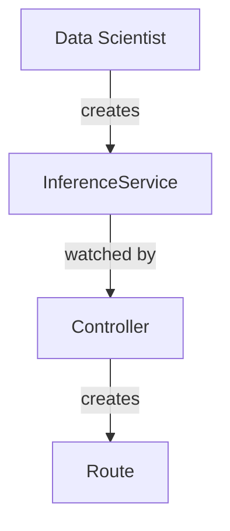

# Architecture Diagrams for ODH Model Controller

Generated from: `architecture/rhoai-2.17/odh-model-controller.md`
Date: 2026-03-16
Component: odh-model-controller (derived from filename)

**Note**: Diagram filenames use base component name without version (directory `rhoai-2.17/` provides versioning context).

## Available Diagrams

All Mermaid diagrams are available in both `.mmd` (source) and `.png` (3000px width, high-resolution) formats.

### For Developers
- [Component Structure](./odh-model-controller-component.png) ([mmd](./odh-model-controller-component.mmd)) - Mermaid diagram showing internal components, reconcilers, CRDs, and dependencies
- [Data Flows](./odh-model-controller-dataflow.png) ([mmd](./odh-model-controller-dataflow.mmd)) - Sequence diagram of InferenceService creation, NIM account reconciliation, and metrics collection
- [Dependencies](./odh-model-controller-dependencies.png) ([mmd](./odh-model-controller-dependencies.mmd)) - Component dependency graph showing external and internal dependencies

### For Architects
- [C4 Context](./odh-model-controller-c4-context.dsl) - System context in C4 format (Structurizr) showing ODH Model Controller in the broader ecosystem
- [Component Overview](./odh-model-controller-component.png) ([mmd](./odh-model-controller-component.mmd)) - High-level component view with reconcilers and integrations

### For Security Teams
- [Security Network Diagram (PNG)](./odh-model-controller-security-network.png) - High-resolution network topology with trust zones
- [Security Network Diagram (Mermaid)](./odh-model-controller-security-network.mmd) - Visual network topology (editable)
- [Security Network Diagram (ASCII)](./odh-model-controller-security-network.txt) - Precise text format for SAR submissions with RBAC, Service Mesh config, and Secrets
- [RBAC Visualization](./odh-model-controller-rbac.png) ([mmd](./odh-model-controller-rbac.mmd)) - RBAC permissions and bindings showing ClusterRoles and API access

## Component Overview

**ODH Model Controller** extends KServe model serving capabilities with OpenShift-native integrations for routing, authentication, and monitoring.

### Key Features
- **Multi-Mode Support**: KServe Serverless, KServe Raw, and ModelMesh deployment modes
- **OpenShift Integration**: Automatic OpenShift Route creation for external access
- **Service Mesh**: Istio integration for mTLS and traffic management
- **Authentication**: Authorino integration for token-based authentication
- **NVIDIA NIM**: Account management for GPU-accelerated inference workloads
- **Monitoring**: Prometheus integration with ServiceMonitor and PodMonitor

### Architecture Highlights
- **Reconcilers**: 6 controllers managing different aspects (InferenceService, ServingRuntime, InferenceGraph, Account, ConfigMap, Secret)
- **Webhooks**: Admission webhooks for validation and defaulting of KServe resources
- **Managed Resources**: Creates ServiceAccount, Route, Istio Gateway/VirtualService, PeerAuthentication, AuthConfig, NetworkPolicy, and monitoring resources

## How to Use

### PNG Files (.png files)
**Automatically generated** at 3000px width for high-resolution presentations and documentation.

- **Ready to use**: High-resolution images suitable for presentations, wikis, and documentation
- **Width**: 3000px (height auto-adjusts to content)
- **Use directly**: Include in PowerPoint, Google Slides, Confluence, etc.

### Mermaid Source Files (.mmd files)
- **In GitHub/GitLab**: Paste into markdown with ` ```mermaid ` code blocks - renders automatically!
- **Live editor**: https://mermaid.live (paste code, edit, export)
- **Editable**: Modify and regenerate if needed

**Example - Embedding in Markdown**:
````markdown

````

**Manual PNG regeneration** (if you edit .mmd files):

1. **Ensure Mermaid CLI is installed**:
   ```bash
   npm install -g @mermaid-js/mermaid-cli
   ```

2. **Regenerate PNG** (3000px width):
   ```bash
   PUPPETEER_EXECUTABLE_PATH=/usr/bin/google-chrome mmdc -i odh-model-controller-component.mmd -o odh-model-controller-component.png -w 3000
   ```

3. **Alternative formats** (if needed):
   ```bash
   # SVG (vector, scales perfectly)
   PUPPETEER_EXECUTABLE_PATH=/usr/bin/google-chrome mmdc -i diagram.mmd -o diagram.svg

   # PDF
   PUPPETEER_EXECUTABLE_PATH=/usr/bin/google-chrome mmdc -i diagram.mmd -o diagram.pdf
   ```

**Note**: If `google-chrome` is not found, try `chromium` or `which google-chrome` to locate it

### C4 Diagrams (.dsl files)
- **Structurizr Lite**: `docker run -p 8080:8080 -v .:/usr/local/structurizr structurizr/lite`
- **CLI export**: `structurizr-cli export -workspace diagram.dsl -format png`
- **Online**: Upload to https://structurizr.com/dsl

### ASCII Diagrams (.txt files)
- View in any text editor
- Include in documentation as-is
- Perfect for security reviews (precise technical details)
- Contains RBAC summary, Service Mesh configuration, and Secrets inventory

## Diagram Details

### 1. Component Diagram
**File**: `odh-model-controller-component.mmd` / `.png`

Shows the internal architecture of ODH Model Controller:
- **Reconcilers**: InferenceService, ServingRuntime, InferenceGraph, Account, ConfigMap, Secret
- **Webhooks**: Mutating and validating admission webhooks
- **CRDs Watched**: InferenceService, ServingRuntime, InferenceGraph, NIM Account
- **Dependencies**: KServe, Kubernetes, OpenShift Route, Istio, Authorino, Prometheus, Knative
- **Created Resources**: ServiceAccount, Route, Istio resources, AuthConfig, NetworkPolicy, monitoring resources

### 2. Data Flow Diagram
**File**: `odh-model-controller-dataflow.mmd` / `.png`

Sequence diagram showing three main flows:
- **Flow 1**: InferenceService Creation (KServe Serverless with Istio)
  - User creates InferenceService → Webhook validation → Controller reconciles → Creates supporting resources
- **Flow 2**: NIM Account Reconciliation
  - User creates NIM Account → Webhook validation → NGC API validation → Creates NIM resources
- **Flow 3**: Metrics Collection
  - Controller exposes metrics → Prometheus scrapes endpoint

### 3. Security Network Diagram
**Files**:
- `odh-model-controller-security-network.txt` (ASCII - precise, for SAR)
- `odh-model-controller-security-network.mmd` / `.png` (Mermaid - visual)

Detailed network topology with:
- **Trust Zones**: External, Kubernetes Control Plane, Application Layer, Monitoring, External Services
- **Ports and Protocols**: Exact specifications (e.g., 9443/TCP HTTPS TLS 1.2+)
- **Encryption**: TLS versions and mTLS enforcement
- **Authentication**: Bearer tokens, API keys, service mesh identity
- **RBAC Summary**: ClusterRole permissions (included in ASCII version)
- **Service Mesh Config**: PeerAuthentication, AuthorizationPolicy, NetworkPolicy (included in ASCII version)
- **Secrets**: Webhook certs, NIM pull secrets, model storage credentials (included in ASCII version)

**Security Note**: Metrics endpoint (8080/TCP) is currently unencrypted and unauthenticated (TODO: migrate to 8443/TLS).

### 4. Dependencies Diagram
**File**: `odh-model-controller-dependencies.mmd` / `.png`

Component dependency graph showing:
- **Required External**: KServe, Kubernetes, OpenShift Route
- **Conditional External**: Istio, Authorino, Prometheus Operator, Knative Serving, Red Hat Service Mesh
- **Internal ODH**: DataScienceCluster, DSCInitialization, Model Registry
- **External Services**: NVIDIA NGC API
- **Integration Points**: ODH Dashboard, Data Science Pipelines
- **Managed Resources**: Routes, Istio resources, AuthConfig, NetworkPolicies, RBAC, Monitoring, NIM resources

### 5. RBAC Diagram
**File**: `odh-model-controller-rbac.mmd` / `.png`

Visual representation of RBAC permissions:
- **Service Account**: `odh-model-controller`
- **ClusterRole**: `odh-model-controller-role` (comprehensive permissions across multiple API groups)
- **API Groups**: Core, KServe, Istio, Maistra, Authorino, Prometheus, OpenShift, NIM, ODH Platform
- **Resources**: ConfigMaps, Secrets, Services, Routes, Gateways, VirtualServices, AuthConfigs, Monitors, etc.
- **Verbs**: create, delete, get, list, patch, update, watch, finalizers
- **Prometheus Role**: `kserve-prometheus-k8s` (read-only access to namespaces, services, endpoints, pods, ingresses)

### 6. C4 Context Diagram
**File**: `odh-model-controller-c4-context.dsl`

Structurizr DSL showing:
- **System Context**: ODH Model Controller in the RHOAI ecosystem
- **Containers**: InferenceService Reconciler, ServingRuntime Reconciler, InferenceGraph Reconciler, Account Reconciler, Webhook Server, Metrics Server
- **External Systems**: KServe, Kubernetes, OpenShift, Istio, Authorino, Prometheus, Knative, NVIDIA NGC
- **Internal Systems**: DataScienceCluster, DSCInitialization, Model Registry, ODH Dashboard, Data Science Pipelines
- **Interactions**: API calls, CRD watches, resource creation, validation

## Architecture Patterns

### Sub-Reconciler Pattern
The controller uses a sub-reconciler pattern where the core InferenceServiceReconciler delegates to mode-specific reconcilers:
- Each reconciler manages a subset of resources (routes, auth, monitoring, etc.)
- Delta processor pattern ensures only changed resources are updated
- Comparator pattern allows custom equality checks for each resource type

### Multi-Mode Support
The controller supports three distinct InferenceService deployment modes:
1. **KServe Serverless**: Uses Knative Serving for autoscaling, Istio for routing and mTLS
2. **KServe Raw**: Direct Kubernetes deployment without Knative, uses OpenShift Routes
3. **ModelMesh**: IBM ModelMesh serving framework for multi-model serving

### Service Mesh Integration
When service mesh is enabled (default in RHOAI):
- All InferenceService pods are automatically enrolled via ServiceMeshMember
- mTLS is enforced via PeerAuthentication resources (STRICT mode)
- Istio Gateway provides ingress with SNI-based routing
- VirtualService configures routing rules and traffic splitting

### Authentication Architecture
The controller integrates with Authorino (Kuadrant) for token-based authentication:
- Creates AuthConfig resources per InferenceService
- Supports JWT validation with configurable audiences
- Integrates with OpenShift OAuth for token issuance
- Enforces authentication at Istio Gateway level

## Updating Diagrams

To regenerate after architecture changes:

```bash
# From repository root
cd architecture/rhoai-2.17

# Regenerate all diagrams (auto-detects output directory)
python ../../scripts/generate_architecture_diagrams.py --architecture=odh-model-controller.md

# Or manually specify output directory
python ../../scripts/generate_architecture_diagrams.py \
  --architecture=odh-model-controller.md \
  --output-dir=diagrams
```

## References

- **Architecture Documentation**: [odh-model-controller.md](../odh-model-controller.md)
- **Repository**: https://github.com/red-hat-data-services/odh-model-controller
- **Version**: v1.27.0-rhods-728-g2e20486
- **Branch**: rhoai-2.17
- **KServe Documentation**: https://kserve.github.io/website/
- **Istio Documentation**: https://istio.io/latest/docs/
- **Authorino Documentation**: https://docs.kuadrant.io/authorino/

## Troubleshooting

### PNG Generation Issues

If PNG generation fails:

1. **Check mmdc installation**:
   ```bash
   which mmdc
   npm list -g @mermaid-js/mermaid-cli
   ```

2. **Verify Chrome/Chromium**:
   ```bash
   which google-chrome
   # or
   which chromium
   ```

3. **Manual PNG generation**:
   ```bash
   PUPPETEER_EXECUTABLE_PATH=$(which google-chrome) mmdc -i diagram.mmd -o diagram.png -w 3000
   ```

### Mermaid Syntax Errors

If diagrams don't render:

1. **Test in Mermaid Live Editor**: https://mermaid.live
2. **Check for common issues**:
   - Unclosed quotes in labels
   - Invalid characters in node IDs
   - Complex nested subgraphs (simplify if needed)

### C4 Diagram Issues

If C4 diagrams don't render:

1. **Validate DSL syntax**: Use Structurizr CLI or online validator
2. **Check workspace structure**: Ensure `workspace { model { ... } views { ... } }` structure is correct
3. **Test locally**: Use Structurizr Lite Docker container

## License

These diagrams are generated from the ODH Model Controller architecture documentation and are subject to the same license as the source repository.
