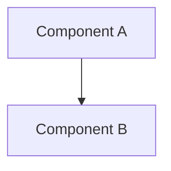

# Architecture Diagrams for RHOAI 2.6 Components

Generated from architecture documentation in `architecture/rhoai-2.6/`
Date: 2026-03-15

**Note**: Diagram filenames use base component name without version (directory is already versioned).

---

## Platform Overview Diagrams

Generated from: `architecture/rhoai-2.6/PLATFORM.md`

All Mermaid diagrams are available in both `.mmd` (source) and `.png` (3000px width, high-resolution) formats.

### For Developers
- [Component Structure](./platform-component.png) ([mmd](./platform-component.mmd)) - Complete RHOAI 2.6 platform architecture showing all 10+ components (operators, dashboard, notebooks, pipelines, model serving, distributed computing, monitoring)
- [Data Flows](./platform-dataflow.png) ([mmd](./platform-dataflow.mmd)) - Sequence diagrams of 5 key platform workflows: notebook development, pipeline execution, KServe model deployment, TrustyAI monitoring, and distributed Ray jobs
- [Dependencies](./platform-dependencies.png) ([mmd](./platform-dependencies.mmd)) - Platform-wide dependency graph showing RHODS Operator orchestration, OpenShift platform integration, required components (Tekton), optional components (Service Mesh, Knative), and external services

### For Architects
- [C4 Context](./platform-c4-context.dsl) - System context in C4 format (Structurizr) with filtered views for developers, security, and distributed computing
- [Component Overview](./platform-component.png) ([mmd](./platform-component.mmd)) - High-level platform component architecture

### For Security Teams
- [Security Network Diagram (PNG)](./platform-security-network.png) - High-resolution network topology with trust zones (External, Ingress, Control Plane, App Services, Monitoring, Service Mesh, User Workloads, External Services)
- [Security Network Diagram (Mermaid)](./platform-security-network.mmd) - Visual network topology (editable, color-coded trust zones)
- [Security Network Diagram (ASCII)](./platform-security-network.txt) - **Precise text format for SAR submissions** with complete RBAC summary for all operators, Service Mesh configuration (PeerAuthentication, AuthorizationPolicy), secrets inventory with rotation policies, authentication mechanisms (OAuth, mTLS, AWS IAM, ServiceAccount JWT), NetworkPolicies, Security Context Constraints, and compliance notes
- [RBAC Visualization](./platform-rbac.png) ([mmd](./platform-rbac.mmd)) - Complete RBAC permissions for all 9 platform operators (RHODS Operator, DSP Operator, KServe, ModelMesh, ODH Model Controller, CodeFlare, KubeRay, TrustyAI, Notebook Controller) across 100+ API resources

**Platform Summary**: Red Hat OpenShift AI 2.6 enterprise ML platform with 10 operators/controllers providing complete ML lifecycle (development → training → serving → monitoring), deep OpenShift integration (OAuth, Routes, Service CA, SCC), optional Service Mesh (Istio mTLS, canary deployments), distributed computing (Ray with CodeFlare/MCAD), dual model serving (KServe serverless, ModelMesh multi-model), GPU support (NVIDIA CUDA, Habana AI), and comprehensive monitoring (Prometheus, TrustyAI fairness).

---

## KServe Diagrams

Generated from: `architecture/rhoai-2.6/kserve.md`

All Mermaid diagrams are available in both `.mmd` (source) and `.png` (3000px width, high-resolution) formats.

### For Developers
- [Component Structure](./kserve-component.png) ([mmd](./kserve-component.mmd)) - Mermaid diagram showing KServe controller, webhook server, runtime components, CRDs, and dependencies
- [Data Flows](./kserve-dataflow.png) ([mmd](./kserve-dataflow.mmd)) - Sequence diagram of model deployment and inference request flows through Istio and Knative
- [Dependencies](./kserve-dependencies.png) ([mmd](./kserve-dependencies.mmd)) - Component dependency graph showing Kubernetes, Istio, Knative, internal ODH dependencies, and deployment modes

### For Architects
- [C4 Context](./kserve-c4-context.dsl) - System context in C4 format (Structurizr)
- [Component Overview](./kserve-component.png) ([mmd](./kserve-component.mmd)) - High-level component view

### For Security Teams
- [Security Network Diagram (PNG)](./kserve-security-network.png) - High-resolution network topology with trust zones
- [Security Network Diagram (Mermaid)](./kserve-security-network.mmd) - Visual network topology (editable)
- [Security Network Diagram (ASCII)](./kserve-security-network.txt) - Precise text format for SAR submissions with RBAC, Service Mesh config, and secrets details
- [RBAC Visualization](./kserve-rbac.png) ([mmd](./kserve-rbac.mmd)) - RBAC permissions for kserve-controller-manager across KServe CRDs, Knative, Istio, and Kubernetes resources

---

## Kubeflow (ODH Notebook Controller) Diagrams

Generated from: `architecture/rhoai-2.6/kubeflow.md`

All Mermaid diagrams are available in both `.mmd` (source) and `.png` (3000px width, high-resolution) formats.

### For Developers
- [Component Structure](./kubeflow-component.png) ([mmd](./kubeflow-component.mmd)) - Mermaid diagram showing internal components, controllers, and webhooks
- [Data Flows](./kubeflow-dataflow.png) ([mmd](./kubeflow-dataflow.mmd)) - Sequence diagram of notebook access with OAuth, CR reconciliation, and webhook injection flows
- [Dependencies](./kubeflow-dependencies.png) ([mmd](./kubeflow-dependencies.mmd)) - Component dependency graph showing external and internal dependencies

### For Architects
- [C4 Context](./kubeflow-c4-context.dsl) - System context in C4 format (Structurizr)
- [Component Overview](./kubeflow-component.png) ([mmd](./kubeflow-component.mmd)) - High-level component view

### For Security Teams
- [Security Network Diagram (PNG)](./kubeflow-security-network.png) - High-resolution network topology with trust zones
- [Security Network Diagram (Mermaid)](./kubeflow-security-network.mmd) - Visual network topology (editable)
- [Security Network Diagram (ASCII)](./kubeflow-security-network.txt) - Precise text format for SAR submissions with RBAC, NetworkPolicy, and secrets details
- [RBAC Visualization](./kubeflow-rbac.png) ([mmd](./kubeflow-rbac.mmd)) - RBAC permissions and bindings for controller and user-facing roles

---

## KubeRay Diagrams

Generated from: `architecture/rhoai-2.6/kuberay.md`

All Mermaid diagrams are available in both `.mmd` (source) and `.png` (3000px width, high-resolution) formats.

### For Developers
- [Component Structure](./kuberay-component.png) ([mmd](./kuberay-component.mmd)) - Mermaid diagram showing operator, controllers, APIServer, Ray cluster resources, and custom resources
- [Data Flows](./kuberay-dataflow.png) ([mmd](./kuberay-dataflow.mmd)) - Sequence diagram of RayCluster creation, RayJob submission, and Ray Serve request flows
- [Dependencies](./kuberay-dependencies.png) ([mmd](./kuberay-dependencies.mmd)) - Component dependency graph showing Kubernetes, Ray, optional components (OpenShift Routes, Volcano, Prometheus), and ODH integrations

### For Architects
- [C4 Context](./kuberay-c4-context.dsl) - System context in C4 format (Structurizr)
- [Component Overview](./kuberay-component.png) ([mmd](./kuberay-component.mmd)) - High-level component view

### For Security Teams
- [Security Network Diagram (PNG)](./kuberay-security-network.png) - High-resolution network topology with trust zones
- [Security Network Diagram (Mermaid)](./kuberay-security-network.mmd) - Visual network topology (editable)
- [Security Network Diagram (ASCII)](./kuberay-security-network.txt) - Precise text format for SAR submissions with RBAC, OpenShift SCC, feature flags, and pod security details
- [RBAC Visualization](./kuberay-rbac.png) ([mmd](./kuberay-rbac.mmd)) - RBAC permissions for kuberay-operator and optional APIServer across Ray CRDs and Kubernetes resources

---

## Data Science Pipelines Operator Diagrams

Generated from: `architecture/rhoai-2.6/data-science-pipelines-operator.md`

All Mermaid diagrams are available in both `.mmd` (source) and `.png` (3000px width, high-resolution) formats.

### For Developers
- [Component Structure](./data-science-pipelines-operator-component.png) ([mmd](./data-science-pipelines-operator-component.mmd)) - Mermaid diagram showing DSPO controller manager, API server, persistence agent, scheduled workflow controller, and optional components (MariaDB, Minio, UI, MLMD)
- [Data Flows](./data-science-pipelines-operator-dataflow.png) ([mmd](./data-science-pipelines-operator-dataflow.mmd)) - Sequence diagram of pipeline submission via API, persistence agent sync, scheduled workflow triggers, and MLMD lineage tracking flows
- [Dependencies](./data-science-pipelines-operator-dependencies.png) ([mmd](./data-science-pipelines-operator-dependencies.mmd)) - Component dependency graph showing OpenShift Pipelines (Tekton), OpenShift platform, ODH Dashboard, Notebook Controller, and external service dependencies

### For Architects
- [C4 Context](./data-science-pipelines-operator-c4-context.dsl) - System context in C4 format (Structurizr)
- [Component Overview](./data-science-pipelines-operator-component.png) ([mmd](./data-science-pipelines-operator-component.mmd)) - High-level component view

### For Security Teams
- [Security Network Diagram (PNG)](./data-science-pipelines-operator-security-network.png) - High-resolution network topology with trust zones
- [Security Network Diagram (Mermaid)](./data-science-pipelines-operator-security-network.mmd) - Visual network topology (editable)
- [Security Network Diagram (ASCII)](./data-science-pipelines-operator-security-network.txt) - Precise text format for SAR submissions with RBAC, NetworkPolicy, secrets, service accounts, and authentication details
- [RBAC Visualization](./data-science-pipelines-operator-rbac.png) ([mmd](./data-science-pipelines-operator-rbac.mmd)) - RBAC permissions for DSPO controller manager and DSPA component service accounts across Tekton, OpenShift Routes, and Kubernetes resources

---

## ModelMesh Serving Diagrams

Generated from: `architecture/rhoai-2.6/modelmesh-serving.md`

All Mermaid diagrams are available in both `.mmd` (source) and `.png` (3000px width, high-resolution) formats.

### For Developers
- [Component Structure](./modelmesh-serving-component.png) ([mmd](./modelmesh-serving-component.mmd)) - Mermaid diagram showing modelmesh-controller, runtime pod architecture (ModelMesh, Runtime Adapter, Storage Helper, Model Runtime, REST Proxy), CRDs, and dependencies
- [Data Flows](./modelmesh-serving-dataflow.png) ([mmd](./modelmesh-serving-dataflow.mmd)) - Sequence diagram of model deployment, inference request (REST via Istio/REST Proxy/ModelMesh), model loading from S3, and metrics collection flows
- [Dependencies](./modelmesh-serving-dependencies.png) ([mmd](./modelmesh-serving-dependencies.mmd)) - Component dependency graph showing etcd (required), optional dependencies (cert-manager, Prometheus Operator, S3), model runtimes (Triton, MLServer, OpenVINO, TorchServe), and ODH integrations

### For Architects
- [C4 Context](./modelmesh-serving-c4-context.dsl) - System context in C4 format (Structurizr)
- [Component Overview](./modelmesh-serving-component.png) ([mmd](./modelmesh-serving-component.mmd)) - High-level component view

### For Security Teams
- [Security Network Diagram (PNG)](./modelmesh-serving-security-network.png) - High-resolution network topology with trust zones
- [Security Network Diagram (Mermaid)](./modelmesh-serving-security-network.mmd) - Visual network topology (editable)
- [Security Network Diagram (ASCII)](./modelmesh-serving-security-network.txt) - Precise text format for SAR submissions with control plane, runtime pod components, etcd state management, S3 storage, RBAC, Service Mesh config, secrets, and SCC details
- [RBAC Visualization](./modelmesh-serving-rbac.png) ([mmd](./modelmesh-serving-rbac.mmd)) - RBAC permissions for modelmesh-controller across KServe CRDs (Predictor, ServingRuntime, ClusterServingRuntime, InferenceService), Kubernetes resources, HPA, and ServiceMonitor

**Key Features**:
- **Multi-Model Serving**: Multiple models per runtime pod for resource efficiency
- **Model Caching**: Automatic caching of frequently-used models across pods
- **Protocol Support**: KServe V2 gRPC (native) and REST (via proxy)
- **Model Runtimes**: Triton (TensorFlow, PyTorch, ONNX, TensorRT), MLServer (SKLearn, XGBoost, LightGBM), OpenVINO (OpenVINO IR, ONNX), TorchServe (PyTorch)
- **Storage Backends**: S3, PVC, HTTP/HTTPS, inline model data
- **State Management**: etcd for distributed model registry
- **High Availability**: Controller leader election, StatefulSet-like runtime behavior
- **Optional mTLS**: Configurable mTLS for ModelMesh internal communication
- **Namespace Enablement**: Requires `modelmesh-enabled=true` label on namespaces

---

## RHODS Operator Diagrams

Generated from: `architecture/rhoai-2.6/rhods-operator.md`

All Mermaid diagrams are available in both `.mmd` (source) and `.png` (3000px width, high-resolution) formats.

### For Developers
- [Component Structure](./rhods-operator-component.png) ([mmd](./rhods-operator-component.mmd)) - Internal architecture showing DataScienceCluster Controller, DSCInitialization Controller, SecretGenerator Controller, Feature Framework, Component Managers, and Webhook Server
- [Data Flows](./rhods-operator-dataflow.png) ([mmd](./rhods-operator-dataflow.mmd)) - Sequence diagrams of 4 key flows: DataScienceCluster creation & component deployment, DSCInitialization platform bootstrap, OAuth secret generation, and Prometheus metrics collection
- [Dependencies](./rhods-operator-dependencies.png) ([mmd](./rhods-operator-dependencies.mmd)) - Component dependency graph showing platform dependencies (Kubernetes, OpenShift, Service Mesh, Prometheus Operator) and 8 managed components (Dashboard, Workbenches, Pipelines, KServe, ModelMesh, CodeFlare, Ray, TrustyAI)

### For Architects
- [C4 Context](./rhods-operator-c4-context.dsl) - System context in C4 format (Structurizr) showing RHODS Operator as primary control plane for RHOAI platform
- [Component Overview](./rhods-operator-component.png) ([mmd](./rhods-operator-component.mmd)) - High-level component view with controllers and managed components

### For Security Teams
- [Security Network Diagram (PNG)](./rhods-operator-security-network.png) - High-resolution network topology with trust zones (External, Ingress, Kubernetes Control Plane, Operator Namespace, Monitoring Namespace, Applications Namespace, Service Mesh, Egress)
- [Security Network Diagram (Mermaid)](./rhods-operator-security-network.mmd) - Visual network topology (editable, color-coded trust zones)
- [Security Network Diagram (ASCII)](./rhods-operator-security-network.txt) - **Precise text format for SAR submissions** with complete RBAC summary (controller-manager ClusterRole with full control over RHOAI CRDs, component CRDs, RBAC resources, OpenShift resources), NetworkPolicies (redhat-ods-operator, redhat-ods-monitoring, redhat-ods-applications), Service Mesh configuration (PeerAuthentication STRICT, AuthorizationPolicy), secrets inventory (webhook-server-cert, oauth-client secrets, proxy-tls), and authentication mechanisms (OAuth, mTLS, Service Account Token)
- [RBAC Visualization](./rhods-operator-rbac.png) ([mmd](./rhods-operator-rbac.mmd)) - RBAC permissions for controller-manager (cluster-wide control over datasciencecluster.opendatahub.io, dscinitialization.opendatahub.io, features.opendatahub.io, all component CRDs, RBAC resources, OpenShift resources) and prometheus service accounts

**RHODS Operator Summary**: Primary control plane for Red Hat OpenShift AI (RHOAI) platform, managing lifecycle of 8 data science components through declarative DataScienceCluster and DSCInitialization CRDs. Embeds component manifests at build time from odh-manifests repositories, uses kustomize for templating, integrates deeply with OpenShift features (Routes, OAuth, RBAC, SCCs), optionally configures Service Mesh for enhanced networking/security, deploys monitoring stack (Prometheus, Alertmanager, Blackbox Exporter), auto-generates OAuth client secrets via SecretGenerator controller, and provides Feature Framework for cross-component functionality. Comprehensive RBAC with full control over RHOAI platform resources, NetworkPolicy-based network isolation, and leader election for high availability.

---

## TrustyAI Service Operator Diagrams

Generated from: `architecture/rhoai-2.6/trustyai-service-operator.md`

All Mermaid diagrams are available in both `.mmd` (source) and `.png` (3000px width, high-resolution) formats.

### For Developers
- [Component Structure](./trustyai-service-operator-component.png) ([mmd](./trustyai-service-operator-component.mmd)) - Operator manager, TrustyAI service deployment with OAuth proxy sidecar, persistent storage, and KServe integration
- [Data Flows](./trustyai-service-operator-dataflow.png) ([mmd](./trustyai-service-operator-dataflow.mmd)) - Sequence diagrams showing service deployment, OAuth-authenticated external access, Prometheus metrics collection, and InferenceService monitoring workflows
- [Dependencies](./trustyai-service-operator-dependencies.png) ([mmd](./trustyai-service-operator-dependencies.mmd)) - Dependency graph showing KServe integration (InferenceService CRDs), Model Mesh environment injection, OpenShift OAuth/Routes, and Prometheus Operator

### For Architects
- [C4 Context](./trustyai-service-operator-c4-context.dsl) - System context in C4 format (Structurizr)
- [Component Overview](./trustyai-service-operator-component.png) ([mmd](./trustyai-service-operator-component.mmd)) - High-level component view

### For Security Teams
- [Security Network Diagram (PNG)](./trustyai-service-operator-security-network.png) - High-resolution network topology with OAuth proxy authentication, OpenShift Route TLS passthrough, and service mesh integration
- [Security Network Diagram (Mermaid)](./trustyai-service-operator-security-network.mmd) - Visual network topology (editable)
- [Security Network Diagram (ASCII)](./trustyai-service-operator-security-network.txt) - Precise text format for SAR submissions with complete RBAC, OAuth configuration, and TLS certificate details
- [RBAC Visualization](./trustyai-service-operator-rbac.png) ([mmd](./trustyai-service-operator-rbac.mmd)) - RBAC permissions including TrustyAI CRDs, KServe resources, OpenShift routes, and OAuth proxy roles

**Component Summary**: Kubernetes operator managing TrustyAI explainability and bias monitoring services for ML models. Features: automated deployment with single CR, OAuth integration for secure access, KServe InferenceService monitoring, persistent storage for inference data, Prometheus metrics (fairness/bias), and OpenShift Routes with TLS.

---

## Other Component Diagrams

This directory contains diagrams for all RHOAI 2.6 components:
- **CodeFlare Operator** - Distributed workload orchestration
- **Data Science Pipelines Operator** - ML pipeline management
- **KServe** - ML model serving platform
- **Kubeflow (Notebook Controller)** - Jupyter notebook management
- **KubeRay** - Ray cluster orchestration
- **ModelMesh Serving** - High-density multi-model serving
- **ODH Model Controller** - Model lifecycle management
- **RHODS Operator** - Platform operator
- **TrustyAI Service Operator** - AI fairness and explainability

Each component has the same set of diagram types available

## How to Use

### PNG Files (.png files)
**Automatically generated** at 3000px width for high-resolution presentations and documentation.

- **Ready to use**: High-resolution images suitable for presentations, wikis, and documentation
- **Width**: 3000px (height auto-adjusts to content)
- **Use directly**: Include in PowerPoint, Google Slides, Confluence, etc.

### Mermaid Source Files (.mmd files)
- **In GitHub/GitLab**: Paste into markdown with ````mermaid` code blocks - renders automatically!
- **Live editor**: https://mermaid.live (paste code, edit, export)
- **Editable**: Modify and regenerate if needed

**Embedding in Markdown**:
```markdown

```

**Manual PNG regeneration** (if you edit .mmd files):

1. **Ensure Mermaid CLI is installed**:
   ```bash
   npm install -g @mermaid-js/mermaid-cli
   ```

2. **Regenerate PNG** (3000px width):
   ```bash
   PUPPETEER_EXECUTABLE_PATH=/usr/bin/google-chrome mmdc -i diagram.mmd -o diagram.png -w 3000
   ```

3. **Alternative formats** (if needed):
   ```bash
   # SVG (vector, scales perfectly)
   PUPPETEER_EXECUTABLE_PATH=/usr/bin/google-chrome mmdc -i diagram.mmd -o diagram.svg

   # PDF
   PUPPETEER_EXECUTABLE_PATH=/usr/bin/google-chrome mmdc -i diagram.mmd -o diagram.pdf
   ```

**Note**: If `google-chrome` is not found, try `chromium` or `which google-chrome` to locate it

### C4 Diagrams (.dsl files)
- **Structurizr Lite**: `docker run -p 8080:8080 -v .:/usr/local/structurizr structurizr/lite`
- **CLI export**: `structurizr-cli export -workspace diagram.dsl -format png`

### ASCII Diagrams (.txt files)
- View in any text editor
- Include in documentation as-is
- Perfect for security reviews (precise technical details)

## Updating Diagrams

To regenerate diagrams after architecture changes:

```bash
# Regenerate PNGs from Mermaid source files (incremental - only updates changed files)
python scripts/generate_diagram_pngs.py architecture/rhoai-2.6/diagrams --width=3000

# Force regenerate all PNGs
python scripts/generate_diagram_pngs.py architecture/rhoai-2.6/diagrams --width=3000 --force
```

---

## Diagram Format Details

### Component Diagram
Shows the internal structure of the component including:
- Controller/operator components
- Custom Resource Definitions (CRDs)
- Runtime components (sidecars, init containers, servers)
- External dependencies (Kubernetes, Istio, Knative, etc.)
- Internal ODH dependencies (ServiceMesh, Authorino, S3, etc.)

### Data Flow Diagram
Sequence diagram showing:
- Request/response flows through the system
- Component interactions with technical details
- Port numbers, protocols, encryption methods, authentication mechanisms
- Examples: Model deployment flows, inference requests, webhook processing

### Security Network Diagram
Available in both ASCII and Mermaid formats:
- **ASCII**: Precise text format with exact technical details for Security Architecture Reviews (SAR)
- **Mermaid**: Visual color-coded trust zones for presentations

Shows:
- Network topology with trust boundaries (External, Ingress, Service Mesh, Control Plane)
- Exact port numbers and protocols (e.g., 443/TCP HTTPS TLS1.3)
- Encryption methods (TLS versions, mTLS, plaintext)
- Authentication mechanisms (Bearer tokens, mTLS certs, AWS IAM, OAuth, etc.)
- RBAC summary, Service Mesh configuration, Secrets details, NetworkPolicies

### C4 Context Diagram
System context diagram showing:
- Component's role in broader ecosystem
- External dependencies and integrations
- Internal ODH component relationships
- Interaction types and protocols

### Dependencies Graph
Mermaid diagram showing:
- External dependencies (required vs optional)
- Internal ODH dependencies
- Integration points (what consumes this component)
- External services (storage, registry, monitoring)
- Deployment mode requirements

### RBAC Visualization
Shows:
- Service accounts used by the component
- ClusterRoles and Roles
- ClusterRoleBindings and RoleBindings
- Resources and permissions granted (API groups, resources, verbs)
- Both controller RBAC and user-facing RBAC roles

---

## File Naming Convention

All diagrams use the base component name without version:
- `kserve-component.mmd` (not `kserve-2.6-component.mmd`)
- `kserve-dataflow.mmd`
- `kserve-security-network.mmd`
- `kserve-security-network.txt`
- `kserve-c4-context.dsl`
- `kserve-dependencies.mmd`
- `kserve-rbac.mmd`

The directory structure provides versioning context: `architecture/rhoai-2.6/diagrams/`

**Examples**:
- KServe: `kserve-*.{mmd,png,txt,dsl}`
- Kubeflow: `kubeflow-*.{mmd,png,txt,dsl}`
- Data Science Pipelines: `data-science-pipelines-operator-*.{mmd,png,txt,dsl}`

---

## Tools and Resources

### Mermaid
- **Official docs**: https://mermaid.js.org/
- **Live editor**: https://mermaid.live
- **CLI**: https://github.com/mermaid-js/mermaid-cli
- **Installation**: `npm install -g @mermaid-js/mermaid-cli`

### C4 Model
- **Official site**: https://c4model.com/
- **Structurizr**: https://structurizr.com/
- **Structurizr Lite**: https://github.com/structurizr/lite
- **Docker**: `docker run -p 8080:8080 -v $(pwd):/usr/local/structurizr structurizr/lite`

### Diagram Rendering
- **Chrome/Chromium**: Required for mmdc (Mermaid CLI) PNG generation
- **Puppeteer**: Used by mmdc for headless browser rendering

---

## Contributing

When updating architecture documentation:
1. Update the component's markdown file in `architecture/rhoai-2.6/`
2. Regenerate diagrams using the automation scripts
3. Review generated diagrams for accuracy
4. Commit both markdown and diagram files together

Example workflow:
```bash
# Edit architecture file
vim architecture/rhoai-2.6/kserve.md

# Regenerate diagrams (this would need to be run with appropriate tooling)
# For now, manually create/update .mmd files, then:
python scripts/generate_diagram_pngs.py architecture/rhoai-2.6/diagrams --width=3000

# Review and commit
git add architecture/rhoai-2.6/kserve.md
git add architecture/rhoai-2.6/diagrams/kserve-*
git commit -m "Update KServe architecture and diagrams"
```

---

## License

These diagrams are generated from architecture documentation and follow the same license as the repository.
