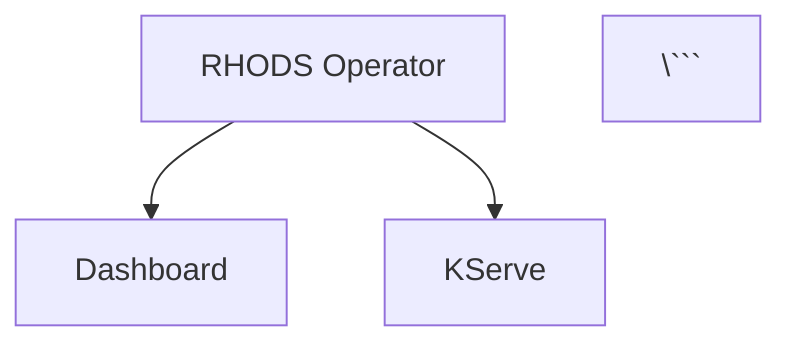

# Architecture Diagrams for Red Hat OpenShift AI 2.9 Platform

Generated from: `architecture/rhoai-2.9/PLATFORM.md`
Date: 2026-03-15

**Note**: Diagram filenames use base component name without version (directory is already versioned).

## Available Diagrams

All Mermaid diagrams are available in both `.mmd` (source) and `.png` (3000px width, high-resolution) formats.

### For Developers
- [Component Structure](./platform-component.png) ([mmd](./platform-component.mmd)) - Mermaid diagram showing internal components and relationships
- [Data Flows](./platform-dataflow.png) ([mmd](./platform-dataflow.mmd)) - Sequence diagram of key platform workflows
- [Dependencies](./platform-dependencies.png) ([mmd](./platform-dependencies.mmd)) - Component dependency graph showing all platform components

### For Architects
- [C4 Context](./platform-c4-context.dsl) - System context in C4 format (Structurizr)
- [Component Overview](./platform-component.png) ([mmd](./platform-component.mmd)) - High-level platform architecture view
- [Component Dependencies](./platform-dependencies.png) ([mmd](./platform-dependencies.mmd)) - Integration points and dependencies

### For Security Teams
- [Security Network Diagram (PNG)](./platform-security-network.png) - High-resolution network topology
- [Security Network Diagram (Mermaid)](./platform-security-network.mmd) - Visual network topology (editable)
- [Security Network Diagram (ASCII)](./platform-security-network.txt) - Precise text format for SAR submissions
- [RBAC Visualization](./platform-rbac.png) ([mmd](./platform-rbac.mmd)) - RBAC permissions and bindings

## Platform Overview

Red Hat OpenShift AI 2.9 is an enterprise AI/ML platform that provides comprehensive tools for the entire machine learning lifecycle. The platform includes:

- **12 Components**: RHODS Operator, ODH Dashboard, Notebook Controller, Data Science Pipelines, KServe, ModelMesh Serving, ODH Model Controller, KubeRay, CodeFlare, Kueue, TrustyAI, and Workbench Images
- **4 Major Workflows**: Notebook development, Model serving, ML pipelines, Distributed training
- **Production-Ready**: Enterprise support, HA configuration, comprehensive monitoring
- **Security**: mTLS via Service Mesh, OAuth authentication, RBAC, NetworkPolicies

## Diagram Descriptions

### Component Structure Diagram
Shows the complete platform architecture with all 12 components, their namespaces, and relationships:
- Core Platform: RHODS Operator (orchestrator)
- Application Services: Dashboard, all component operators
- User Workloads: Notebooks, InferenceServices, Pipelines, RayClusters
- Infrastructure: Service Mesh (Istio), OpenShift OAuth, Prometheus
- External Dependencies: S3 Storage, Container Registries, Package Repos

### Data Flow Diagram
Five key workflows in sequence diagram format:
1. **Notebook Workbench Creation**: Dashboard → Notebook Controller → StatefulSet → JupyterLab
2. **Model Deployment (KServe)**: InferenceService CR → KServe Controller → Knative Service → Inference endpoint
3. **ML Pipeline Execution**: DSPA CR → DSP Operator → Argo/Tekton → Pipeline pods
4. **Distributed Training**: RayCluster CR → Kueue → KubeRay → CodeFlare → Ray cluster
5. **Model Monitoring**: TrustyAIService CR → TrustyAI Operator → Payload logging → Fairness metrics

### Security Network Diagram
Comprehensive network architecture showing:
- **Trust Zones**: External (Untrusted) → Ingress (DMZ) → Platform Services → Service Mesh → User Workloads → External Services
- **Ports & Protocols**: All communication paths with exact port numbers, protocols, and encryption
- **Authentication**: OAuth Bearer tokens, mTLS certificates, ServiceAccount tokens, AWS IAM
- **Secrets**: All platform secrets with types and rotation policies
- **RBAC**: ClusterRoles and permissions for all operators
- **Network Policies**: CodeFlare-managed policies for Ray clusters
- **Security Context Constraints**: SCC requirements for different workload types

Available in three formats:
- **ASCII (.txt)**: Precise technical details, ideal for Security Architecture Reviews (SAR)
- **Mermaid (.mmd)**: Visual graph with color-coded trust zones, editable
- **PNG**: High-resolution render for presentations

### C4 Context Diagram
Structurizr DSL format showing:
- **Users**: Data Scientists, ML Engineers, Platform Admins
- **Platform System**: All 12 RHOAI components as containers
- **Infrastructure**: OpenShift, Service Mesh, OAuth
- **External Systems**: S3 Storage, Databases, Registries, Package Repos
- **Multiple Views**: System Context, Platform Containers, Core Platform, Model Serving, ML Pipelines, Distributed Computing, Monitoring

Use with Structurizr Lite or CLI to generate interactive diagrams.

### Component Dependencies Diagram
Dependency graph showing:
- **Core Platform**: RHODS Operator deploys and manages all components
- **Platform Dependencies**: Kubernetes API, Service Mesh, OAuth, Monitoring, cert-manager, Knative
- **External Dependencies**: S3 Storage, Databases, Container Registries, Package Repos
- **Integration Patterns**: Component-to-component relationships and data flows
- **Color-coded**: Core (red), Operators (blue), Infrastructure (gray), External (orange)

### RBAC Visualization Diagram
Shows the complete RBAC structure:
- **Service Accounts**: All operator service accounts with namespaces
- **ClusterRoles**: Permissions for each component
- **ClusterRoleBindings**: Service Account → ClusterRole mappings
- **API Resources**: Platform CRDs, Workbench CRDs, Model Serving CRDs, Kubernetes core resources, OpenShift resources, Service Mesh resources
- **Permission Verbs**: get, list, watch, create, update, patch, delete for each resource

## How to Use

### PNG Files (.png files)
**Automatically generated** at 3000px width for high-resolution presentations and documentation.

- **Ready to use**: High-resolution images suitable for presentations, wikis, and documentation
- **Width**: 3000px (height auto-adjusts to content)
- **Use directly**: Include in PowerPoint, Google Slides, Confluence, etc.

### Mermaid Source Files (.mmd files)
- **In GitHub/GitLab**: Paste into markdown with ````mermaid` code blocks - renders automatically!
- **Live editor**: https://mermaid.live (paste code, edit, export)
- **Editable**: Modify and regenerate if needed

**Embedding in Markdown**:
```markdown


**Manual PNG regeneration** (if you edit .mmd files):

1. **Ensure Mermaid CLI is installed**:
   ```bash
   npm install -g @mermaid-js/mermaid-cli
   ```

2. **Regenerate PNG** (3000px width):
   ```bash
   PUPPETEER_EXECUTABLE_PATH=/usr/bin/google-chrome mmdc -i platform-component.mmd -o platform-component.png -w 3000
   ```

3. **Alternative formats** (if needed):
   ```bash
   # SVG (vector, scales perfectly)
   PUPPETEER_EXECUTABLE_PATH=/usr/bin/google-chrome mmdc -i platform-component.mmd -o platform-component.svg

   # PDF
   PUPPETEER_EXECUTABLE_PATH=/usr/bin/google-chrome mmdc -i platform-component.mmd -o platform-component.pdf
   ```

**Note**: If `google-chrome` is not found, try `chromium` or `which google-chrome` to locate it

### C4 Diagrams (.dsl files)
**Structurizr Lite** (Docker):
```bash
docker run -it --rm -p 8080:8080 -v $(pwd):/usr/local/structurizr structurizr/lite
# Open http://localhost:8080 and select platform-c4-context.dsl
```

**Structurizr CLI** (export to PNG/SVG):
```bash
# Install Structurizr CLI
curl -L https://github.com/structurizr/cli/releases/download/v1.32.0/structurizr-cli-1.32.0.zip -o structurizr-cli.zip
unzip structurizr-cli.zip

# Export to PNG
./structurizr.sh export -workspace platform-c4-context.dsl -format png
```

### ASCII Diagrams (.txt files)
- View in any text editor (monospaced font recommended)
- Include in documentation as-is (preserve formatting)
- Perfect for security reviews (precise technical details, no ambiguity)
- Copy directly into SAR documents, compliance reports, technical specifications

**Recommended viewers**:
- Terminal: `cat platform-security-network.txt`
- VS Code: Built-in text viewer
- Confluence: Use `{code}` macro with "Text" syntax
- Google Docs: Use "Courier New" or "Roboto Mono" font

## Platform Architecture Highlights

### Component Distribution
- **Core**: 1 operator (RHODS Operator)
- **Application Services**: 10 operators + 1 web app (Dashboard)
- **Monitoring**: Prometheus, Grafana, Alertmanager
- **High Availability**: Dashboard (2 replicas), ODH Model Controller (3 replicas)

### Network Security
- **Ingress**: OpenShift Routes (TLS 1.2+), Istio Ingress Gateway
- **Internal**: Service Mesh mTLS STRICT mode (when enabled)
- **Authentication**: OAuth Bearer tokens, ServiceAccount tokens, mTLS certificates
- **Egress**: S3 (HTTPS/443), Databases (TLS optional), Container Registries (HTTPS/443)

### Resource Requirements
- **Operator Overhead**: ~4.3 CPU cores, ~9 GB memory (minimum)
- **User Workloads**: Configurable (notebooks, inference, training)
- **GPU Support**: NVIDIA CUDA, Intel GPU, Habana Gaudi

### Key Integrations
- **Service Mesh**: Istio/Maistra 2.x (mTLS, traffic management)
- **Serverless**: Knative Serving 1.12+ (KServe autoscaling)
- **Certificate Management**: cert-manager 1.13+, service-ca operator
- **Authentication**: OpenShift OAuth (LDAP, GitHub, SAML, OIDC)
- **Monitoring**: Prometheus Operator (ServiceMonitor/PodMonitor)

## Updating Diagrams

To regenerate after architecture changes:

1. **Update architecture file**:
   ```bash
   # Edit PLATFORM.md with new component information
   vi architecture/rhoai-2.9/PLATFORM.md
   ```

2. **Regenerate diagrams**:
   ```bash
   # Use the diagram generation skill/tool
   /generate-architecture-diagrams --architecture=architecture/rhoai-2.9/PLATFORM.md
   ```

3. **Verify changes**:
   ```bash
   # Check generated files
   ls -lh architecture/rhoai-2.9/diagrams/platform-*

   # View PNG previews
   open architecture/rhoai-2.9/diagrams/platform-*.png
   ```

## Related Documentation

- **Platform Architecture**: [../PLATFORM.md](../PLATFORM.md)
- **Component Architectures**: Individual component `.md` files in parent directory
- **Deployment Guide**: OpenShift AI documentation
- **API Reference**: CRD documentation for each component

## Support and Feedback

For questions or issues with the diagrams:
1. Review the source architecture file: `../PLATFORM.md`
2. Check component-specific architecture files for detailed information
3. Verify diagram rendering in Mermaid Live Editor: https://mermaid.live
4. Contact the platform architecture team

---

**Generated**: 2026-03-15
**Platform Version**: Red Hat OpenShift AI 2.9
**Components**: 12 operators + 1 web application + image catalog
**Diagram Formats**: Mermaid (.mmd + .png), C4 (.dsl), ASCII (.txt)
