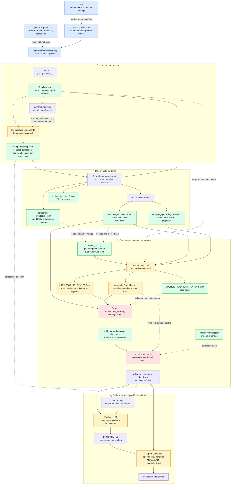

# Pipeline Architecture

Status: current implementation review, 2026-08-02

## Executive summary

This repository is an asynchronous, file-oriented architecture-documentation
pipeline. `main.py` is only the process entrypoint: it loads `.env`, parses a
subcommand, and calls `lib.phases.main`. The phase orchestrators then combine
deterministic repository analysis and validation with Claude Code agents that
write narrative architecture documents.

The central design is a hybrid evidence pipeline:

```text
platforms.yaml
      |
      v
Git checkouts --> component-map.json --> arch-analyzer artifacts
                                             |
                                             v
                              bounded component synthesis
                                             |
                                             v
                         validated component Markdown
                                             |
                  +--------------------------+------------------+
                  v                                             v
          PLATFORM.md aggregation                         diagrams
```

The `architecture/<platform>/` tree is the shared intermediate and output
store. It contains the component map, analyzer evidence, generation sidecars,
component documents, platform documents, schemas, and diagrams. This makes
phases independently runnable and allows later phases to skip work based on
existing outputs and modification times.

## Phase and contract map

The diagram below shows the control flow and the durable contract at each
boundary. Solid arrows represent data or control flow. Dotted arrows represent
context, policy, or validation inputs. The component-generation portion is
expanded to show that the LLM does not write directly over analyzer facts.



## Entry point and command model

[`main.py`](../../main.py) does four things:

1. Requires `.env` at the repository root and loads it with `python-dotenv`.
2. Parses the CLI using [`lib/cli.py`](../../lib/cli.py).
3. Runs the asynchronous phase dispatcher with `asyncio.run()`.
4. Converts interrupts and uncaught exceptions into process exit codes.

The CLI exposes these operational commands:

- `fetch`
- `parse-manifests`
- `discover-components`
- `static-analysis`
- `generate-architecture`
- `generate-platform-architecture`
- `generate-diagrams`
- `pipeline` for an explicitly ordered, optionally component-scoped subset
- `all` for the normal end-to-end run

`check-eligibility` is a diagnostic command rather than a generation phase.

The `all` dispatcher in
[`lib/phases/orchestration.py`](../../lib/phases/orchestration.py) resolves the
platform configuration, organization, checkout suffix, branch, and target
version before constructing phase-specific `Namespace` objects. `--clean`
removes generated contents from matching architecture directories and implies
`--force`; otherwise the phases are generally incremental.

## Configuration and external boundaries

[`platforms.yaml`](../../platforms.yaml) is the declarative input for a
platform. It can define:

- primary and extra GitHub organizations;
- individual extra repositories, branches, suffixes, and Git protocols;
- repository and component exclusions;
- component inclusion and field overrides;
- sync configuration used for upstream/downstream provenance; and
- post-checkout file exclusions.

The pipeline crosses these external boundaries:

| Boundary | Role |
| --- | --- |
| GitHub/Git | Fetches source repositories and branch-specific checkouts. |
| `gh-org-clone` | Clones complete organizations; the pipeline builds it locally if it is unavailable. |
| `arch-analyzer` | Repository-local Go binary that extracts deterministic architecture evidence. |
| Claude Agent SDK | Runs discovery, synthesis, aggregation, and diagram agents. |
| `arch-query` | Go CLI used by platform aggregation to query generated architecture data. |
| `arch-doc` | Go CLI used to enforce Markdown section ownership and assemble merged documents. |
| Mermaid/Chrome tooling | Optional PNG rendering invoked by the diagram skill. |

The analyzer, query, and document tools are built from `src/` as needed and
placed in `bin/`. Go build caches are directed to `/tmp` when not already
configured.

## End-to-end phase flow

### 1. Fetch repositories

[`lib/phases/fetch.py`](../../lib/phases/fetch.py) loads the platform
configuration and calls `fetch_repositories()` in [`lib/fetch.py`](../../lib/fetch.py).
The primary organization is fetched through `gh-org-clone`; extra organizations
and individual repositories are fetched according to their per-entry settings.
Branches and suffixes determine checkout paths such as
`checkouts/red-hat-data-services.rhoai-3.4/`. Existing repositories can be
pulled with `--pull`.

The fetch phase also applies configured repository exclusions and can remove
configured files or directories after checkout. It writes `logs/fetch.log`.
The checkouts are working inputs and are gitignored; they are not the final
architecture artifact.

### 2. Parse the operator manifest script

[`lib/phases/manifest.py`](../../lib/phases/manifest.py) resolves the relevant
`get_all_manifests.sh` path and parses the platform-specific associative array
(`ODH_COMPONENT_MANIFESTS`, `RHOAI_COMPONENT_MANIFESTS`, or the legacy generic
array) using [`lib/manifest_parser.py`](../../lib/manifest_parser.py).

This phase produces a human-readable summary or JSON on stdout. In the current
dispatcher it is primarily a checkout/manifest validation and inspection step;
it does not itself write `component-map.json`. Component-map creation is done
by the next discovery agent and its post-processing.

### 2b. Discover components

[`lib/phases/discover.py`](../../lib/phases/discover.py) starts one Claude
discovery agent with the configured checkout directories. The
`discover-components` skill classifies repositories by following platform
breadcrumbs such as operators, manifests, images, dependencies, installers,
and build artifacts. Its main durable output is:

```text
architecture/<platform>/component-map.json
```

The map is the handoff contract for the remaining phases. It records component
keys, repository identity, checkout paths, refs, tiers/types, discovery
metadata, and (when available) provenance.

After the agent succeeds, Python enriches the map with sync-configuration
repositories, `platforms.yaml` include/exclude/override rules, and repository
lineage/provenance. If the map already exists, discovery skips unless forced.

### 2c. Deterministic static analysis

[`lib/phases/static_analysis.py`](../../lib/phases/static_analysis.py) reads
the component map, applies platform overrides, and runs `arch-analyzer`
concurrently (default maximum: 10 components). For each component it runs:

1. `arch-analyzer extract` to produce structured JSON;
2. `arch-analyzer render` to produce the Markdown analyzer baseline; and
3. `arch-analyzer extract-schema` unless schemas were skipped.

Analyzer output is deliberately stored in the architecture tree rather than
inside source checkouts:

```text
architecture/<platform>/<component>/.analyzer/
  component-architecture.json
  analyzer_architecture.md
  analyzer_synthesis_context.md
  contracts/schemas/*.json
```

The JSON is validated before it is accepted. The analyzer is the deterministic
owner of inventories such as APIs, services, dependencies, security evidence,
webhooks, coverage status, and provenance. A distribution-specific extraction
is retried without the distribution when no matching kustomize distribution is
found. Cached artifacts are reused when valid and `--force` is absent.

### 3. Generate component architecture documents

[`lib/phases/architecture.py`](../../lib/phases/architecture.py) reads the map,
filters components by checkout, explicit component, selected-map metadata, and
optional tier, then skips existing canonical documents unless forced. Each
missing component becomes an independent Claude agent job.

The default `all` and CLI behavior enables evidence-gated generation. For a
valid analyzer baseline, [`lib/architecture_routing.py`](../../lib/architecture_routing.py)
currently routes every readiness classification through the bounded `partial`
route. The route is an extend-and-improve synthesis: the analyzer baseline is
preseeded, and the agent is given declared gap categories, a source-file budget,
and targeted discovery permissions. Missing or invalid analyzer artifacts, or
an explicit `--no-evidence-gated-merge`, use the unrestricted legacy route.

Each component run uses private sidecars under:

```text
architecture/<platform>/<component>/.generation/
  preseed.md
  candidate.md
  merged.md
  ARCHITECTURE_CHANGES.md
  INSIGHTS_ARTIFACT.json
  SOURCE_READ_JUSTIFICATIONS.json
```

The agent prompt points at the checkout, analyzer directory, distribution,
version, candidate output, and route policy. Restricted agents are guarded by
[`lib/agent_runner.py`](../../lib/agent_runner.py): source reads stay in the
checkout or analyzer context, writes are limited to declared output artifacts,
and broad shell/discovery activity is denied. Read, discovery, tool-call,
context, and model-usage telemetry is retained in logs.

Post-processing is the key correctness boundary:

1. The source-read justification sidecar is validated against observed
   telemetry.
2. The candidate must contain a substantive delta from the preseed.
3. [`lib/architecture_merge.py`](../../lib/architecture_merge.py) applies only
   exact, evidence-backed structured changes to the analyzer tables.
4. [`arch-doc`](../../src/arch-doc/README.md) assembles synthesis-owned
   sections onto analyzer-owned sections according to
   [`section-manifest.json`](../../src/arch-doc/section-manifest.json).
5. The merged document is validated by the architecture skill validator.
6. The validated result is copied through a temporary file and atomically
   promoted to `architecture/<platform>/<component>.md`.

Insights are supplementary and are replaced with a valid empty artifact if
the agent emits an invalid insight file. Agent logs and durable per-run JSON
reports are written under the generation log directory. The final component
Markdown is therefore a product of deterministic evidence plus bounded agent
authorship, not an unconstrained replacement of analyzer facts.

### The three-way interaction, step by step

For one analyzer-backed component, the interaction is a controlled document
transformation rather than three tools independently editing the same file:

```text
arch-analyzer extract
  -> component-architecture.json       (structured facts + provenance)
  -> arch-analyzer render
       -> analyzer_architecture.md      (baseline Markdown)
       -> analyzer_synthesis_context.md (compact evidence projection)

baseline Markdown + compact context + bounded source reads
  -> LLM candidate.md                   (proposed synthesis and table edits)
  -> LLM ARCHITECTURE_CHANGES.md        (authorization requests for table edits)

analyzer baseline + candidate + change records
  -> Python evidence-gated merge        (approved table changes only)
  -> arch-doc assemble                  (approved section ownership)
  -> validator
  -> canonical component Markdown
```

The responsibilities are intentionally different:

| Stage | What it knows/does | What it cannot establish by itself |
| --- | --- | --- |
| `arch-analyzer extract` | Parses repository source/manifests into typed facts, source locations, coverage status, and provenance. | It does not author the final architectural interpretation or infer behavior absent from extracted evidence. |
| `arch-analyzer render` | Converts JSON facts into the canonical Markdown shape, including deterministic baseline narrative and inline source citations. | Its generated narrative is a baseline; it is not the final LLM-authored analysis. |
| LLM component agent | Reads the analyzer baseline/context, performs route-authorized targeted source reads, writes synthesis sections, and proposes exact evidence-backed table changes. | It cannot make an unsupported table addition/update survive the merge, and it cannot replace analyzer-owned sections on the normal route. |
| Python merge layer | Compares analyzer and candidate tables, checks change-record identity/evidence/category budgets, restores omitted analyzer rows, and rejects unapproved additions or edits. | It does not decide whether free-form prose is architecturally insightful; that remains LLM synthesis subject to document validation. |
| `arch-doc assemble` | Applies the section ownership manifest: preserves analyzer-owned sections, replaces synthesis-owned sections, handles conditional sections, and validates section layout. | It does not inspect repository source or independently verify the semantic truth of a prose claim. |

The normal route has two separate LLM authorization paths:

1. **Narrative path:** the candidate's `Purpose`, `Data Flows`, and
   `Architectural Analysis` sections are eligible for `arch-doc` assembly.
   `Security` is shared; only approved synthesis subsections may be carried
   into it while analyzer security evidence remains intact.
2. **Structured-fact path:** candidate table edits require a matching
   `ARCHITECTURE_CHANGES.md` record with the exact category, row identity,
   changed values, reason, and repository-relative numeric evidence. The Python
   merger, not `arch-doc`, decides whether each row edit is applied.

`arch-doc` is consequently the final section/layout gate, not the evidence
adjudicator. Python performs table adjudication first, passes the table-merged
analyzer document plus the raw candidate to `arch-doc assemble`, and only then
validates and promotes the result. The raw candidate is never promoted on the
evidence-gated route.

If analyzer JSON or its rendered baseline is missing/invalid, or the operator
explicitly disables evidence-gated generation, the component uses the legacy
route. That route still validates the candidate Markdown, but it does not use
the normal Python evidence-gated merge plus `arch-doc` assembly boundary; this
is the principal reason it has a broader LLM/source-inspection surface.

### 4. Aggregate platform architecture

[`lib/phases/platform.py`](../../lib/phases/platform.py) scans one or more
platform directories for component Markdown files. It regenerates
`PLATFORM.md` when absent, forced, or older than a component document. Before
launching aggregation it ensures `arch-query` is available.

The platform agent invokes the `aggregate-platform-architecture` skill with the
platform directory, distribution, version, and model metadata. The skill uses
`arch-query` for structured component/platform inventories and synthesizes
relationships, workflows, security, network, deployment, observability, and
other cross-component patterns into:

```text
architecture/<platform>/PLATFORM.md
```

Platform aggregation is intentionally a synthesis document rather than a flat
copy of every component table; the detailed inventories remain in component
Markdown and analyzer JSON.

### 5. Generate diagrams

[`lib/phases/diagrams.py`](../../lib/phases/diagrams.py) finds Markdown files
in selected platform directories, including `PLATFORM.md`, and uses file
timestamps to skip fresh diagram sets. Platform diagrams run before component
diagrams. The respective skills write Mermaid, C4/Structurizr, and security
network outputs under:

```text
architecture/<platform>/diagrams/
```

`--export-png` additionally invokes the repository diagram-rendering script and
requires Mermaid CLI/Chrome tooling. Diagram generation reads the already
validated architecture documents; it is downstream visualization, not a source
of architectural facts.

## Data contracts and ownership

| Artifact | Producer | Consumer/authority |
| --- | --- | --- |
| Checkout tree | Fetch phase | Manifest parser, discovery, analyzer, component agents |
| `component-map.json` | Discovery agent plus Python enrichment | Static analysis and component generation |
| `.analyzer/component-architecture.json` | `arch-analyzer extract` | Validation, routing, merge, query/aggregation |
| `.analyzer/analyzer_architecture.md` | `arch-analyzer render` | Component preseed and merge base |
| `.analyzer/analyzer_synthesis_context.md` | `arch-analyzer render` | Compact analyzer evidence context for the component LLM |
| `.generation/candidate.md` | Component agent | Merge/validation only; never directly authoritative on restricted routes |
| Component `.md` | Merge/validation/promotion | Platform aggregation and diagrams |
| `PLATFORM.md` | Platform aggregation agent | Platform diagrams and human consumers |
| `diagrams/*` | Diagram agents/scripts | Human and downstream visualization consumers |
| `overlays/*` | Human-authored repository input | Skills/consumers when active; not generated by `main.py` |

The analyzer owns structured facts and provenance. Agent synthesis owns the
free-form architectural analysis and other synthesis sections. The merge and
section-assembly tools enforce this boundary in the component route.

## Operational characteristics

- **Asynchronous execution:** fetch subprocesses, analyzer jobs, and agent jobs
  are asynchronous; analyzer and agent phases use semaphores for bounded
  concurrency.
- **Incremental execution:** existing maps, analyzer artifacts, component docs,
  platform docs, and diagrams are reused when valid and fresh.
- **Targeted execution:** `pipeline` can run selected phases in caller-provided
  order and resolve components from keys, repository names, `org/repo`, or URL
  tails.
- **Observability:** phase logs, agent logs, telemetry, source-read ledgers,
  merge reports, insight artifacts, and optional strace traces provide run
  diagnostics.
- **Failure isolation:** component agents are independent; a failed component
  does not require all other component jobs to be discarded. A failed
  constrained merge is kept out of the canonical output rather than silently
  promoting the candidate.

## Current-code caveats

These are findings about the checked-in implementation, not assumptions about
future intent:

1. The README describes the project as five phases, while the current CLI and
   dispatcher expose seven logical stages (fetch, manifest parsing, discovery,
   static analysis, component generation, platform generation, and diagrams).
   The source comments retain historical phase labels such as “Phase 5” and
   “Phase 6”.
2. `lib/build_info.py` and `lib/kustomize_context.py` contain helpers for build
   metadata and operator-selected kustomize context, but the current `lib/`
   call graph has no callers for those helpers. The README describes their
   prompt injection as active behavior; that behavior is not demonstrated by
   the current Python orchestration path.
3. The repository contains substantial generated-output changes in the working
   tree while this note was written. Those changes were not inspected as
   pipeline implementation and were not modified by this task.
4. The work-ledger path referenced by `AGENTS.md` (`docs/notes/agentic_work_ledger.md`)
   is absent from this checkout. This note therefore follows the code and
   existing checked-in plans/notes rather than an unavailable ledger
   specification.

## Architectural assessment

The strongest architectural choice is the explicit separation between
deterministic evidence extraction and probabilistic narrative synthesis. The
architecture tree acts as a durable, inspectable event log between phases,
while validation and section ownership prevent an agent from replacing
analyzer-owned facts accidentally.

The main coupling point is the filesystem contract: later phases depend on
specific paths, filenames, Markdown sections, JSON shapes, and timestamps. This
supports resumability and targeted replay, but changes to output layout or
section ownership must be coordinated across Python, Go tools, skills, tests,
and consumer/query code.
